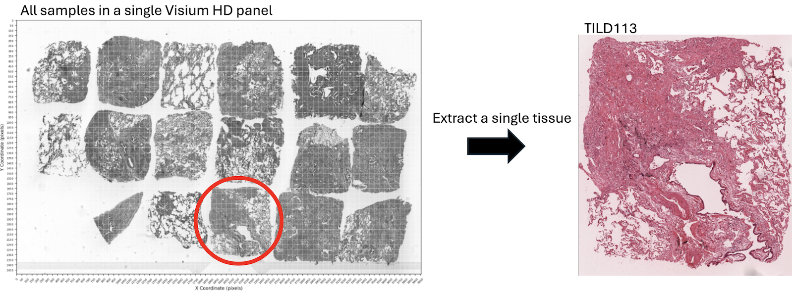

## 1. Visium HD pre-processing
Here we describe a series of analyses of Visium HD cell type annotation.

### Outline
[1.1. Subset](#1-subset-python)

[1.2. Robust Cell Type Decomposition](#2-robust-cell-type-decomposition-cell-type-annotation-r)

---
#### 1. Subset (Python)
This Jupyter Notebook, [`Crop_high_resolution_microsope_image.ipynb`](./Visium_HD_Crop_high_resolution_microsope_image.ipynb), demonstrates how to:
- Load and visualize high-resolution microscope `.tif` images.
- Crop regions of interest (ROIs) based on coordinate inputs.
- Save the cropped output for downstream spatial analysis (e.g., Cell type annotation, Visium HD - Xenium alignment).

#### Required input files
- High resolution H&E tiff

---
#### 2. Robust Cell Type Decomposition, Cell type annotation (R)
This Rscript, [`Spatial_Deconvolution_Clustering_Pipeline.R`](./Tissue2_celltype_annotation.R) processes Visium HD binned spatial transcriptomics data from human lung tissue to perform spatial deconvolution, clustering, coordinate normalization, and JSON export for downstream applications like visualization or LLM prompting.

##### Workflow Steps
1. Load & Preprocess Visium HD Counts
- Load filtered matrix (Space Ranger 8µm output)
- Map ENSEMBL IDs to gene symbols
- Remove duplicated or missing gene entries

2. Load Spatial Coordinates
-  Read `tissue_positions.parquet`
-  Subset a region of interest (ROI) using pixel bounds

3. Build RCTD Input
- Create `SpatialRNA` object
- Load LungMAP scRNA-seq reference (You can use your reference)
- Filter out cell types with low abundance (<25 cells)

4. Run RCTD
- Run in `doublet` mode
- Thresholds: `UMI_min = 40`, `counts_MIN = 10`

5. Unsupervised Clustering (Seurat)
- Convert RCTD output to Seurat
- Normalize → PCA → Leiden clustering (`res = 0.17`) → UMAP
  * Vannan et al. selected 12 clusters (CNiche & TNiche)
    
6. Normalize & Rotate Coordinates
- Rotate 90° clockwise for orientation correction (To adjust the coordinates/image to match the Xenium orientation)
- Normalize x and y coordinates to [0, 1] scale (For downstream analysis. e.g., Visium-Xenium alignment)

7. Update RCTD Object
- Replace coordinates in `@spatialRNA@coords`
- Add Seurat clusters and UMAP coordinates to `@results_df`

8. Save Processed Object
- Save RCTD + Seurat integrated object as `Visium2.RData`

9. Export Metadata (JSON)
Outputs:
- Spot class counts (singlet, doublet, reject)
- Cell type labels
- Seurat clusters
- Coordinate ranges
- Plotting suggestions (coloring, axes, default view)

Required Inputs
| Input                        | Description                                                                            |
| ---------------------------- | -------------------------------------------------------------------------------------- |
| `matrix.mtx.gz`              | Sparse gene expression matrix (filtered) from 8 µm binned Visium HD output             |
| `barcodes.tsv.gz`            | Spot barcodes corresponding to matrix columns                                          |
| `features.tsv.gz`            | Gene metadata (ENSEMBL ID and gene symbols)                                            |
| `tissue_positions.parquet`   | Pixel-level coordinates of each spot from Space Ranger                                 |
| `scRNA-seq reference (.rds)` | Preprocessed single-cell reference (e.g., LungMAP, with `celltype_level1` annotations) |
| `ROI pixel boundaries`       | Bounding box to subset spatial region of interest (manually defined)                   |

Output Files
| Output                                | Format                          | Description                                                                    |
| ------------------------------------- | ------------------------------- | ------------------------------------------------------------------------------ |
| `Visium2.RData`                       | RData                           | Full RCTD object with normalized coordinates and Seurat clustering added       |
| `Visium2.json`                        | JSON                            | Summary metadata for visualization, downstream LLM-based plotting, or web apps |
| `seurat_clusters`, `UMAP_1`, `UMAP_2` | In `Visium2@results$results_df` | Clustering and UMAP coordinates appended to RCTD results                       |
| `SpatialRNA object`                   | In `Visium2@spatialRNA`         | Coordinates rotated and normalized (\[0, 1] scale) for spatial plotting        |

