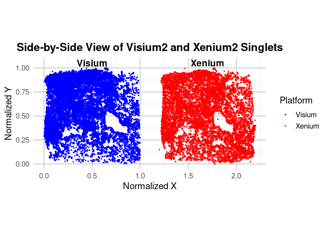

## 3. Visium HD - Xenium alignment
This repository contains an R-based pipeline to align 10x Genomics Xenium and Visium HD spatial transcriptomics data from the same tissue section, with the goal of harmonizing platforms and refining cell-type annotations using spatial scTriangulate.

#### Goal
To identify the most reliable cell-type annotations by:
- Aligning matched Xenium and Visium HD spots using gene expression similarity
- Evaluating cross-platform transcript concordance
- Integrating metadata and RCTD results
- Prepareing input files for spatial scTriangulate to optimize annotations across platforms

#### Script
- [`Rmarkdown`](./Alignment.md)
- [`Rmarkdown with figures (html format)`](https://shunyasanuma.github.io/Spatial_LungChat/Alignment.html)
---

##### Workflow Steps
#### 1. Extracting Singlet Coordinates
To ensure high-confidence cell mapping, only RCTD-classified singlets are used from each platform:
- From Visium2@results$results_df and Xenium2@results$results_df, spots with spot_class == "singlet" are extracted.
- Raw spatial coordinates (`x`, `y`) for those singlet spots are retained from:
  * `Visium2@spatialRNA@coords`
  *  `Xenium2@spatialRNA@coords`

#### 2. Manual Alignment of Xenium to Visium 
Due to imaging differences between Xenium and Visium HD (e.g., rotation, mirroring), direct spatial overlay is not possible. Orientation was corrected in a previous step.

Manual alignment is performed by:
- Rotating, scaling, and mirroring Xenium spatial coordinates to approximate Visium's spatial coordinate system.
- Resulting aligned coordinates (`X`, `Y`) are stored in `xenium_df` and `visium_df`.
- These aligned coordinates enable more accurate 1:1 spatial comparisons across platforms.
- Uses `FNN::get.knnx()` to perform nearest-neighbor search in 2D space (For each Xenium spot, the closest Visium spot is assigned).
- Construct Mapping Table: Matches are stored in `alignment_df`, a 1:1 mapping of Xenium barcodes → Visium barcodes.

Both raw (`x`, `y`) and normalized (`X`, `Y`) spatial positions are included in the final metadata table (`combined_df`) for each matched spot:
- `X_xenium_raw`, `Y_xenium_raw`, `X_visium_raw`, `Y_visium_raw`
- `X_xenium_norm`, `Y_xenium_norm`, `X_visium_norm`, `Y_visium_norm`
- This allows downstream tools (`scTriangulate`) to use either raw or aligned coordinates for spatial integration and visualization.

#### 3. Evaluation of Alignment Quality
- Identifies common genes between platforms.
- Compute per-gene Pearson correlations across aligned spot pairs (Visium HD - Xenium pairs)
* Loads gene expression matrices:
  - `expr_xenium` from `Xenium2@spatialRNA@counts`
  - `expr_visium` from `Visium2@spatialRNA@counts`
- Ranks spot pairs by expression similarity (abs_diff) using a top marker gene.
- Line plot showing the Pearson correlation (y-axis) versus the number of top aligned spot pairs (x-axis) ranked by absolute difference in expression for the most correlated gene (`top_gene`).

- Select top 7,500 most similar spot pairs based on expression difference (r = 0.9)
- Filter only those pairs with valid expression and metadata

After filtering top 7,500:

#### 4. Annotation Integration
- Merge manuscript annotations (`CNiche`, `TNiche`, `Final_CT`, etc.)\
- Include RCTD-predicted cell types for both Visium and Xenium
- Combine raw and normalized spatial coordinates

#### 5. Combined Matrix Creation
- Merge expression matrices from Visium and Xenium (spot × gene)
- ag gene names with platform suffix (`_visium`, `_xenium`)
