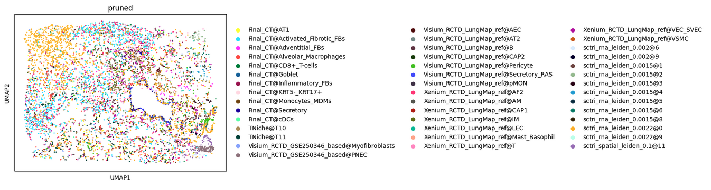

## 4. Spatial scTriangulate 
### Cross-Platform Cell Type Refinement
This notebook [`Spatial_scTriangulate.ipynb`](./scTriangulate.ipynb) performs cell type annotation refinement across Visium HD and Xenium spatial transcriptomics platforms using `scTriangulate`. It follows up on a prior alignment step and evaluates consistency across multiple annotation sources.

---
#### Workflow Steps
#### 1. Load Aligned Expression Data
- Loads the combined expression matrix generated from the `Alignment.Rmd` step (matched Visium–Xenium spots, with `_visium` and `_xenium` gene suffixes).
- Parses cell annotations from:
- RCTD (Visium + Xenium)
  * `Visium_RCTD_LungMap_ref`
  * `Visium_RCTD_GSE250346_based`
  * `Xenium_RCTD_LungMap_ref`
- Manuscript labels
  * `Final_CT`
  * `CNiche`
  * `TNiche`
- UMAP cluster assignments
  * `sctri_rna_leiden_0.0015` (11 clusters)
  * `sctri_rna_leiden_0.002` (12 clusters)
  * `sctri_rna_leiden_0.0022` (13 clusters)
  * `sctri_spatial_leiden_0.097` (11 clusters)
  * `sctri_spatial_leiden_0.099` (12 clusters)
  * `sctri_spatial_leiden_0.1` (13 clusters)

#### 2.  Build `scTriangulate` Object
- Initializes a triangulate object using:
  * Combined expression matrix
  * Multi-source annotations (RCTD, manuscript labels)
 
#### 3. Run scTriangulate Pipeline
Performs:
- Unsupervised clustering:
  * `sctri_rna_leiden_0.0015` (11 clusters)
  * `sctri_rna_leiden_0.002` (12 clusters)
  * `sctri_rna_leiden_0.0022` (13 clusters)
  * `sctri_spatial_leiden_0.097` (11 clusters)
  * `sctri_spatial_leiden_0.099` (12 clusters)
  * `sctri_spatial_leiden_0.1` (13 clusters)
- Computes label stability and confidence scores.

#### 4. Visualize Results

