## 5. LungChat (LLM) functions

### Outline
[5.1. Visualization/Analysis](#1-Visualization-&-Analysis)

[5.2. Ingestion](#2-Ingestion)

---
#### 1. Visualization & Analysis

##### `plot_RCTD_spatial()`
- Visualize spatial cell type or metadata annotation from an RCTD object.
#### Example usages

Highlight only AT1 and AT2 in the spatial plot (Visium HD)
```
plot_RCTD_spatial(
  obj = Visium2,
  annotation = "first_type",
  spot_class = c("singlet"),
  point_size = 0.5,
  highlight = c("AT1", "AT2"),
  title = "Visium HD - AT1 and AT2 Highlighted"
)
```
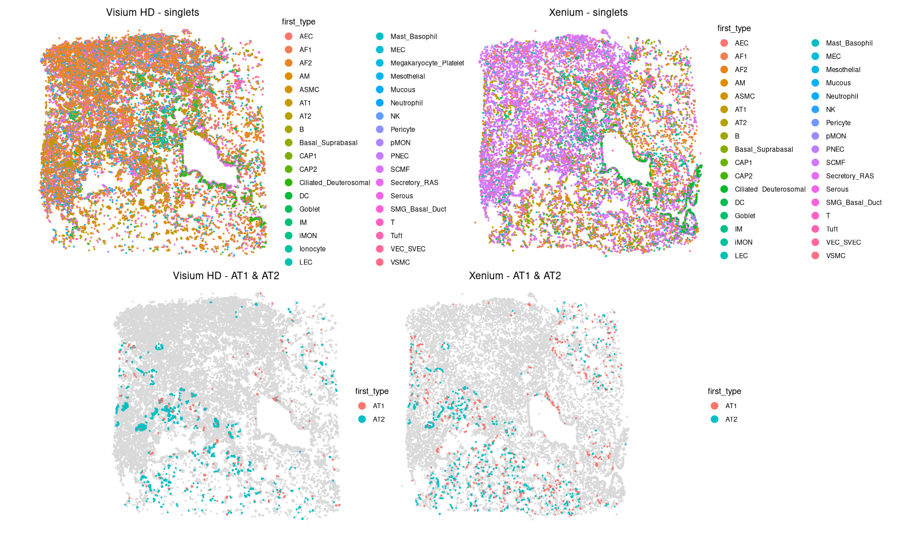

| Parameter           | Type                    | Default        | Description                                                                                                                       |
| ------------------- | ----------------------- | -------------- | --------------------------------------------------------------------------------------------------------------------------------- |
| `obj`               | `RCTD` object           | *(required)*   | The RCTD object loaded from `.RData` containing `spatialRNA` and `results_df`.                                                    |
| `annotation`        | `string`                | `"first_type"` | Column name in `results_df` (e.g., `"first_type"`, `"seurat_clusters"`) or a gene name from `@spatialRNA@counts`.                 |
| `spot_class`        | `character[]`           | `"singlet"`    | Spot class(es) to include, e.g., `c("singlet", "doublet_certain")`.                                                               |
| `point_size`        | `numeric`               | `0.5`          | Size of the spatial plot dots.                                                                                                    |
| `legend_point_size` | `numeric`               | `4`            | Size of the legend dots.                                                                                                          |
| `title`             | `string` or `NULL`      | `NULL`         | Custom plot title. If `NULL`, the function generates a title from `annotation`.                                                   |
| `highlight`         | `character[]` or `NULL` | `NULL`         | Optional. If set, only highlights the given annotation values; others are shown in grey. Only applies to categorical annotations. |


---
##### `plot_RCTD_gene_spatial()`
- Plot spatial expression of a single gene from an RCTD object.
#### Example usages

Highlight only AT1 and AT2 in the spatial plot (Visium HD)
```
plot_RCTD_gene_spatial(Visium2, 
                       gene = "COL1A1", 
                       spot_class = c("reject", "singlet", "doublet_certain", "doublet_uncertain"),
                       title = "Visium COL1A1 Expression"
                       )

plot_RCTD_gene_spatial(Xenium2, 
                       gene = "COL1A1", 
                       spot_class = c("reject", "singlet", "doublet_certain", "doublet_uncertain"),
                       title = "Xenium COL1A1 Expression"
                       )
```
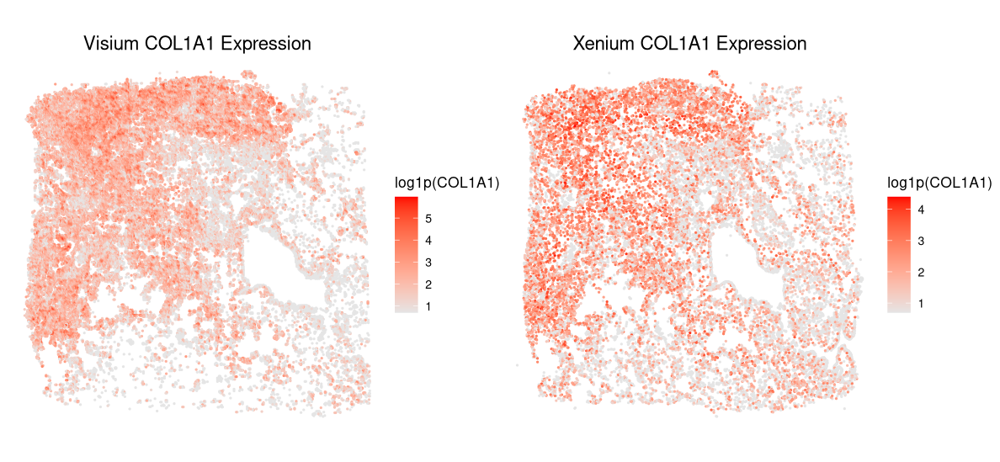

---
##### `plot_RCTD_umap()`
- Visualize UMAP embedding from an RCTD object, colored by metadata or gene expression.
#### Example usages

```
plot_RCTD_umap(
  obj = Visium2,
  annotation = "first_type",
  spot_class = c("singlet", "doublet_certain"),
  highlight = c("AT1", "AT2"),
  title = "UMAP: AT1 and AT2",
  add_labels = FALSE
)

plot_RCTD_umap(
    obj = Visium2,
    annotation = "seurat_clusters",
    spot_class = c("singlet", "doublet_certain"),
    title = "UMAP - Leiden clusters",
    add_labels = TRUE
)
```
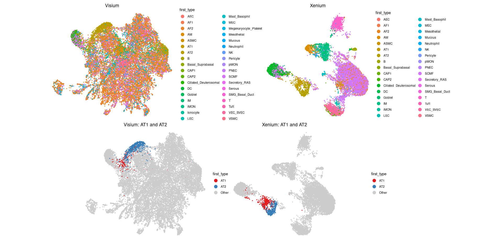

---
##### `plot_scTriangulate_gene_spatial()`
- Plot spatial expression of a single gene from a scTriangulate-derived .h5ad object.
#### Example usages

```
plot_scTriangulate_spatial(
    obj = scTriangulate2,
    annotation = "pruned",
    title = "Spatial scTriangulate",
    x_col = "X_xenium_norm",
    y_col = "Y_xenium_norm"
) 

plot_scTriangulate_spatial(
        obj = scTriangulate2,
        annotation = "pruned",
        highlight = c("Final_CT@Activated_Fibrotic_FBs", "Xenium_RCTD_LungMap_ref@AF2"),
        x_col = "X_xenium_norm",
        y_col = "Y_xenium_norm"
    )
```
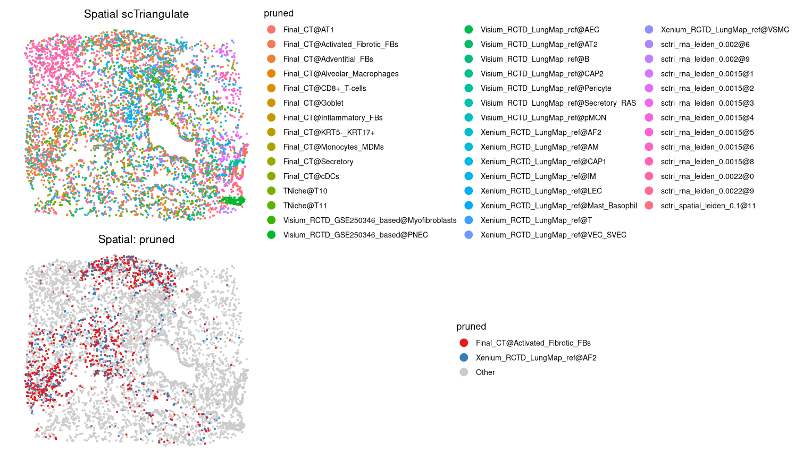

---
##### `rank_marker_specificity()`
- Rank how specific a given gene is to different annotations using one-sided t-tests.

#### Example usages

Default: pruned, both Visium and Xenium
```
> rank_marker_specificity(scTriangulate2, 
+                         gene_name = "COL1A1")
                                      Cluster Mean_Expr   Pct_Expr      P_Value Annotation_Source        P_Adj
1             Final_CT@Activated_Fibrotic_FBs 6.4664907  99.891304 0.000000e+00            pruned 0.000000e+00
2                 Xenium_RCTD_LungMap_ref@AF2 6.2187951  99.224806 0.000000e+00            pruned 0.000000e+00
3                   Final_CT@Inflammatory_FBs 6.1094086  99.000000 4.521522e-60            pruned 6.480849e-59
4                   sctri_rna_leiden_0.0022@0 4.2439978  70.895522 1.082409e-31            pruned 1.163590e-30
5                    Final_CT@Adventitial_FBs 5.8361746  96.511628 2.146234e-30            pruned 1.845761e-29
6  Visium_RCTD_GSE250346_based@Myofibroblasts 5.2437888  91.017964 2.021304e-25            pruned 1.448601e-24
7                                  TNiche@T10 4.6985681  84.577114 2.682018e-13            pruned 1.647525e-12
8                   sctri_rna_leiden_0.0015@8 5.1116646 100.000000 1.280295e-05            pruned 6.881583e-05
9                    sctri_rna_leiden_0.002@9 5.2925532  93.750000 2.306602e-04            pruned 1.102043e-03
10               Xenium_RCTD_LungMap_ref@VSMC 4.0933627  76.190476 2.815837e-03            pruned 1.210810e-02
11                   sctri_rna_leiden_0.002@6 4.7077121  86.666667 2.215039e-02            pruned 8.658789e-02
12                      Final_CT@KRT5-_KRT17+ 3.8583990  73.684211 2.156601e-01            pruned 7.727820e-01
13                Visium_RCTD_LungMap_ref@AT2 3.4240519  63.809524 6.768158e-01            pruned 1.000000e+00
14                sctri_spatial_leiden_0.1@11 3.2637571  60.975610 8.231963e-01            pruned 1.000000e+00
15                  sctri_rna_leiden_0.0015@3 2.5698628  50.000000 9.759786e-01            pruned 1.000000e+00
16               Visium_RCTD_LungMap_ref@CAP2 2.3655766  50.000000 9.140531e-01            pruned 1.000000e+00
17                  Visium_RCTD_LungMap_ref@B 2.0982391  42.222222 1.000000e+00            pruned 1.000000e+00
18                                 TNiche@T11 1.9570175  47.208122 1.000000e+00            pruned 1.000000e+00
19                               Final_CT@AT1 1.9470839  42.982456 1.000000e+00            pruned 1.000000e+00
20                Xenium_RCTD_LungMap_ref@LEC 1.8778168  39.240506 1.000000e+00            pruned 1.000000e+00
21                  sctri_rna_leiden_0.0015@5 1.6753324  38.888889 9.989477e-01            pruned 1.000000e+00
22      Visium_RCTD_LungMap_ref@Secretory_RAS 1.5204591  34.920635 1.000000e+00            pruned 1.000000e+00
23           Visium_RCTD_GSE250346_based@PNEC 1.4982333  32.642487 1.000000e+00            pruned 1.000000e+00
24           Visium_RCTD_LungMap_ref@Pericyte 1.4727246  29.677419 1.000000e+00            pruned 1.000000e+00
25                      Final_CT@CD8+_T-cells 1.4218493  28.846154 1.000000e+00            pruned 1.000000e+00
26                  Xenium_RCTD_LungMap_ref@T 1.3868088  29.940120 1.000000e+00            pruned 1.000000e+00
27                 Xenium_RCTD_LungMap_ref@IM 1.2440684  27.927928 1.000000e+00            pruned 1.000000e+00
28                         Final_CT@Secretory 1.2416679  30.578512 1.000000e+00            pruned 1.000000e+00
29           Xenium_RCTD_LungMap_ref@VEC_SVEC 1.2159647  28.919861 1.000000e+00            pruned 1.000000e+00
30                            Final_CT@Goblet 1.1694600  27.500000 1.000000e+00            pruned 1.000000e+00
31                              Final_CT@cDCs 1.1025328  21.739130 1.000000e+00            pruned 1.000000e+00
32                Visium_RCTD_LungMap_ref@AEC 1.0830353  24.193548 1.000000e+00            pruned 1.000000e+00
33                  sctri_rna_leiden_0.0015@6 1.0166222  26.666667 9.999688e-01            pruned 1.000000e+00
34               Xenium_RCTD_LungMap_ref@CAP1 1.0008548  20.833333 9.999985e-01            pruned 1.000000e+00
35                  sctri_rna_leiden_0.0015@2 0.9753216  27.272727 1.000000e+00            pruned 1.000000e+00
36                    Final_CT@Monocytes_MDMs 0.9211042  21.126761 1.000000e+00            pruned 1.000000e+00
37                  sctri_rna_leiden_0.0015@1 0.7451546  18.181818 1.000000e+00            pruned 1.000000e+00
38      Xenium_RCTD_LungMap_ref@Mast_Basophil 0.6522933  13.636364 1.000000e+00            pruned 1.000000e+00
39                 Xenium_RCTD_LungMap_ref@AM 0.5980320  15.789474 1.000000e+00            pruned 1.000000e+00
40              Final_CT@Alveolar_Macrophages 0.5548935  17.277487 1.000000e+00            pruned 1.000000e+00
41                  sctri_rna_leiden_0.0015@4 0.4844387  11.111111 1.000000e+00            pruned 1.000000e+00
42               Visium_RCTD_LungMap_ref@pMON 0.3668385   9.090909 9.999973e-01            pruned 1.000000e+00
43                  sctri_rna_leiden_0.0022@9 0.0000000   0.000000 1.000000e+00            pruned 1.000000e+00
```
Top 10 clusters across selected annotations
```
> rank_marker_specificity(scTriangulate2,
+                         gene_name = "COL1A1",
+                         cluster_cols = c("Final_CT", "TNiche", "Xenium_RCTD_LungMap_ref"),
+                         top_n = 10)
                  Cluster Mean_Expr  Pct_Expr       P_Value       Annotation_Source         P_Adj
1                      T6  6.473462 100.00000  0.000000e+00                  TNiche  0.000000e+00
2  Activated_Fibrotic_FBs  6.463648  99.76744  0.000000e+00                Final_CT  0.000000e+00
3                    SCMF  6.268872  99.00383  0.000000e+00 Xenium_RCTD_LungMap_ref  0.000000e+00
4            Alveolar_FBs  5.921972  96.15385  0.000000e+00                Final_CT  0.000000e+00
5                     AF1  5.603290  93.77593 2.998743e-111 Xenium_RCTD_LungMap_ref 5.037888e-110
6       Proliferating_FBs  6.042782  97.27891  7.616392e-58                Final_CT  1.066295e-56
7                     AF2  5.822775  96.59091  4.124303e-30 Xenium_RCTD_LungMap_ref  4.949164e-29
8          Myofibroblasts  5.922833 100.00000  4.659300e-29                Final_CT  4.892265e-28
9        Inflammatory_FBs  5.930452 100.00000  4.613340e-26                Final_CT  4.305784e-25
10         SMCs_Pericytes  4.504373  81.63265  1.639774e-18                Final_CT  1.377410e-17
```

Visium-only, limited annotations
```
> rank_marker_specificity(scTriangulate2,
+                         gene_name = "COL1A1",
+                         cluster_cols = c("Visium_RCTD_GSE250346_based"),
+                         platforms = "Visium",
+                         top_n = 10)
                  Cluster Mean_Expr Pct_Expr      P_Value           Annotation_Source        P_Adj
1  Activated_Fibrotic_FBs  5.984355 97.06927 0.000000e+00 Visium_RCTD_GSE250346_based 0.000000e+00
2         Adventitial_FBs  5.127736 88.17734 8.961141e-35 Visium_RCTD_GSE250346_based 2.016257e-33
3            KRT5-_KRT17+  5.119623 92.30769 1.224945e-06 Visium_RCTD_GSE250346_based 1.724492e-05
4        Inflammatory_FBs  4.306897 86.47799 1.532882e-06 Visium_RCTD_GSE250346_based 1.724492e-05
5          Subpleural_FBs  5.188549 93.10345 7.403813e-05 Visium_RCTD_GSE250346_based 6.663432e-04
6          Myofibroblasts  4.722898 87.50000 1.196379e-04 Visium_RCTD_GSE250346_based 8.972843e-04
7    Proliferating_NK_NKT  4.398941 85.71429 9.769193e-02 Visium_RCTD_GSE250346_based 6.280196e-01
8       Proliferating_FBs  4.453057 78.94737 1.315825e-01 Visium_RCTD_GSE250346_based 6.930042e-01
9                 B_cells  4.202985 81.25000 1.540009e-01 Visium_RCTD_GSE250346_based 6.930042e-01
10                   PNEC  3.905525 90.67358 1.456637e-01 Visium_RCTD_GSE250346_based 6.930042e-01
```

---
##### `rank_cross_platform_gene_correlation()`
- Compute gene-wise Pearson correlations between Xenium and Visium matched spots.

#### Example usages
Top 5 genes with the highest correlation between Visium HD and Xenium.
```
> rank_cross_platform_gene_correlation(
+     Xenium_obj = Xenium2,
+     Visium_obj = Visium2,
+     alignment_df = alignment_df2,
+     top_genes = 5
+ )
   COL1A1    COL3A1    COL1A2   SCGB3A2     MARCO 
0.8968483 0.6852229 0.6121173 0.5324030 0.4863397 
```
---
##### `plot_cross_platform_gene_correlation()`
- Plot correlation vs. number of best-matched spots for a selected gene across platforms.

#### Example usages
Visualize the agreement in gene expression between two spatial transcriptomics platforms (e.g., Xenium and Visium) for a given gene (e.g., COL1A1).
```
plot_cross_platform_gene_correlation(
    Xenium_obj = Xenium2,
    Visium_obj = Visium2,
    alignment_df = alignment_df2,
    gene_name = "COL1A1",
    hline = 0.9,
    y_range = c(0.8, 1),
    title = "COL1A1 Cumulative Correlation"
)
```
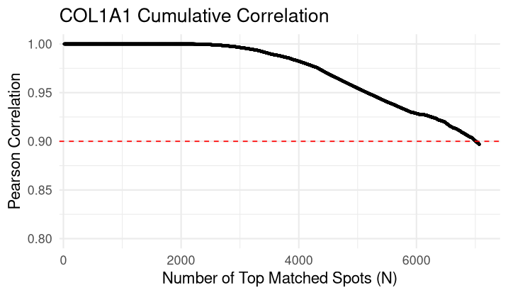

---
##### `find_top_markers_for_celltype()`
- Identify top genes specifically enriched in a target cell type on a selected platform.
  
#### Example usages
Top 10 marker genes for B cells
```
> find_top_markers_for_celltype(
+     sce = scTriangulate2,
+     celltype = "B",
+     annotation_col = "Visium_RCTD_LungMap_ref",
+     platform_suffix = "visium",
+     top_n = 10
+ )
                gene    logFC       P_Value         P_Adj
IGKC_visium     IGKC 1.411783 6.575049e-125 6.042470e-122
IGHA1_visium   IGHA1 1.443091 1.892872e-108 8.697748e-106
CD79A_visium   CD79A 1.153946  3.183363e-65  9.751703e-63
CHGB_visium     CHGB 1.214852  4.359910e-51  5.948981e-49
ROBO4_visium   ROBO4 1.114986  4.531324e-51  5.948981e-49
PSMB9_visium   PSMB9 1.113148  2.745531e-51  5.948981e-49
IFNAR2_visium IFNAR2 1.107883  4.366593e-51  5.948981e-49
WIPF1_visium   WIPF1 1.107277  8.562866e-51  9.642481e-49
LMBRD1_visium LMBRD1 1.105284  1.011138e-50  9.642481e-49
STAT3_visium   STAT3 1.097915  1.049236e-50  9.642481e-49
```
---
##### `plot_ARI_dotplot()`
- Generates a dot plot to visualize the Adjusted Rand Index (ARI) between clustering results and reference annotations, highlighting the concordance of cell-type or cluster labels across methods or conditions.
  
#### Example usages
RCTD on Visium HD and Xenium using LungMap reference
```
plot_ARI_dotplot(
  sce = scTriangulate2,
  annotation1 = "Xenium_RCTD_LungMap_ref",
  annotation2 = "Visium_RCTD_LungMap_ref",
  title = "RCTD Matching Dot Plot"
)
```
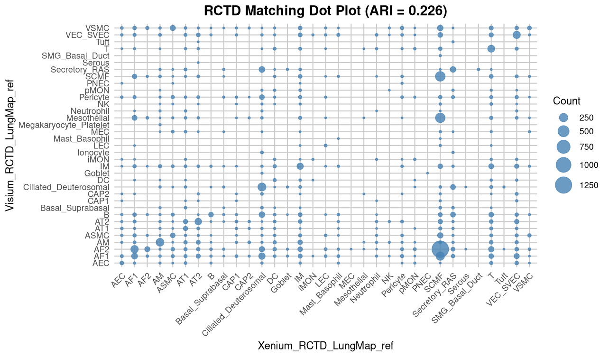

TNiche vs CNiche (Annotations from Vannan et al.)
```
plot_ARI_dotplot(
    sce = scTriangulate2,
    annotation1 = "TNiche",
    annotation2 = "CNiche",
    title = "TNiche-CNiche Matching Dot Plot"
)
```
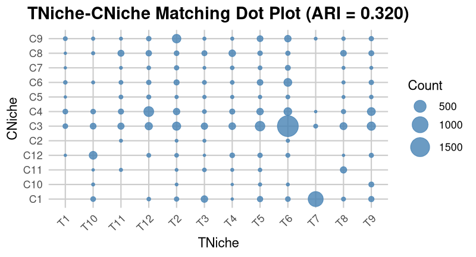

---
#### Existing `CellChat` (Suoqin Jin et al.) functions that can use in Spatial LungChat
Required to load
```
library(CellChat)
```
---
##### `netVisual_circle() `
- The width of edges represent the strength of the communication. 
#### Example usages
```
netVisual_circle(Xenium1@net$count, 
                 vertex.weight = group_sizes$Xenium1, 
                 title.name = "Xenium1 - Unaffected", 
                 vertex.label.cex = 0.8, 
                 margin = 0.4, 
                 remove.isolate = TRUE)
```
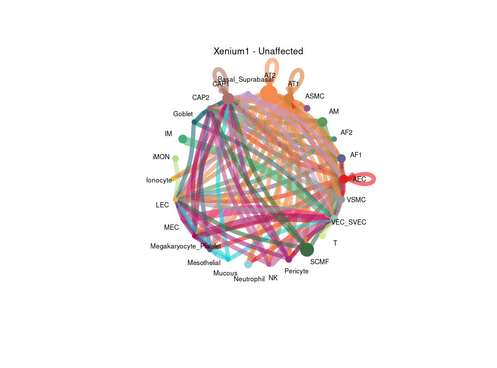

---
##### `obj`@netP$pathways
- Showing signaling pathways that were identified as active between cell types based on the input expression data and ligand-receptor interactions.
#### Example usages
Active Signaling Pathways in the Control Sample
```
> Xenium1_author@netP$pathways
[1] "SPP1"  "VEGF"  "UGRP1" "CCL"   "EGF"
```
Active Signaling Pathways in the a IPF Sample
``` 
> Xenium2_author@netP$pathways
[1] "UGRP1"  "SPP1"   "VEGF"   "CCL"    "FASLG"  "CXCL"   "APELIN"
```

---
##### `netVisual_heatmap()`
- Showing a heatmap to visualize the strength of cell-cell communication based on a specified measure.
#### Example usages
```
netVisual_heatmap(Xenium1_author, 
                  measure = "weight", 
                  color.heatmap = "Reds", 
                  title.name = "Xenium Control")
```
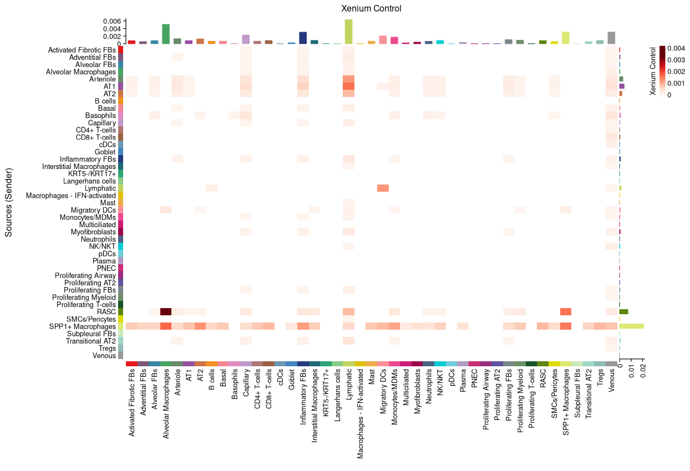
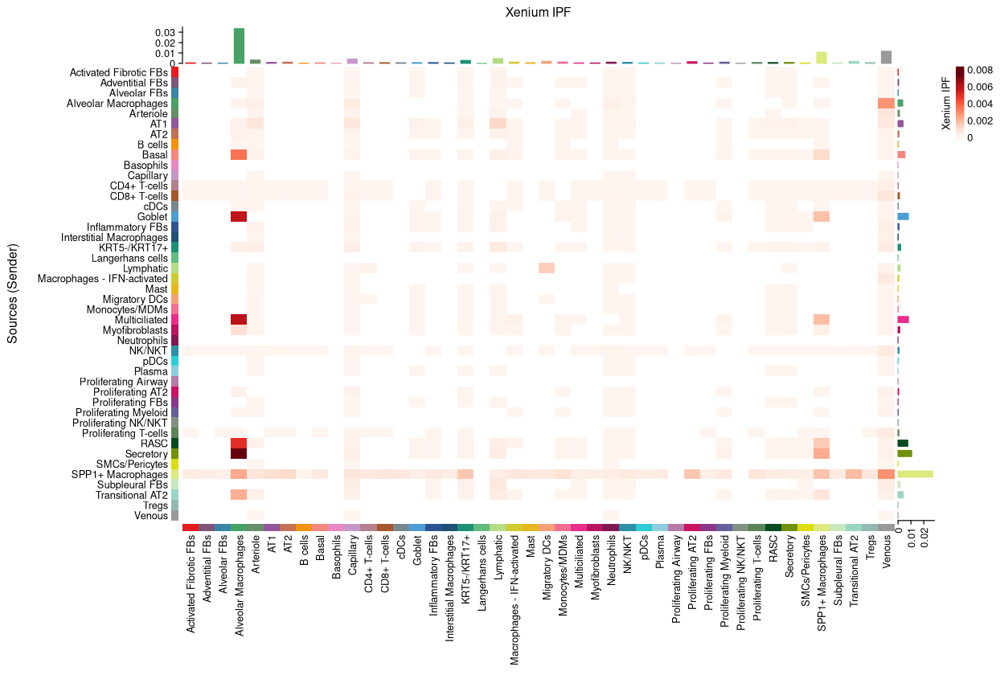

---
##### `netVisual_aggregate()`
- Visualize the inferred signaling network of signaling pathways
#### Example usages
Pathway-Specific Network (e.g., UGRP1)
```
netVisual_aggregate(Xenium2_author, 
                    signaling = "UGRP1", 
                    layout = "circle", 
                    remove.isolate = TRUE)
```
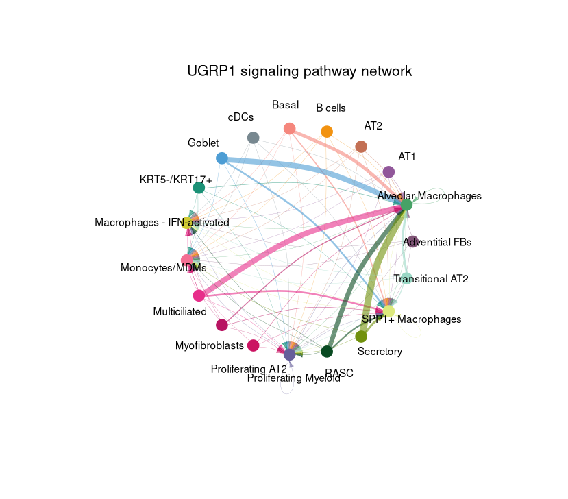

---
##### `netAnalysis_signalingRole_network()`
- Heatmap showing the centrality scores/importance of cell groups as senders, receivers, mediators and influencers in a single intercellular communication network 
#### Example usages
SPP1 signaling heatmap
```
netAnalysis_signalingRole_network(
    object = Xenium2_author,
    signaling = "SPP1",
    color.heatmap = "Reds"
)
```
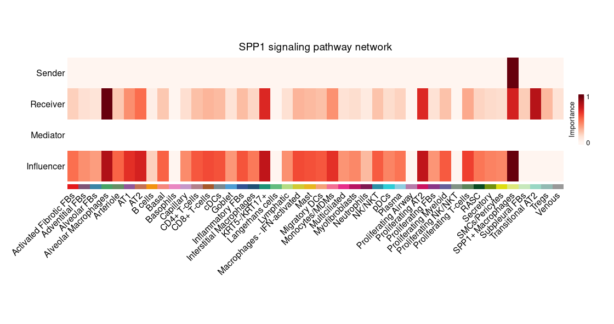

---
##### `subsetCommunication()`
- Extract Ligand–Receptor Table for a Pathway
#### Example usages
SPP1 signaling source - target
```
> subsetCommunication(Xenium2, signaling = "UGRP1", slot.name = "netP")
                   source target pathway_name         prob pval
1                      AM     AM        UGRP1 3.344582e-05 0.00
2                      AM     IM        UGRP1 1.214992e-07 0.00
3                      AM   iMON        UGRP1 5.487191e-07 0.02
4                      AM   pMON        UGRP1 5.926166e-07 0.00
5                    ASMC     AM        UGRP1 5.249921e-06 0.00
6                    ASMC     IM        UGRP1 1.907093e-08 0.00
7                    ASMC   iMON        UGRP1 8.612890e-08 0.04
8                    ASMC   pMON        UGRP1 9.301921e-08 0.00
9                     AT1     AM        UGRP1 2.777314e-04 0.00
10                    AT1     IM        UGRP1 1.009165e-06 0.00
11                    AT1   iMON        UGRP1 4.557614e-06 0.00
12                    AT1   pMON        UGRP1 4.922221e-06 0.00
13                    AT2     AM        UGRP1 1.527164e-04 0.00
14                    AT2     IM        UGRP1 5.548411e-07 0.00
15                    AT2   iMON        UGRP1 2.505790e-06 0.00
16                    AT2   pMON        UGRP1 2.706253e-06 0.00
17       Basal_Suprabasal     AM        UGRP1 2.248421e-03 0.00
18       Basal_Suprabasal     IM        UGRP1 8.185941e-06 0.00
19       Basal_Suprabasal   iMON        UGRP1 3.696860e-05 0.00
20       Basal_Suprabasal   pMON        UGRP1 3.992597e-05 0.00
21  Ciliated_Deuterosomal     AM        UGRP1 3.892635e-03 0.00
22  Ciliated_Deuterosomal     IM        UGRP1 1.419542e-05 0.00
23  Ciliated_Deuterosomal   iMON        UGRP1 6.410672e-05 0.00
24  Ciliated_Deuterosomal   pMON        UGRP1 6.923491e-05 0.00
25                     DC     AM        UGRP1 8.516510e-06 0.00
26                     DC     IM        UGRP1 3.093729e-08 0.00
27                     DC   iMON        UGRP1 1.397202e-07 0.04
28                     DC   pMON        UGRP1 1.508978e-07 0.00
29                 Goblet     AM        UGRP1 3.677811e-04 0.00
30                 Goblet     IM        UGRP1 1.336489e-06 0.00
31                 Goblet   iMON        UGRP1 6.035877e-06 0.00
32                 Goblet   pMON        UGRP1 6.518744e-06 0.00
33               Ionocyte     AM        UGRP1 1.081990e-04 0.00
34               Ionocyte     IM        UGRP1 3.930855e-07 0.00
35               Ionocyte   iMON        UGRP1 1.775266e-06 0.02
36               Ionocyte   pMON        UGRP1 1.917287e-06 0.00
37                    MEC     AM        UGRP1 6.131564e-05 0.00
38                    MEC     IM        UGRP1 2.227485e-07 0.00
39                    MEC   iMON        UGRP1 1.005985e-06 0.02
40                    MEC   pMON        UGRP1 1.086463e-06 0.00
41 Megakaryocyte_Platelet     AM        UGRP1 3.832315e-05 0.00
42 Megakaryocyte_Platelet     IM        UGRP1 1.392178e-07 0.00
43 Megakaryocyte_Platelet   iMON        UGRP1 6.287406e-07 0.01
44 Megakaryocyte_Platelet   pMON        UGRP1 6.790398e-07 0.00
45            Mesothelial     AM        UGRP1 7.048157e-06 0.00
46            Mesothelial     IM        UGRP1 2.560328e-08 0.00
47            Mesothelial   iMON        UGRP1 1.156305e-07 0.04
48            Mesothelial   pMON        UGRP1 1.248810e-07 0.00
49         SMG_Basal_Duct     AM        UGRP1 2.829325e-04 0.00
50         SMG_Basal_Duct     IM        UGRP1 1.028069e-06 0.00
51         SMG_Basal_Duct   pMON        UGRP1 5.014426e-06 0.00
52          Secretory_RAS     AM        UGRP1 5.862856e-03 0.00
53          Secretory_RAS     IM        UGRP1 2.142252e-05 0.00
54          Secretory_RAS   iMON        UGRP1 9.674195e-05 0.00
55          Secretory_RAS   pMON        UGRP1 1.044805e-04 0.00
56                   Tuft     AM        UGRP1 1.290768e-04 0.00
57                   Tuft     IM        UGRP1 4.689440e-07 0.00
58                   Tuft   pMON        UGRP1 2.287288e-06 0.00
```

---
#### 2. Ingestion
TO BE UPDATED 
