## 5. LungChat (LLM) functions

### Outline
[5.1. Xenium](#1-Xenium)


[5.1. Visualization/Analysis](#1-Visualization-&-Analysis)

[5.2. CellChat](#2-CellChat)

[5.3. Neighbors enrichment_analysis](#3-neighbors-enrichment_analysis)

[5.4. ToppCell](#4-ToppCell)

[5.5. Ingestion](#5-Ingestion)

---
### 1. Xenium

#### `analyze_proportions()`
- Analyze and Compare Cell Type Proportions Between Two Groups

#### Example usage
Frequency of TNiche between More_Affected (IPF) and Unaffected (Control).
```
analyze_proportions(
      obj = CellChat_Squidpy,
      annotation = "TNiche",
      sample_col = "sample",
      group1 = "More_Affected",
      group2 = "Unaffected"
  )
```
#### Output

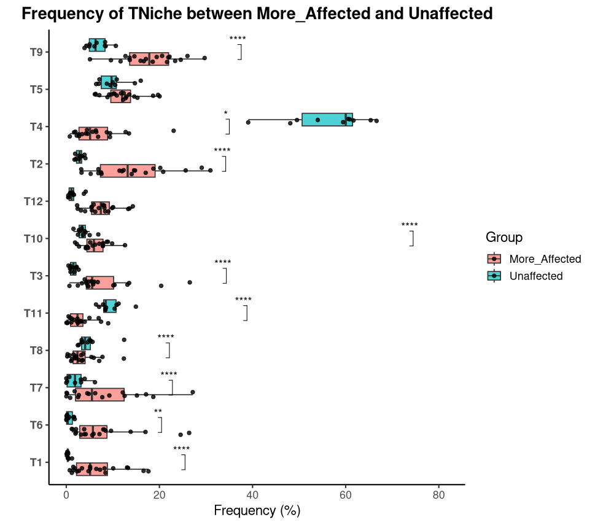

```
$stats_table
# A tibble: 12 × 7
   Category Group1        Group2     Samples_G1 Samples_G2      p_value p_value_adjusted
   <chr>    <chr>         <chr>           <int>      <int>        <dbl>            <dbl>
 1 T1       More_Affected Unaffected         20         10 0.000000266       0.00000160 
 2 T10      More_Affected Unaffected         20         10 0.00529           0.00705    
 3 T11      More_Affected Unaffected         19         10 0.00000969        0.0000145  
 4 T12      More_Affected Unaffected         20         10 0.000003          0.0000072  
 5 T2       More_Affected Unaffected         20         10 0.00000446        0.00000892 
 6 T3       More_Affected Unaffected         20         10 0.00000925        0.0000145  
 7 T4       More_Affected Unaffected         20         10 0.0000000666      0.000000799
 8 T5       More_Affected Unaffected         20         10 0.198             0.198      
 9 T6       More_Affected Unaffected         20         10 0.000002          0.0000072  
10 T7       More_Affected Unaffected         18          9 0.0405            0.0486     
11 T8       More_Affected Unaffected         20         10 0.0996            0.109      
12 T9       More_Affected Unaffected         20         10 0.000003          0.0000072  
```
---
#### `analyze_proportion_differences()`
- Analyze and Plot Cell Proportion Differences (Using Median)

#### Example usage
Identify cell types that are specific to IPF relative to controls.
```
analyze_proportion_differences(
      obj = CellChat_Squidpy,
      annotation = "Final_CT",
      sample_col = "sample",
      group1 = "More_Affected",
      group2 = "Unaffected",
      metric = "log2fc" # or "absolute_difference"
  )
```

#### Output
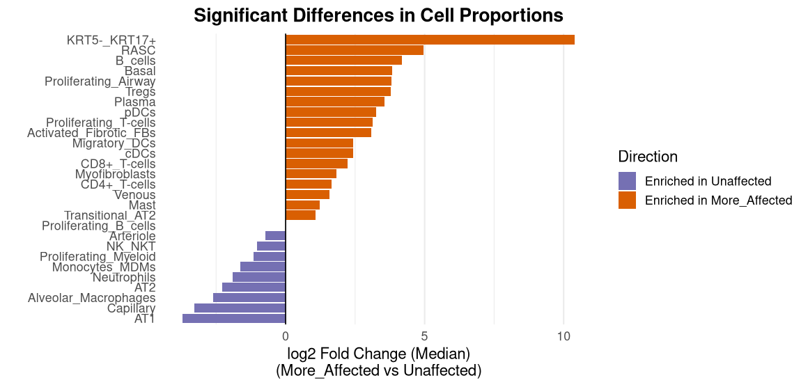

```
$table
# A tibble: 28 × 6
   Category               More_Affected Unaffected log2FoldChange      p_value p_value_adjusted
   <chr>                          <dbl>      <dbl>          <dbl>        <dbl>            <dbl>
 1 AT1                          0.00408    0.0534          -3.71  0.0000000666       0.00000104
 2 AT2                          0.0264     0.128           -2.28  0.000002           0.0000104 
 3 Activated_Fibrotic_FBs       0.0191     0.00228          3.07  0.00000126         0.00000846
 4 Alveolar_Macrophages         0.00338    0.0208          -2.62  0.00451            0.00883   
 5 Arteriole                    0.00406    0.00674         -0.732 0.0127             0.0239    
 6 B_cells                      0.0220     0.00120          4.19  0.000002           0.0000104 
 7 Basal                        0.0251     0.00175          3.84  0.00135            0.00288   
 8 CD4+_T-cells                 0.0587     0.0188           1.64  0.0000179          0.0000765 
 9 CD8+_T-cells                 0.0391     0.00842          2.22  0.0000000666       0.00000104
10 Capillary                    0.0251     0.244           -3.28  0.0000000666       0.00000104
# ℹ 18 more rows
# ℹ Use `print(n = ...)` to see more rows
```
---

#### `plot_annotation_heatmap()`
- Plot Concordance Heatmap with Per-Sample Normalization (Median)
- Creates a heatmap visualizing the median concordance between two annotations, normalized per sample.

#### Example usage
Relationship between TNiche and Final_CT (cell type annotation)
```
plot_annotation_heatmap(
      obj = CellChat_Squidpy,
      sample_col = "sample",
      primary_annotation = "TNiche",
      secondary_annotation = "Final_CT",
      group = "Unaffected"
  )
```

#### Output
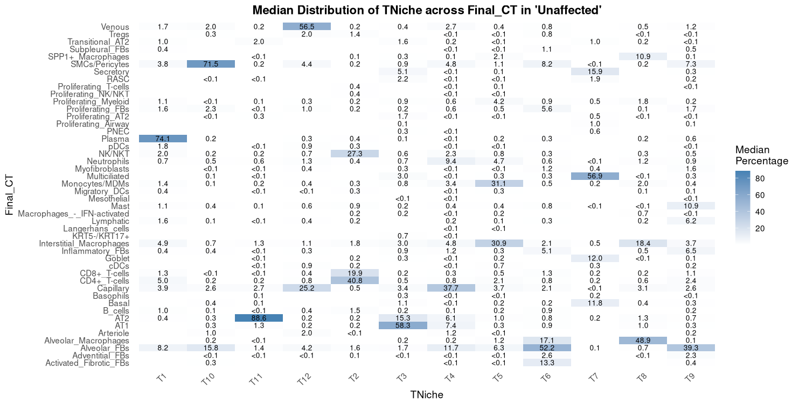

---
#### `find_annotation_enrichment()`
- Find Detailed Enrichment of Cell Types in a Secondary Annotation
- Calculates a detailed statistical summary (mean, median, min, max, IQR) of cell type enrichment across samples within a group.

#### Example usage
Determine which TNiches are enriched with activated fibrotic fibroblasts in IPF samples.
```
find_annotation_enrichment(
      obj = CellChat_Squidpy,
      sample_col = "sample",
      primary_annotation = "Final_CT",
      target_cell_types = "Activated_Fibrotic_FBs",
      secondary_annotation = "TNiche",
      group = "More_Affected"
  )
```

#### Output

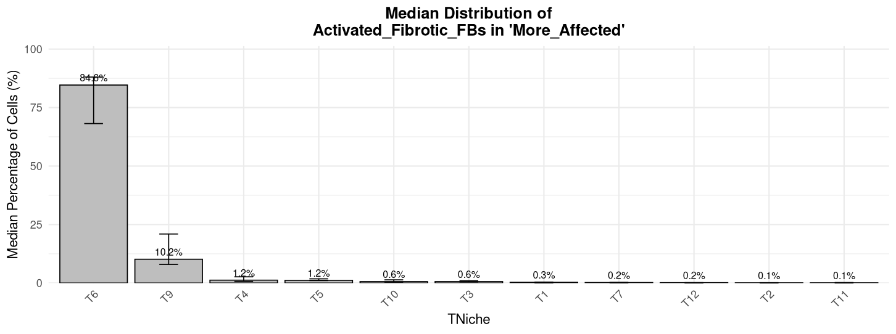

```
$summary_table
# A tibble: 11 × 9
   TNiche n_samples   mean  median     min    max     q25    q75    iqr
   <chr>      <int>  <dbl>   <dbl>   <dbl>  <dbl>   <dbl>  <dbl>  <dbl>
 1 T6            20 78.5   84.6    45.7    95.4   68.2    88.1   19.9  
 2 T9            20 15.8   10.2     1.82   39.7    7.97   21.0   13.0  
 3 T4            19  1.61   1.24    0.118   4.08   0.700   2.66   1.96 
 4 T5            19  1.73   1.16    0.619   6.43   1.06    1.80   0.742
 5 T10           18  1.30   0.616   0.101   5.84   0.371   1.37   0.996
 6 T3            16  1.02   0.609   0.0478  3.76   0.452   0.982  0.530
 7 T1            13  0.401  0.322   0.0336  1.61   0.107   0.422  0.315
 8 T7             2  0.212  0.212   0.0484  0.376  0.130   0.294  0.164
 9 T12           11  0.240  0.153   0.0336  1.29   0.0702  0.171  0.100
10 T2             7  0.175  0.0957  0.0214  0.643  0.0652  0.167  0.102
11 T11            8  0.157  0.0931  0.0428  0.382  0.0695  0.210  0.140
```
---

#### `get_group_specific_pairs()`
- Find Group-Specific cell-cell Interactions
- Identifies cell-cell communication pairs that are unique to a primary group (group1) compared to a control group (group2) using CellChat data
- It then annotates these unique pairs with spatial neighborhood enrichment data from Squidpy and filters them to find "spatially validated" interactions
- The spatial validation is based on two criteria:
1. Comparative Enrichment: The interaction is statistically stronger in group1 than group2 (p-value < pval_cutoff) and has a strong z-score
2. Group-Specific Enrichment: The interaction is strong in group1 (z-score > zscore_threshold) but absent or has insufficient data in group2

#### Example usage
Identify spatially-significant cell-cell interactions involving `Activated_Fibrotic_FBs` that are unique to the `More_Affected` lung tissue environment when compared to `Unaffected` tissue.
```
get_group_specific_pairs(
  obj = CellChat_Squidpy,
  annotation = "Final_CT",
  cell_type1 = "Activated_Fibrotic_FBs", 
  group1 = "More_Affected",               
  group2 = "Unaffected"
  )
```

#### Output
```
Found 33 significant interactions for cell type(s) in 'More_Affected'
Found 13 significant interactions for cell type(s) in 'Unaffected'
Analysis mode: Niche-Specific
Found 13 unique interaction patterns in control group ('Unaffected') to use for exclusion.
$spatially_validated_pairs
                  source                 target median_zscore_More_Affected median_zscore_Unaffected p_value
1           KRT5-_KRT17+ Activated_Fibrotic_FBs                    8.505345                       NA      NA
2 Activated_Fibrotic_FBs           KRT5-_KRT17+                    8.505345                       NA      NA

$spatially_validated_interactions_detailed
                  source                 target interaction_score median_zscore_More_Affected median_zscore_Unaffected ligand receptor pval interaction_name interaction_name_2 pathway_name         annotation                       evidence
1           KRT5-_KRT17+ Activated_Fibrotic_FBs           7.17e-7                    8.505345                       NA   EREG     EGFR    0        EREG_EGFR        EREG - EGFR          EGF Secreted Signaling                 KEGG: hsa04012
2 Activated_Fibrotic_FBs           KRT5-_KRT17+           4.22e-6                    8.505345                       NA  VEGFA      KDR    0     VEGFA_VEGFR2     VEGFA - VEGFR2         VEGF Secreted Signaling KEGG: hsa04370; PMID: 16633338
```
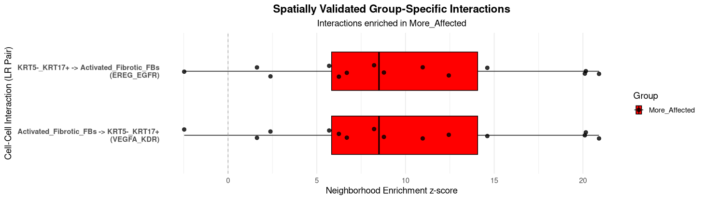

---

#### `rank_differential_interactions()`
- Rank and visualize differentially enriched cell interactions
- Performs a differential analysis on shared communication pathways between two groups. It identifies interactions significantly enriched in the primary group (group1), annotates them with spatial z-scores, and filters for a "spatially validated" subset
- This function produces two plots for comprehensive visualization:
1. Score Ratio Plot: A bar plot ranking the top interactions by the log2 fold change of their CellChat communication scores
2. Z-Score Boxplot: A boxplot showing the distribution of the underlying spatial neighborhood enrichment z-scores for the interactions shown in the bar plot

#### Example usage
Identify cell-cell communication pathways involving `SPP1+ Macrophages` that are significantly enriched in `More_Affected` compared to `Unaffected`
```
rank_differential_interactions(
  obj = CellChat_Squidpy,
  annotation = "Final_CT",
  cell_type1 = "SPP1+_Macrophages",
  group1 = "More_Affected",
  group2 = "Unaffected")
```

#### Output
```
$tables
$tables$all_differential_interactions
# A tibble: 66 × 11
   source            target            interaction_name ligand  receptor    interaction_score_More_Affected interaction_score_Unaf…¹ log2_score_ratio pathway_name neighborhood_enrichm…² neighborhood_enrichm…³
   <chr>             <chr>             <fct>            <chr>   <chr>       <chr>                           <chr>                               <dbl> <chr>                         <dbl>                  <dbl>
 1 SPP1+_Macrophages Transitional_AT2  SPP1_ITGAV_ITGB6 SPP1    ITGAV_ITGB6 1.15e-4                         3.98e-6                              4.86 SPP1                           0.78                  -0.88
 2 SPP1+_Macrophages Transitional_AT2  SPP1_ITGAV_ITGB1 SPP1    ITGAV_ITGB1 1.54e-4                         7.13e-6                              4.43 SPP1                           0.78                  -0.88
 3 Transitional_AT2  SPP1+_Macrophages SCGB3A2_MARCO    SCGB3A2 MARCO       3.34e-4                         2.23e-5                              3.91 UGRP1                          0.78                  -0.88
 4 SPP1+_Macrophages Basal             SPP1_ITGAV_ITGB1 SPP1    ITGAV_ITGB1 1.28e-4                         1.26e-5                              3.34 SPP1                          -4.66                  -1.52
 5 SPP1+_Macrophages Transitional_AT2  SPP1_CD44        SPP1    CD44        4.44e-4                         4.54e-5                              3.29 SPP1                           0.78                  -0.88
 6 SPP1+_Macrophages RASC              SPP1_CD44        SPP1    CD44        1.48e-4                         1.61e-5                              3.20 SPP1                           0.4                   -0.96
 7 SPP1+_Macrophages RASC              SPP1_ITGAV_ITGB1 SPP1    ITGAV_ITGB1 4.16e-5                         4.77e-6                              3.12 SPP1                           0.4                   -0.96
 8 SPP1+_Macrophages Tregs             SPP1_ITGAV_ITGB1 SPP1    ITGAV_ITGB1 2.70e-5                         3.23e-6                              3.06 SPP1                          -1.6                    1.01
 9 SPP1+_Macrophages Basal             SPP1_CD44        SPP1    CD44        2.92e-4                         3.54e-5                              3.05 SPP1                          -4.66                  -1.52
10 SPP1+_Macrophages Migratory_DCs     SPP1_CD44        SPP1    CD44        2.08e-4                         2.55e-5                              3.03 SPP1                          -1.76                  -0.26
# ℹ 56 more rows
# ℹ abbreviated names: ¹​interaction_score_Unaffected, ²​neighborhood_enrichment_More_Affected, ³​neighborhood_enrichment_Unaffected
# ℹ Use `print(n = ...)` to see more rows
```

```
$tables$spatially_validated_interactions
# A tibble: 15 × 11
   source            target                      interaction_name ligand  receptor    interaction_score_Mor…¹ interaction_score_Un…² log2_score_ratio pathway_name neighborhood_enrichm…³ neighborhood_enrichm…⁴
   <chr>             <chr>                       <fct>            <chr>   <chr>       <chr>                   <chr>                             <dbl> <chr>                         <dbl>                  <dbl>
 1 Proliferating_AT2 SPP1+_Macrophages           SCGB3A2_MARCO    SCGB3A2 MARCO       1.13e-4                 1.42e-5                            2.99 UGRP1                          2.2                   -1.28
 2 SPP1+_Macrophages Proliferating_AT2           SPP1_ITGAV_ITGB1 SPP1    ITGAV_ITGB1 1.11e-4                 1.78e-5                            2.64 SPP1                           2.2                   -1.28
 3 SPP1+_Macrophages Proliferating_AT2           SPP1_ITGAV_ITGB6 SPP1    ITGAV_ITGB6 4.75e-5                 7.69e-6                            2.62 SPP1                           2.2                   -1.28
 4 SPP1+_Macrophages Proliferating_AT2           SPP1_CD44        SPP1    CD44        2.46e-4                 5.26e-5                            2.23 SPP1                           2.2                   -1.28
 5 SPP1+_Macrophages AT1                         SPP1_CD44        SPP1    CD44        2.32e-4                 5.93e-5                            1.97 SPP1                           4                     -0.11
 6 SPP1+_Macrophages AT1                         SPP1_ITGAV_ITGB6 SPP1    ITGAV_ITGB6 1.28e-4                 3.51e-5                            1.86 SPP1                           4                     -0.11
 7 SPP1+_Macrophages SPP1+_Macrophages           SPP1_CD44        SPP1    CD44        2.67e-3                 8.42e-4                            1.66 SPP1                         119.                    18.6 
 8 SPP1+_Macrophages Proliferating_Myeloid       SPP1_CD44        SPP1    CD44        2.23e-4                 7.64e-5                            1.55 SPP1                          20.0                    0.54
 9 SPP1+_Macrophages Interstitial_Macrophages    SPP1_CD44        SPP1    CD44        2.63e-4                 1.04e-4                            1.34 SPP1                          15.6                    4.35
10 SPP1+_Macrophages AT1                         SPP1_ITGAV_ITGB1 SPP1    ITGAV_ITGB1 1.59e-4                 6.57e-5                            1.28 SPP1                           4                     -0.11
11 SPP1+_Macrophages Proliferating_Myeloid       SPP1_ITGAV_ITGB1 SPP1    ITGAV_ITGB1 5.27e-5                 2.21e-5                            1.25 SPP1                          20.0                    0.54
12 SPP1+_Macrophages SPP1+_Macrophages           SPP1_ITGAV_ITGB1 SPP1    ITGAV_ITGB1 6.13e-4                 2.69e-4                            1.19 SPP1                         119.                    18.6 
13 SPP1+_Macrophages Interstitial_Macrophages    SPP1_ITGAV_ITGB1 SPP1    ITGAV_ITGB1 6.29e-5                 2.88e-5                            1.13 SPP1                          15.6                    4.35
14 SPP1+_Macrophages Macrophages_-_IFN-activated SPP1_CD44        SPP1    CD44        9.65e-5                 4.46e-5                            1.11 SPP1                           6.02                   0.66
15 SPP1+_Macrophages Monocytes_MDMs              SPP1_CD44        SPP1    CD44        4.05e-4                 1.93e-4                            1.07 SPP1                           5                      1.29
# ℹ abbreviated names: ¹​interaction_score_More_Affected, ²​interaction_score_Unaffected, ³​neighborhood_enrichment_More_Affected, ⁴​neighborhood_enrichment_Unaffected
```
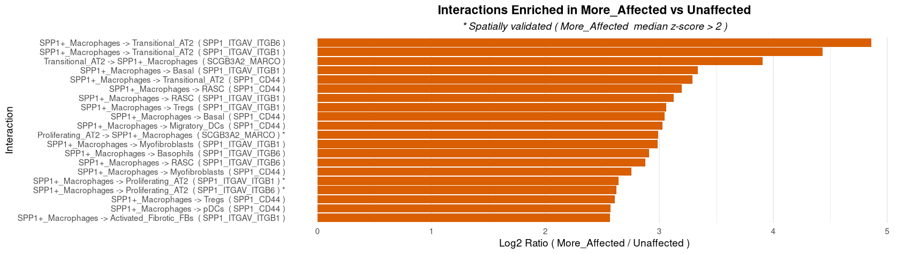
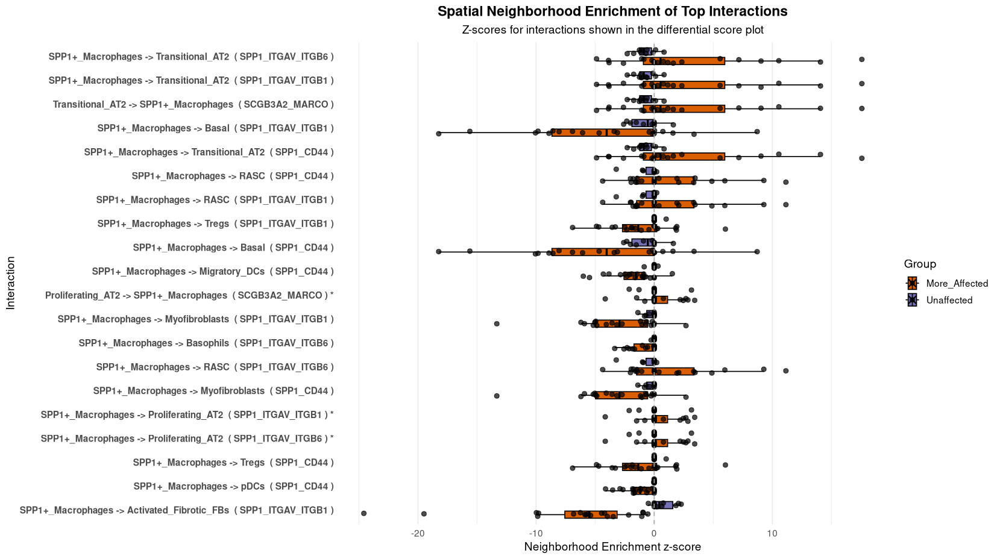

---

#### `analyze_and_plot_neighbors()`
- Analyze and plot neighborhood enrichment for a cell type
- Extracts neighborhood enrichment z-scores from Squidpy data
- Ranks potential neighbors by their median z-score across all samples, filters for eighbors exceeding a median z-score threshold (default > 2)
- Generates a box plot visualizing the z-score distribution for these enriched neighbors
- Prints and returns a summary table with detailed statistics (mean, median, SD, etc.) for the plotted neighbors

#### Example usage
Spatial neighborhood surrounding Activated Fibrotic Fibroblasts within the `More_Affected`
```
analyze_and_plot_neighbors(
    obj = CellChat_Squidpy,
    target_cell_type = "Activated_Fibrotic_FBs", 
    group = "More_Affected",
    annotation = "Final_CT"
)
```

#### Output
```
$table
  neighbor_cell_type n_samples mean_zscore median_zscore sd_zscore       IQR  min_zscore max_zscore
1       Alveolar_FBs        20   13.561409     12.586750  8.228680 14.408384  2.21463212  30.006152
2       KRT5-_KRT17+        20    9.741810      8.505345  7.250022  8.233726 -2.47237927  20.905892
3  Proliferating_FBs        20    6.371740      5.471122  4.872146  8.010324  0.01519762  15.440846
4     Myofibroblasts        20    4.835862      4.463621  3.742121  5.330900 -0.46442877  11.660489
5                AT1        20    2.682367      3.115398  4.300269  4.307805 -5.76034514   9.162316
6              Basal        20    1.221099      2.494432  5.395176  4.468255 -9.63941390  10.516897
```
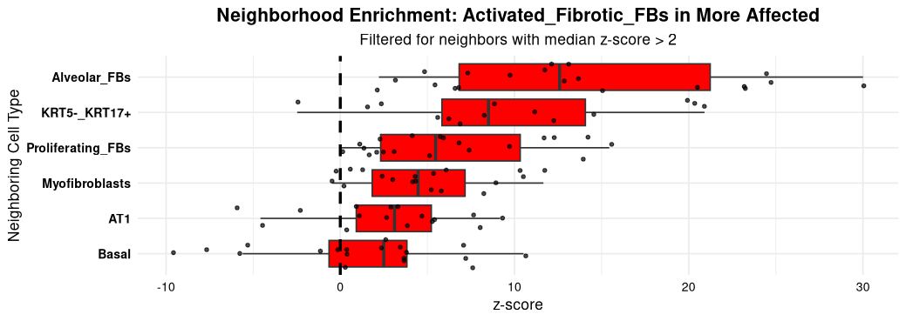

---

#### `find_diff_neighbors()`
- Find and plot differentially enriched neighbors
- Compares neighborhood enrichment between two groups for a target cell type, performs a t-test, and visualizes the result

#### Example usage
Identify differentially enriched neighbors of `Activated_Fibrotic_FBs` between `More_Affected` and `Unaffected`
```
find_diff_neighbors(
    obj = CellChat_Squidpy,
    group1 = "More_Affected",
    group2 = "Unaffected",
    annotation = "Final_CT",
    target_cell_type = "Activated_Fibrotic_FBs"
)
```

#### Output
```
$table
# A tibble: 3 × 8
  neighbor_cell_type mean_g1 median_g1 mean_g2 median_g2   p_value higher_association_in diff_mean
  <chr>                <dbl>     <dbl>   <dbl>     <dbl>     <dbl> <chr>                     <dbl>
1 Alveolar_FBs         13.6      12.6    2.11      0.549 0.0000467 More_Affected             11.4 
2 Proliferating_FBs     6.37      5.47   0.755     0.285 0.000170  More_Affected              5.62
3 AT1                   2.68      3.12  -0.859    -1.98  0.0202    More_Affected              3.54
```
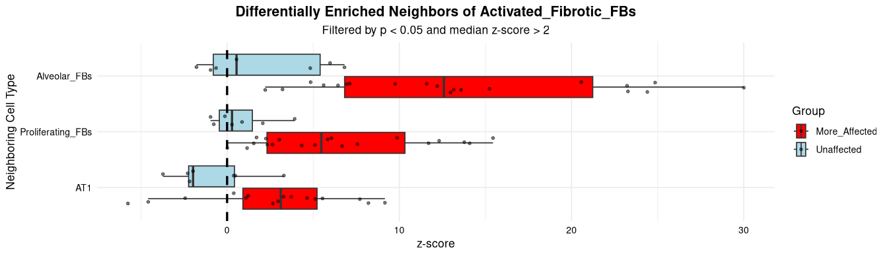

###########################
#### 1. Visualization & Analysis
Script: [`Spatial_functions.R`](./Spatial_functions_v5.R)

#### `plot_spatial()`
- Visualize spatial annotation (categorical or numeric) from a SummarizedExperiment object.

| **Parameter**       | **Type**                                        | **Default**  | **Options**                                                              | **Description**                                                                 |
| ------------------- | ----------------------------------------------- | ------------ | ------------------------------------------------------------------------ | ------------------------------------------------------------------------------- |
| `obj`               | `SingleCellExperiment` / `SummarizedExperiment` | *(required)* | —                                                                        | H5AD-derived object loaded using `zellkonverter::readH5AD()`                    |
| `platform`          | character                                       | `"Xenium"`   | `"Xenium"`, `"Visium"`                                                   | Used to select the appropriate UMAP coordinate columns                          |
| `annotation`        | character                                       | `"Final_CT"` | Any column in `colData(obj)`, e.g., `"Final_CT"`, `"pruned"`, `"TNiche"` | Column in `colData(obj)` used to color the UMAP plot                            |
| `title`             | character                                       | `NULL`       | —                                                                        | Custom plot title; if `NULL`, uses `"<platform> UMAP: <annotation>"`            |
| `point_size`        | numeric                                         | `0.5`        | Any positive number                                                      | Size of points in the UMAP scatterplot                                          |
| `legend_point_size` | numeric                                         | `4`          | Any positive number                                                      | Size of points in the legend                                                    |
| `highlight`         | character vector                                | `NULL`       | Subset of annotation levels, e.g., `c("AT1", "AT2")`                     | If set and `annotation` is a factor, highlights selected levels, others in grey |

[`The list of available annotations is here.`](./annotation_labels.md)

#### Example usages
Generates a spatial scatterplot of scTriangulate2 cells or spots, colored by the "pruned" annotation to visualize cell type or cluster identity across tissue space.
```
plot_spatial(scTriangulate2, annotation = "pruned")
```
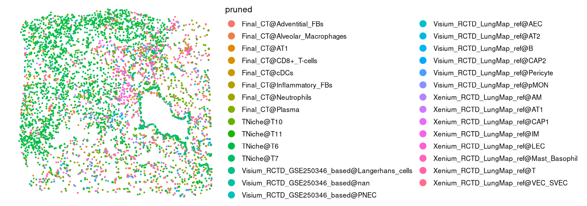

Generate a spatial plot highlighting `TNiche@T6` and `TNiche@T7` clusters
```
plot_spatial(scTriangulate2, 
             annotation = "pruned", 
             highlight = c("TNiche@T6", "TNiche@T7"))
```
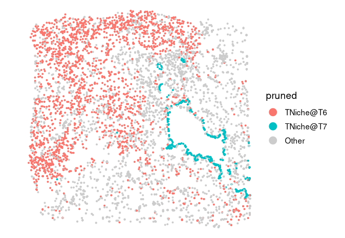

Generates a spatial map of the IPF microenvironment where each spot is colored by confidence score
```
plot_spatial(
    obj = scTriangulate2,
    annotation = "confidence",
    title = "Spatial Confidence Map of the IPF Microenvironment",
    point_size = 0.4
)
```
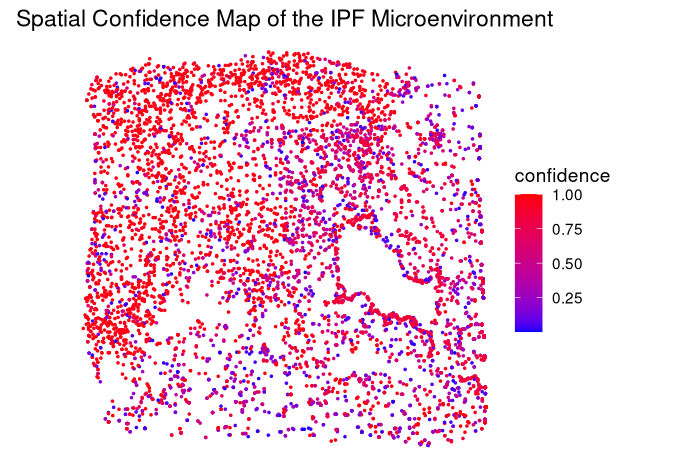

---
#### `plot_umap()`
- Visualize UMAP embedding for Visium HD or Xenium platforms using metadata or highlights.

| **Parameter**       | **Type**                                        | **Default**  | **Options**                                                              | **Description**                                                                 |
| ------------------- | ----------------------------------------------- | ------------ | ------------------------------------------------------------------------ | ------------------------------------------------------------------------------- |
| `obj`               | `SingleCellExperiment` / `SummarizedExperiment` | *(required)* | —                                                                        | H5AD-derived object loaded using `zellkonverter::readH5AD()`                    |
| `platform`          | character                                       | `"Xenium"`   | `"Xenium"`, `"Visium"`                                                   | Used to select the appropriate UMAP coordinate columns                          |
| `annotation`        | character                                       | `"Final_CT"` | Any column in `colData(obj)`, e.g., `"Final_CT"`, `"pruned"`, `"TNiche"` | Column in `colData(obj)` used to color the UMAP plot                            |
| `title`             | character                                       | `NULL`       | —                                                                        | Custom plot title; if `NULL`, uses `"<platform> UMAP: <annotation>"`            |
| `point_size`        | numeric                                         | `0.5`        | Any positive number                                                      | Size of points in the UMAP scatterplot                                          |
| `legend_point_size` | numeric                                         | `4`          | Any positive number                                                      | Size of points in the legend                                                    |
| `highlight`         | character vector                                | `NULL`       | Subset of annotation levels, e.g., `c("AT1", "AT2")`                     | If set and `annotation` is a factor, highlights selected levels, others in grey |

[`The list of available annotations is here.`](./annotation_labels.md)

#### Example usages
Xenium UMAP
```
plot_umap(scTriangulate2, 
          platform = "Xenium", 
          annotation = "Final_CT")
```
Visium HD UMAP
```
plot_umap(scTriangulate2, 
          platform = "Visium", 
          annotation = "Visium_RCTD_LungMap_ref")
```
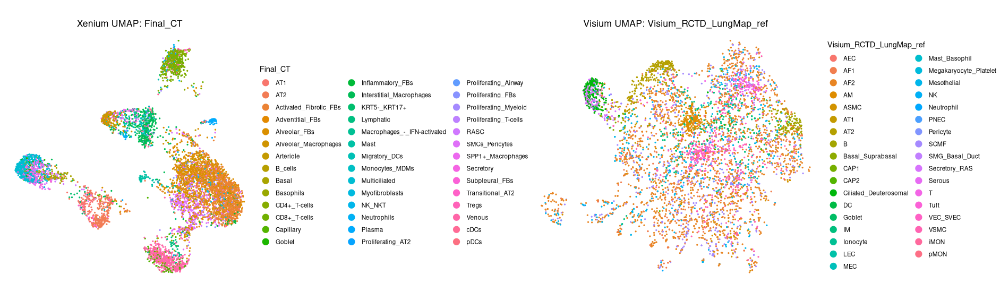

Xenium (AT1 & AT2)
```
plot_umap(scTriangulate2, 
          platform = "Visium", 
          annotation = "Visium_RCTD_LungMap_ref", 
          title = "Visium - AT1 & AT2",
          highlight = c("AT1", "AT2"))
```
Visium HD (AT1 & AT2)
```
plot_umap(scTriangulate2, 
          platform = "Xenium", 
          annotation = "Final_CT", 
          title = "Xenium - AT1 & AT2",
          highlight = c("AT1", "AT2"))
```
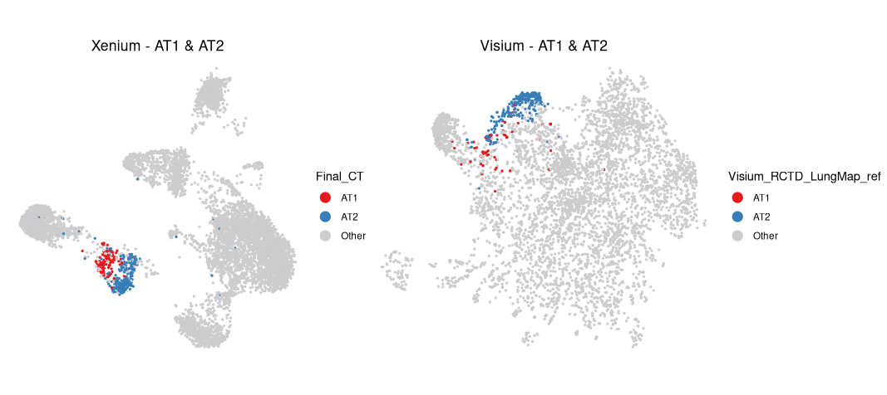

---
#### `plot_gene_spatial()`
- Plot spatial gene expression for Visium or Xenium using platform-specific coordinates.

| **Parameter** | **Type**                                        | **Default**                   | **Options**                                                | **Description**                                                           |
| ------------- | ----------------------------------------------- | ----------------------------- | ---------------------------------------------------------- | ------------------------------------------------------------------------- |
| `obj`         | `SingleCellExperiment` / `SummarizedExperiment` | *(required)*                  | —                                                          | H5AD-derived object loaded using `zellkonverter::readH5AD()`              |
| `gene`        | character                                       | *(required)*                  | Must match a row in `rownames(assay(obj))`, e.g., `"AGER"` | Gene to visualize (suffix added based on platform)                        |
| `platform`    | character                                       | `"Xenium"`                    | `"Xenium"`, `"Visium"`                                     | Platform used to determine spatial columns and gene suffix                |
| `x_col`       | character                                       | `"X_xenium_norm"` (if Xenium) | e.g., `"X_visium_norm"`, `"X_xenium_norm"`                 | Column in `colData(obj)` for X coordinates (auto-set by platform if NULL) |
| `y_col`       | character                                       | `"Y_xenium_norm"` (if Xenium) | e.g., `"Y_visium_norm"`, `"Y_xenium_norm"`                 | Column in `colData(obj)` for Y coordinates (auto-set by platform if NULL) |
| `title`       | character                                       | `NULL`                        | —                                                          | Custom plot title; if NULL, defaults to `"Spatial Expression of <gene>"`  |
| `point_size`  | numeric                                         | `0.5`                         | Any positive number                                        | Size of points on the scatterplot                                         |
| `low_color`   | character                                       | `"grey90"`                    | Any valid R color                                          | Color used for low expression                                             |
| `high_color`  | character                                       | `"red"`                       | Any valid R color                                          | Color used for high expression                                            |

[`The list of available genes is here.`](./available_genes_by_platform.md)

#### Example usages
```
plot_gene_spatial(scTriangulate2, 
                  gene = "COL1A1", 
                  platform = "Visium", 
                  point_size = 0.4,
                  title = "Visium - Expression of COL1A1")
                  
plot_gene_spatial(scTriangulate2, 
                  gene = "COL1A1", 
                  platform = "Xenium", 
                  point_size = 0.4,
                  title = "Xenium - Expression of COL1A1")
```
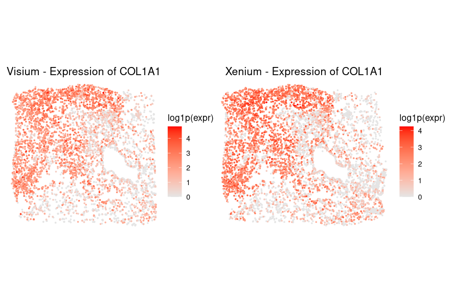

---
#### `rank_cross_platform_gene_correlation()`
- Rank genes by Pearson correlation across Xenium-Visium matched expression.

| **Parameter** | **Type**                                        | **Default**  | **Options**              | **Description**                                                               |
| ------------- | ----------------------------------------------- | ------------ | ------------------------ | ----------------------------------------------------------------------------- |
| `obj`         | `SingleCellExperiment` / `SummarizedExperiment` | *(required)* | —                        | Object containing gene expression from both Xenium and Visium platforms       |
| `top_genes`   | numeric                                         | `5`          | Any positive integer     | Number of top correlated gene pairs to return and visualize                   |
| `layer`       | character                                       | `"X"`        | Must match an assay name | Assay layer (e.g., `"X"`, `"counts"`, `"logcounts"`) used for expression data |

#### Example usages
Top 5 highly correlated genes (Visium HD - Xenium)
```
rank_cross_platform_gene_correlation(
    obj = scTriangulate2,
    top_genes = 5
)
```
Output
```
     Gene Correlation
1  COL1A1   0.8968483
2  COL3A1   0.6852229
3  COL1A2   0.6121173
4 SCGB3A2   0.5324030
5   MARCO   0.4863397
```
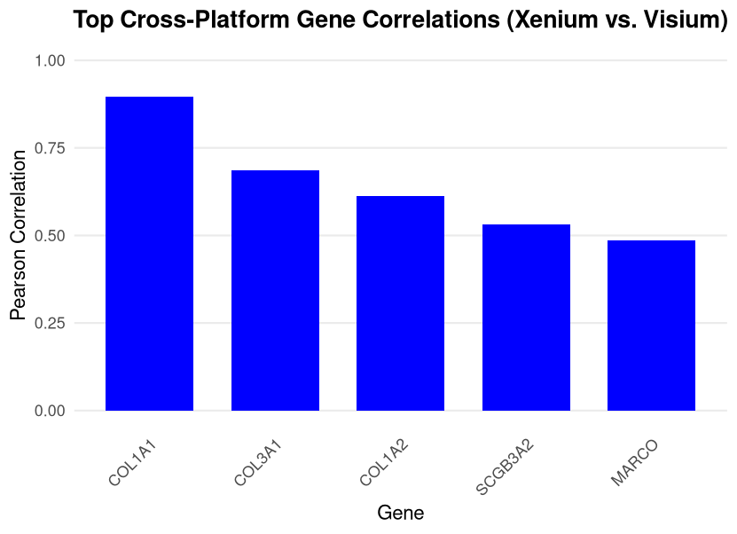

---
#### `generate_stability_report()`
- Summarize per-cluster metrics (confidence, reassign, SCCAF, TF-IDF 10, TF-IDF 5m Shapley)

| **Parameter**     | **Type**                                        | **Default**  | **Options**                                          | **Description**                                                      |
| ----------------- | ----------------------------------------------- | ------------ | ---------------------------------------------------- | -------------------------------------------------------------------- |
| `sce`             | `SingleCellExperiment` / `SummarizedExperiment` | *(required)* | —                                                    | Object containing stability metric columns and cell type annotations |
| `celltype_labels` | `list` (named character vectors)                | *(required)* | Format: `list("Annotation" = c("Label1", "Label2"))` | Specifies which cell type labels (per annotation) to evaluate        |

[`The list of available annotations is here.`](./annotation_labels.md)

#### Example usages
Stability of T cells 
```
# Define Inputs and Generate Outputs
# Define the single list of clusters you want to analyze and plot
clusters_to_process <- list(
    Final_CT = c("CD4+_T-cells", "CD8+_T-cells"),
    Visium_RCTD_LungMap_ref = c("T"),
    Visium_RCTD_GSE250346_based = c("CD4+_T-cells", "CD8+_T-cells")
)

# Call the function once to get both the table and the plot
output <- generate_stability_report(
    sce = scTriangulate2, 
    celltype_labels = clusters_to_process
)


# Print Both the Table and the Plot
if (!is.null(output)) {
    
    # Print the summary table
    print(kable(output$summary_table, digits = 3, caption = "Summary of Cell Type Stability Metrics"))
    
    # Print the final plot
    print(output$stability_plot)
    
}
```
Output
```
Table: Summary of Cell Type Stability Metrics

|Cluster                                  | Reassign| SCCAF| TF-IDF 5| TF-IDF 10| Shapley| Confidence|
|:----------------------------------------|--------:|-----:|--------:|---------:|-------:|----------:|
|Final_CT@CD4+_T-cells                    |    0.562| 0.767|    0.727|     0.540|   1.783|      0.599|
|Final_CT@CD8+_T-cells                    |    0.456| 0.722|    0.837|     0.673|   6.917|      0.850|
|Visium_RCTD_LungMap_ref@T                |    0.706| 0.789|    0.623|     0.521|   8.083|      0.156|
|Visium_RCTD_GSE250346_based@CD4+_T-cells |    0.476| 0.290|    0.520|     0.469|   0.783|      0.850|
|Visium_RCTD_GSE250346_based@CD8+_T-cells |    0.000| 0.304|    0.332|     0.305|   0.067|      0.128|
```
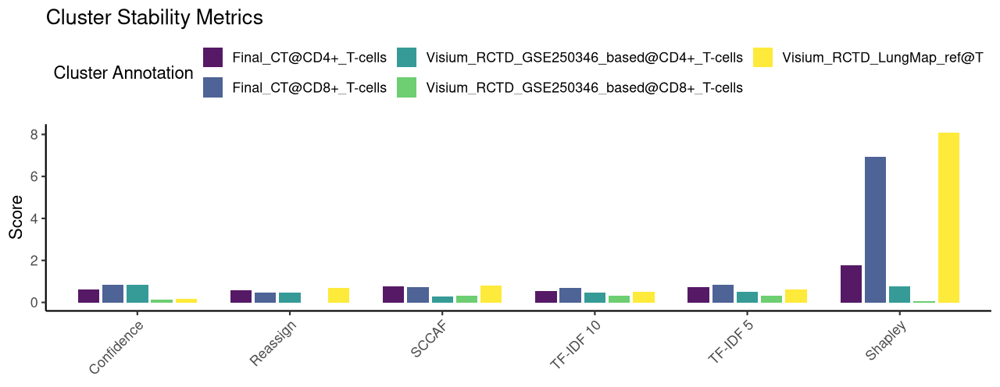

---
#### `rank_marker_specificity()`
- Rank how specific a gene is to a cell type using one-sided t-tests and FDR correction.

| **Parameter**  | **Type**                                        | **Default**             | **Options**                                           | **Description**                                                               |
| -------------- | ----------------------------------------------- | ----------------------- | ----------------------------------------------------- | ----------------------------------------------------------------------------- |
| `sce`          | `SingleCellExperiment` / `SummarizedExperiment` | *(required)*            | —                                                     | Object containing gene expression matrix and cluster annotations              |
| `gene_name`    | character                                       | `"COL1A1"`              | Any gene (with or without `_xenium`/`_visium` suffix) | Base name of the gene to assess for cluster-specific enrichment               |
| `cluster_cols` | character vector                                | `c("pruned")`           | One or more column names in `colData(sce)`            | Metadata columns used to define clusters or cell types                        |
| `assay_name`   | character                                       | `"X"`                   | Must exist in `assayNames(sce)`                       | Expression matrix to use                                                      |
| `platforms`    | character vector                                | `c("Xenium", "Visium")` | Subset of `c("Xenium", "Visium")`                     | Platforms to include when filtering by `meta$Platform`, if such column exists |
| `top_n`        | integer or `NULL`                               | `NULL`                  | `NULL` (all clusters) or a positive integer           | If set, returns only the top N cluster-gene combinations by adjusted p-value  |

[`The list of available genes is here.`](./available_genes_by_platform.md)

#### Example usages
COL1A1 - pruned, both Visium and Xenium
```
rank_marker_specificity(scTriangulate2, 
                        gene_name = "COL1A1",
                        top_n = 3)
```
Output
```
                    Cluster Mean_Expr Pct_Expr      P_Value Annotation_Source        P_Adj
1                 TNiche@T6 15.087205 99.83700 0.000000e+00            pruned 0.000000e+00
2 Final_CT@Inflammatory_FBs  8.892857 99.10714 2.637340e-07            pruned 3.824143e-06
3  Final_CT@Adventitial_FBs  6.216667 93.33333 3.877084e-01            pruned 1.000000e+00
```
Top 5 clusters across selected annotations
```
rank_marker_specificity(scTriangulate2,
                        gene_name = "COL1A1",
                        cluster_cols = c("Final_CT", "TNiche", "Xenium_RCTD_LungMap_ref"),
                        top_n = 5)
```
Output
```
                 Cluster Mean_Expr  Pct_Expr       P_Value       Annotation_Source         P_Adj
1                     T6 15.398747 100.00000  0.000000e+00                  TNiche  0.000000e+00
2                   SCMF 13.409579  99.00383  0.000000e+00 Xenium_RCTD_LungMap_ref  0.000000e+00
3 Activated_Fibrotic_FBs 17.800000  99.76744 6.613296e-302                Final_CT 1.851723e-300
4           Alveolar_FBs  9.208145  96.15385  2.075145e-59                Final_CT  4.357804e-58
5                    AF1 10.039419  93.77593  2.415718e-20 Xenium_RCTD_LungMap_ref  4.058406e-19
```
Visium-only, limited annotations
```
rank_marker_specificity(scTriangulate2,
                        gene_name = "COL1A1",
                        cluster_cols = c("Visium_RCTD_GSE250346_based"),
                        platforms = "Visium",
                        top_n = 3)
```
Output
```
                 Cluster Mean_Expr Pct_Expr       P_Value           Annotation_Source         P_Adj
1 Activated_Fibrotic_FBs 13.004885 97.06927 5.559134e-288 Visium_RCTD_GSE250346_based 2.501610e-286
2        Adventitial_FBs  7.719212 88.17734  1.283858e-07 Visium_RCTD_GSE250346_based  2.888679e-06
3         Subpleural_FBs  6.034483 93.10345  3.533602e-01 Visium_RCTD_GSE250346_based  1.000000e+00
```
---
#### `find_celltype_markers()`
- Identify top marker genes for a specific cell type by calculating their differential expression and statistical significance, returning both a ranked table and a volcano plot to visualize the results.

| **Parameter**     | **Type**                                        | **Default**  | **Options**                                   | **Description**                                                                |
| ----------------- | ----------------------------------------------- | ------------ | --------------------------------------------- | ------------------------------------------------------------------------------ |
| `sce`             | `SingleCellExperiment` / `SummarizedExperiment` | *(required)* | —                                             | Object containing normalized gene expression and metadata                      |
| `celltype`        | character                                       | *(required)* | Any value in `colData(sce)[[annotation_col]]` | Cell type label to compare against all others                                  |
| `annotation_col`  | character                                       | *(required)* | A column name in `colData(sce)`               | Metadata column that defines cell types or clusters                            |
| `platform`        | character                                       | `"Xenium"`   | `"Xenium"`, `"Visium"`                        | Platform used to select gene suffix (e.g., `_xenium`) for expression filtering |
| `assay_name`      | character                                       | `"X"`        | Any value in `assayNames(sce)`                | Expression assay to use                                                        |
| `top_n`           | integer                                         | `10`         | Any positive integer                          | Number of top-ranked marker genes to return                                    |
| `logfc_threshold` | numeric                                         | `0.25`       | ≥ 0                                           | Minimum log2 fold change threshold to consider as significant                  |
| `padj_threshold`  | numeric                                         | `0.05`       | (0, 1)                                        | Adjusted p-value (FDR) threshold for statistical significance                  |


#### Example usages
Identify top marker genes for T6
```
# Define Inputs and Find Markers
marker_report <- find_celltype_markers(
    sce = scTriangulate2,
    celltype = "T6",
    annotation_col = "TNiche",
    platform = "xenium"
)
# Access and Print Both the Table and the Plot
if (!is.null(marker_report)) {
    # Print the ranked table of top marker genes
    print(kable(marker_report$table, digits = 3, caption = "Top Marker Genes"))
    
    # Print the volcano plot
    print(marker_report$plot)
}
```
Output
```
Table: Top Marker Genes

|gene   | logFC| P_Value| P_Adj| log10_P_Adj|significant |
|:------|-----:|-------:|-----:|-----------:|:-----------|
|COL1A1 | 3.647|       0|     0|     335.145|TRUE        |
|MEG3   | 3.508|       0|     0|     335.145|TRUE        |
|COL3A1 | 3.403|       0|     0|     335.145|TRUE        |
|SFRP4  | 3.148|       0|     0|     335.145|TRUE        |
|LUM    | 3.067|       0|     0|     335.145|TRUE        |
|COL1A2 | 3.058|       0|     0|     335.145|TRUE        |
|CTHRC1 | 3.047|       0|     0|     335.145|TRUE        |
|DCN    | 2.268|       0|     0|     335.145|TRUE        |
|POSTN  | 1.964|       0|     0|     335.145|TRUE        |
|FN1    | 1.251|       0|     0|     335.145|TRUE        |
```
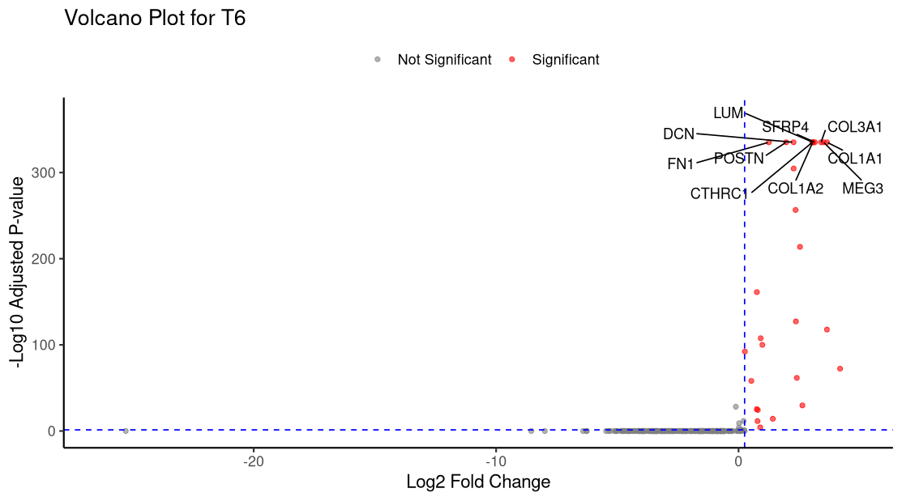

---
#### `generate_marker_report()`
- Analyzes the expression specificity of given genes across various cell type annotations, returning both a ranked statistical table and a dot plot summarizing the results.

| **Parameter**     | **Type**                                        | **Default**  | **Options**                                                           | **Description**                                                              |
| ----------------- | ----------------------------------------------- | ------------ | --------------------------------------------------------------------- | ---------------------------------------------------------------------------- |
| `obj`             | `SingleCellExperiment` / `SummarizedExperiment` | *(required)* | —                                                                     | Object containing expression data and cell metadata                          |
| `genes`           | `character vector`                              | *(required)* | Any set of gene names (e.g., `"COL1A1"`, `"AGER"`, `"CD3D"`)          | Gene names to test for enrichment                                            |
| `annotation_cols` | `character vector`                              | *(required)* | Must match columns in `colData(obj)` (e.g., `"Final_CT"`, `"pruned"`) | Annotation columns used to group cells for differential expression testing   |
| `assay_name`      | `character`                                     | `"X"`        | Any valid assay in `assayNames(obj)`                                  | Assay layer to pull expression data from                                     |
| `min_pct`         | `numeric`                                       | `5`          | 0–100                                                                 | Minimum percentage of expressing cells in a cluster to include the gene      |
| `max_genes_plot`  | `integer`                                       | `50`         | Positive integer or `NULL`                                            | Max number of genes to display in dot plot; `NULL` shows all passing filters |

[`The list of available genes is here.`](./available_genes_by_platform.md)

#### Example usages
List cell types that "COL1A1", "AGER", "CD3D", "SFTPC" are differentially expressed.
```
# Define Inputs and Generate Outputs
genes_of_interest <- c("COL1A1", "AGER", "CD3D", "SFTPC")
annotations_to_process <- c("pruned")

# Call the function
marker_report <- generate_marker_report(
    obj = scTriangulate2,
    genes = genes_of_interest,
    annotation_cols = annotations_to_process
)


# Access and Print Both the Table and the Plot
if (!is.null(marker_report)) {
    # Print the full, ranked data table
    print(kable(marker_report$table, digits = 3, caption = "Marker Gene Specificity Ranking"))
    
    # Print the dot plot
    print(marker_report$plot)
}
```
Output (Portion)
```
Table: Marker Gene Specificity Ranking

|Gene   |Platform |Cluster                                             | Mean_Expr| Pct_Expr| P_Value| P_Adj|
|:------|:--------|:---------------------------------------------------|---------:|--------:|-------:|-----:|
|COL1A1 |Visium   |pruned@TNiche@T6                                    |    13.681|   99.307|   0.000| 0.000|
|COL1A1 |Xenium   |pruned@TNiche@T6                                    |    15.087|   99.837|   0.000| 0.000|
|SFTPC  |Xenium   |pruned@TNiche@T11                                   |    18.464|   93.724|   0.000| 0.000|
|CD3D   |Xenium   |pruned@Xenium_RCTD_LungMap_ref@T                    |     1.008|   60.615|   0.000| 0.000|
|CD3D   |Xenium   |pruned@Final_CT@CD8+_T-cells                        |     1.052|   56.897|   0.000| 0.000|
|SFTPC  |Visium   |pruned@TNiche@T11                                   |     0.732|   31.799|   0.000| 0.000|
|AGER   |Xenium   |pruned@Final_CT@AT1                                 |     3.209|   79.104|   0.000| 0.000|
|AGER   |Xenium   |pruned@Xenium_RCTD_LungMap_ref@AT1                  |     2.037|   57.009|   0.000| 0.000|
|SFTPC  |Visium   |pruned@Visium_RCTD_LungMap_ref@AT2                  |     0.990|   46.392|   0.000| 0.000|
|AGER   |Xenium   |pruned@TNiche@T11                                   |     0.427|   27.615|   0.000| 0.000|
|COL1A1 |Xenium   |pruned@Final_CT@Inflammatory_FBs                    |     8.893|   99.107|   0.000| 0.000|
|CD3D   |Visium   |pruned@Xenium_RCTD_LungMap_ref@T                    |     0.120|    7.821|   0.000| 0.000|
|CD3D   |Xenium   |pruned@Visium_RCTD_LungMap_ref@B                    |     0.241|   14.815|   0.004| 0.065|
|COL1A1 |Visium   |pruned@Final_CT@Inflammatory_FBs                    |     7.312|   99.107|   0.010| 0.167|
|AGER   |Visium   |pruned@Xenium_RCTD_LungMap_ref@AT1                  |     0.047|    4.673|   0.017| 0.265|
|SFTPC  |Xenium   |pruned@Xenium_RCTD_LungMap_ref@AT1                  |     1.336|   35.514|   0.019| 0.282|
|CD3D   |Xenium   |pruned@Visium_RCTD_LungMap_ref@AEC                  |     0.323|   14.516|   0.021| 0.283|
|SFTPC  |Visium   |pruned@Xenium_RCTD_LungMap_ref@AT1                  |     0.178|    8.411|   0.051| 0.653|
|AGER   |Visium   |pruned@Visium_RCTD_LungMap_ref@AT2                  |     0.031|    3.093|   0.059| 0.719|
|CD3D   |Xenium   |pruned@Visium_RCTD_LungMap_ref@Pericyte             |     0.273|   10.606|   0.065| 0.759|
```
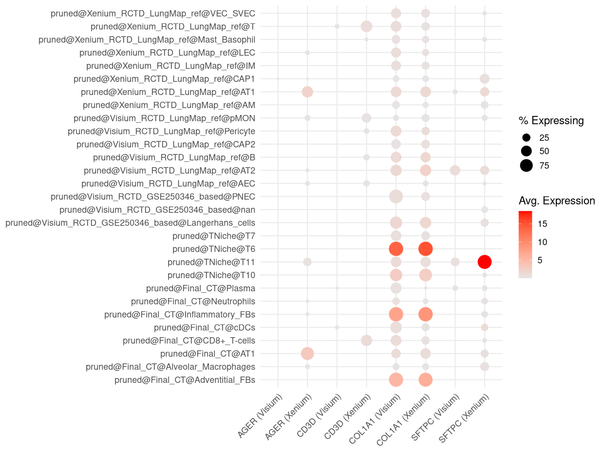

---
#### `plot_ARI_dotplot()`
- Plot pairwise cluster overlap using dotplot and display Adjusted Rand Index (ARI).

| **Parameter** | **Type**                                         | **Default**  | **Options**                                                                                                                                    | **Description**                                                            |
| ------------- | ------------------------------------------------ | ------------ | ---------------------------------------------------------------------------------------------------------------------------------------------- | -------------------------------------------------------------------------- |
| `obj`         | `SingleCellExperiment` or `SummarizedExperiment` | *(required)* | —                                                                                                                                              | Object containing cell metadata with clustering annotations.               |
| `annotation1` | `character`                                      | *(required)* | `pruned`, `Final_CT`, `Final_lineage`, `CNiche`, `TNiche`, `Visium_RCTD_LungMap_ref`, `Visium_RCTD_GSE250346_based`, `Xenium_RCTD_LungMap_ref` | First clustering annotation to compare.                                    |
| `annotation2` | `character`                                      | *(required)* | `pruned`, `Final_CT`, `Final_lineage`, `CNiche`, `TNiche`, `Visium_RCTD_LungMap_ref`, `Visium_RCTD_GSE250346_based`, `Xenium_RCTD_LungMap_ref` | Second clustering annotation to compare.                                   |
| `title`       | `character` or `NULL`                            | `NULL`       | Custom string or `NULL`                                                                                                                        | Optional plot title; if `NULL`, auto-generates a title with the ARI value. |
| `size_range`  | `numeric vector (length = 2)`                    | `c(1, 10)`   | Any numeric range                                                                                                                              | Range of point sizes in the dot plot based on cross-tabulated frequency.   |

#### Example usages
ARI between Visium HD and Xenium RCTD based on LungMap ref
```
plot_ARI_dotplot(
  obj = scTriangulate2,
  annotation1 = "Xenium_RCTD_LungMap_ref",
  annotation2 = "Visium_RCTD_LungMap_ref",
  title = "RCTD Matching Dot Plot"
)
```
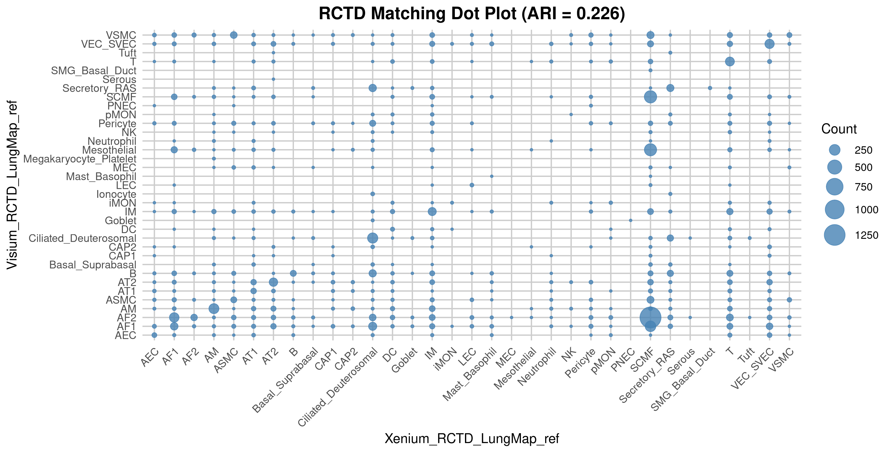

---
#### `plot_cluster_composition_groupedbar()`
- Compare cluster or cell-type compositions between one or two annotations using barplots.

| **Parameter** | **Type**                                        | **Default**  | **Options**                                                                                                                                    | **Description**                                                             |
| ------------- | ----------------------------------------------- | ------------ | ---------------------------------------------------------------------------------------------------------------------------------------------- | --------------------------------------------------------------------------- |
| `obj`         | `SingleCellExperiment` / `SummarizedExperiment` | *(required)* | —                                                                                                                                              | Object containing clustering annotations and metadata in `colData`.         |
| `annotation`  | `character vector` (length 1 or 2)              | *(required)* | `pruned`, `Final_CT`, `Final_lineage`, `CNiche`, `TNiche`, `Visium_RCTD_LungMap_ref`, `Visium_RCTD_GSE250346_based`, `Xenium_RCTD_LungMap_ref` | One or two annotation columns to compare cluster composition.               |
| `palette`     | named `character` vector or `NULL`              | `NULL`       | e.g., `c("Visium" = "blue", "Xenium" = "red")`                                                                                                 | Custom fill colors for annotation sources. If `NULL`, uses default palette. |
| `title`       | `character` or `NULL`                           | `NULL`       | —                                                                                                                                              | Custom plot title. If `NULL`, uses `"Cluster Composition Comparison"`.      |
| `rotate_x`    | `logical`                                       | `TRUE`       | `TRUE`, `FALSE`                                                                                                                                | Whether to rotate x-axis labels by 45° for readability.                     |

#### Example usages
`pruned` cell type composition
```
plot_cluster_composition_groupedbar(
    obj = scTriangulate2,
    annotation = c("pruned")
)
```


Comparison between `Visium_RCTD_LungMap_ref` and `Xenium_RCTD_LungMap_ref`
```
plot_cluster_composition_groupedbar(
    obj = scTriangulate2,
    annotation = c("Visium_RCTD_LungMap_ref", "Xenium_RCTD_LungMap_ref")
)
```
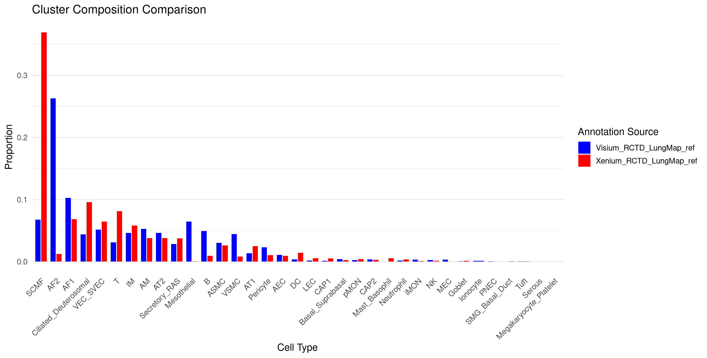

---
#### `compare_annotations_via_heatmap()`
- Visualize overlap between two annotations using a normalized confusion matrix heatmap.

| **Parameter** | **Type**                                        | **Default**  | **Options**                                                                                                                                    | **Description**                                                       |
| ------------- | ----------------------------------------------- | ------------ | ---------------------------------------------------------------------------------------------------------------------------------------------- | --------------------------------------------------------------------- |
| `obj`         | `SingleCellExperiment` / `SummarizedExperiment` | *(required)* | —                                                                                                                                              | Object containing annotation metadata in `colData`.                   |
| `annotation1` | `character`                                     | *(required)* | `pruned`, `Final_CT`, `Final_lineage`, `CNiche`, `TNiche`, `Visium_RCTD_LungMap_ref`, `Visium_RCTD_GSE250346_based`, `Xenium_RCTD_LungMap_ref` | First annotation column to use as heatmap rows.                       |
| `annotation2` | `character`                                     | *(required)* | Same as `annotation1`                                                                                                                          | Second annotation column to use as heatmap columns.                   |
| `normalize`   | `character`                                     | `"none"`     | `"none"`, `"row"`, `"column"`, `"both"`                                                                                                        | Normalize values by row, column, both, or not at all (raw counts).    |
| `palette`     | `character`                                     | `"Blues"`    | Any valid palette from `RColorBrewer::brewer.pal.info` (e.g., `"Reds"`, `"Purples"`)                                                           | Color palette for the heatmap fill.                                   |
| `title`       | `character` or `NULL`                           | `NULL`       | —                                                                                                                                              | Custom plot title. If `NULL`, uses `"Annotation Comparison Heatmap"`. |

#### Example usages
Comparison between `pruned` and `Final_CT`
```
compare_annotations_via_heatmap(
    obj = scTriangulate2,
    annotation1 = "pruned",
    annotation2 = "Final_CT",
    normalize = "row"
)
```
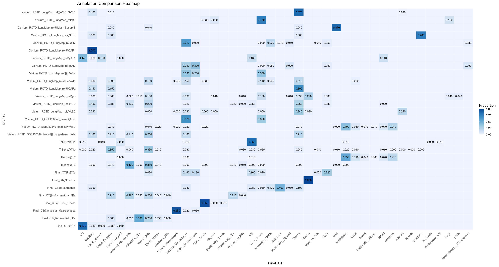

---
#### `visualize_matched_pairs_scatter()`
- Scatterplot showing gene expression correlation across Visium and Xenium matched spots.

| **Parameter**      | **Type**                                    | **Default**  | **Options / Example Values** | **Description**                                                       |
| ------------------ | ------------------------------------------- | ------------ | ---------------------------- | --------------------------------------------------------------------- |
| `obj`              | `SingleCellExperiment` or compatible object | *(required)* | —                            | Object with gene expression matrix and matched Visium/Xenium entries. |
| `gene`             | `character`                                 | *(required)* | e.g., `"COL1A1"`             | Base gene name (assumes suffixes `_visium` and `_xenium` exist).      |
| `layer`            | `character`                                 | `"X"`        | Any valid assay layer        | Layer from which to extract expression data.                          |
| `log1p`            | `logical`                                   | `TRUE`       | `TRUE`, `FALSE`              | Apply log(1 + x) transformation to expression values.                 |
| `point_size`       | `numeric`                                   | `0.4`        | e.g., `0.2`, `0.5`, `1.0`    | Size of scatter plot points.                                          |
| `alpha`            | `numeric`                                   | `0.6`        | Range: 0–1                   | Opacity of scatter plot points.                                       |
| `show_correlation` | `logical`                                   | `FALSE`      | `TRUE`, `FALSE`              | If `TRUE`, displays Pearson correlation in the title.                 |
| `title`            | `character` o                               |              |                              |                                                                       |

[`The list of available genes is here.`](./available_genes_by_platform.md)
#### Example usages
COL1A1 correlation between Visium HD and Xenium
```
visualize_matched_pairs_scatter(
  obj = scTriangulate2,
  gene = "COL1A1",
  show_correlation = TRUE
)
```
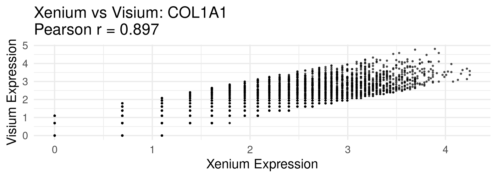

---
#### `generate_de_volcano_plot()`
- Generate table and volcano plot of DE genes
#### Example usages
Identify DEGs in 'More_Affected' T6 in IPF samples comapred to 'Unaffected' T6 control samples
```
generate_de_volcano_plot(
    obj_list = CellChat_Squidpy[["CellChat"]],
    annotation = "TNiche",
    group_1 = "More_Affected",
    group_2 = "Unaffected",
    celltype_filter = "T6",
    label_top_n = 10
)
```
Output (Top 10 genes)
```
        Gene         p_val avg_log2FC pct.1 pct.2     p_val_adj log10_padj             Sig
1      POSTN 1.782835e-270  2.1740071 0.576 0.152 6.115124e-268 267.213595   Up in Group 1
2     S100A8 2.645121e-161 -1.8177308 0.020 0.113 9.072766e-159 158.042260 Down in Group 1
3     PDGFRA 2.454663e-145 -1.3288754 0.287 0.517 8.419495e-143 142.074714 Down in Group 1
4      PLIN2 2.455126e-135 -1.6178956 0.106 0.278 8.421081e-133 132.074632 Down in Group 1
5   HIST1H1C 4.041545e-129 -1.4691020 0.140 0.328 1.386250e-126 125.858158 Down in Group 1
6      SFRP2  1.517121e-89  1.1355709 0.486 0.254  5.203725e-87  86.283686   Up in Group 1
7       SOD2  1.167657e-82 -0.9161804 0.355 0.533  4.005063e-80  79.397391 Down in Group 1
8       EGFR  1.174035e-72 -1.1470345 0.105 0.231  4.026941e-70  69.395025 Down in Group 1
9     COL1A1  5.299139e-65  0.3064564 0.959 0.933  1.817605e-62  61.740501   Up in Group 1
10     MFAP5  4.301939e-64 -2.0013742 0.016 0.065  1.475565e-61  60.831042 Down in Group 1
```
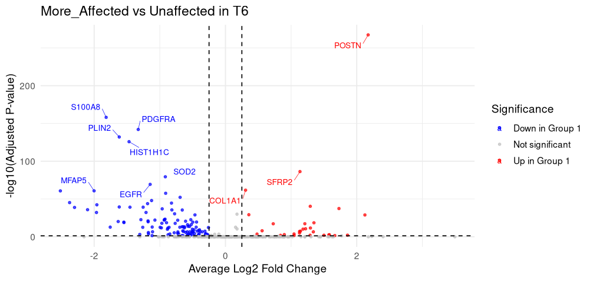

Indentify DEGs in 'More_Affected' in IPF samples comapred to 'Unaffected' control samples
```
generate_de_volcano_plot(
    obj_list = CellChat_Squidpy[["CellChat"]],
    annotation = "TNiche",
    group_1 = "More_Affected",
    group_2 = "Unaffected"
)
```
Output (Top 10 genes)
```
$table
         Gene p_val avg_log2FC pct.1 pct.2 p_val_adj log10_padj             Sig
1       MS4A1     0   3.928060 0.051 0.008         0        300   Up in Group 1
2       CD79A     0   3.757472 0.066 0.006         0        300   Up in Group 1
3         CA4     0  -3.645654 0.011 0.111         0        300 Down in Group 1
4        MMP7     0   3.191984 0.076 0.016         0        300   Up in Group 1
5      JCHAIN     0   3.188527 0.252 0.045         0        300   Up in Group 1
6       SFRP2     0   3.173698 0.203 0.030         0        300   Up in Group 1
7   TNFRSF13C     0   3.107436 0.057 0.012         0        300   Up in Group 1
8       FOXP3     0   2.890871 0.016 0.003         0        300   Up in Group 1
9        FCN3     0  -2.884330 0.035 0.195         0        300 Down in Group 1
10       AGER     0  -2.841862 0.022 0.116         0        300 Down in Group 1
```
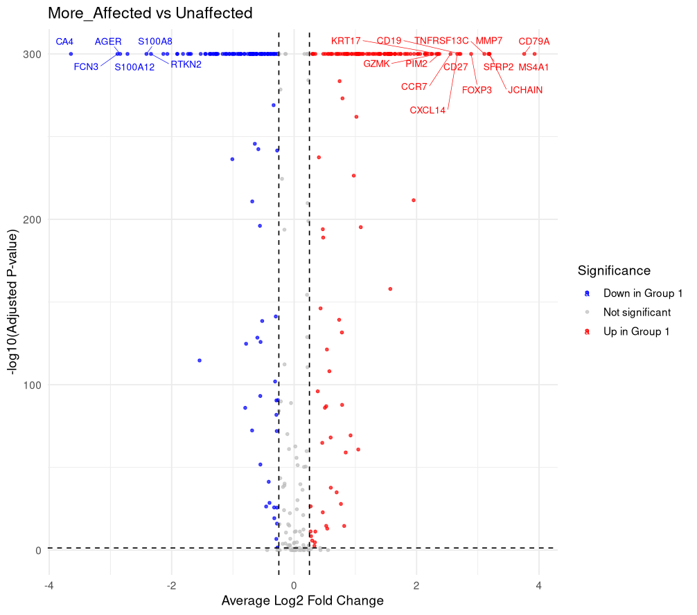

---
#### 2. CellChat
Cell-Cell communication analysis pakage developed by Jin et al.

#### Pre-processing
```
# Pre-processing
library(CellChat)
# Initialize output list to store group sizes
groupSizes <- list()
for (annot in names(CellChat_Squidpy$CellChat)) {
  groupSizes[[annot]] <- list()
  for (affect in names(CellChat_Squidpy$CellChat[[annot]])) {
    obj <- CellChat_Squidpy$CellChat[[annot]][[affect]]
    
    # Match idents to ordering in the net$count matrix
    idents_order <- rownames(obj@net$count)
    groupSizes[[annot]][[affect]] <- as.numeric(table(factor(obj@idents, levels = idents_order)))
    
    # Optional: recompute centrality (no change)
    CellChat_Squidpy$CellChat[[annot]][[affect]] <- netAnalysis_computeCentrality(obj)
  }
}
```

#### `netVisual_circle()`
- Circle plot of cell-cell communication network
```
netVisual_circle(CellChat_Squidpy[["CellChat"]][["Final_CT"]][["Unaffected"]]@net$count, 
                 vertex.weight = groupSizes[["Final_CT"]][["Unaffected"]], 
                 vertex.label.cex = 0.7, 
                 margin = 0.2, 
                 remove.isolate = TRUE)
```
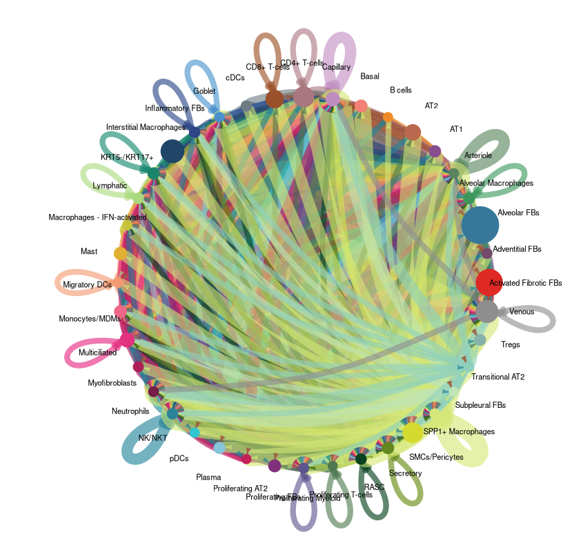

---
#### List all inferred signaling pathways
Control vs IPF (Annotations based on those annotated by Vannan et al.)
```
> # Unaffected 
> CellChat_Squidpy[["CellChat"]][["Final_CT"]][["Unaffected"]]@netP$pathways
[1] "VEGF"  "SPP1"  "UGRP1" "CCL"   "FASLG" "EGF"  
> # IPF
> CellChat_Squidpy[["CellChat"]][["Final_CT"]][["More_Affected"]]@netP$pathways
[1] "SPP1"  "UGRP1" "VEGF"  "CCL"   "EGF"   "CXCL"  "FASLG"
```

---
#### `netVisual_heatmap()`
- Generates a heatmap of intercellular communication strength
#### Example usages
Xenium, IPF
```
netVisual_heatmap(CellChat_Squidpy[["CellChat"]][["Final_CT"]][["More_Affected"]], 
                  measure = "weight", 
                  color.heatmap = "Reds", 
                  title.name = "Xenium IPF")
```
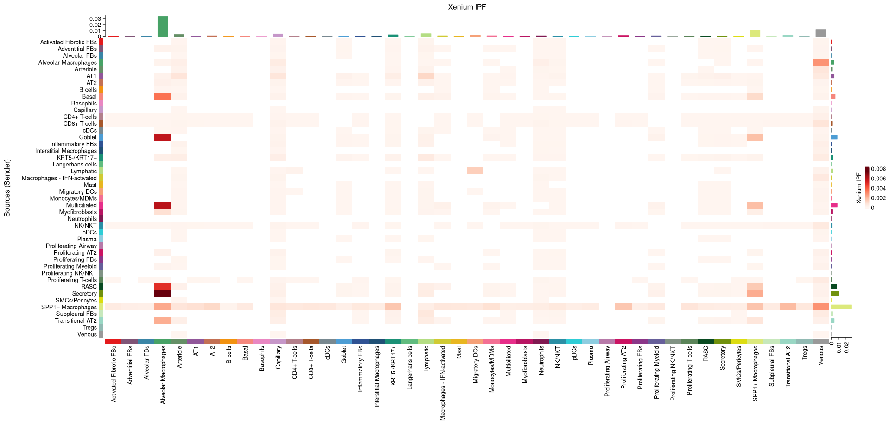

Xenium, Control
```
netVisual_heatmap(CellChat_Squidpy[["CellChat"]][["Final_CT"]][["Unaffected"]], 
                  measure = "weight", 
                  color.heatmap = "Reds", 
                  title.name = "Xenium Control")
```
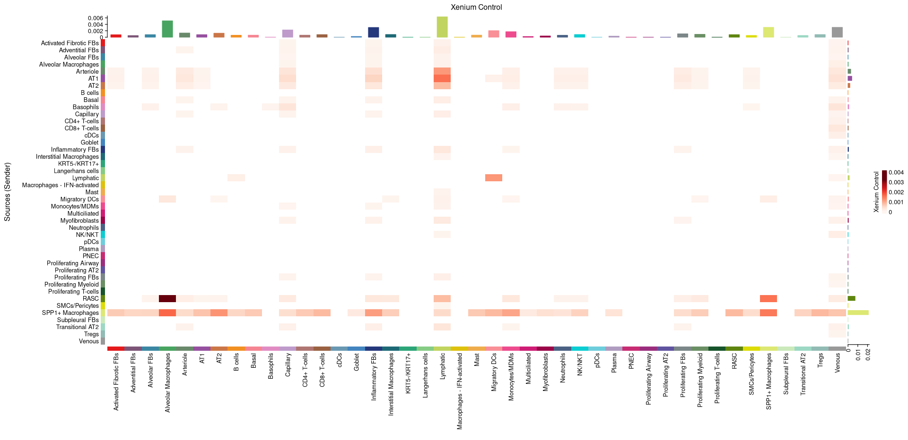

---
#### `netVisual_aggregate()`
- Visualize the inferred signaling network of signaling pathways by aggregating all L-R pairs
#### Example usages
Circle plot that visualizes the intercellular communication network for the UGRP1 signaling pathway in the IPFs
```
netVisual_aggregate(CellChat_Squidpy[["CellChat"]][["Final_CT"]][["More_Affected"]], 
                    signaling = "UGRP1", 
                    layout = "circle", 
                    remove.isolate = TRUE)
```
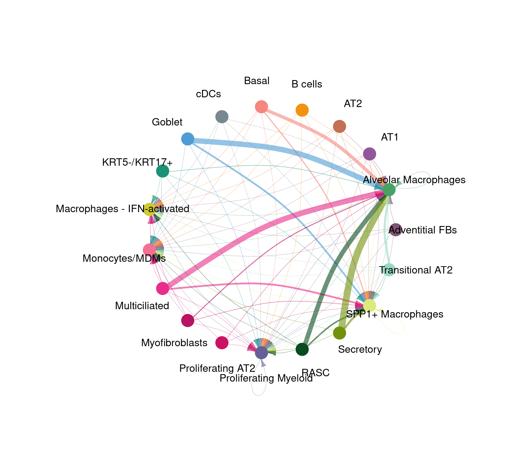

---
#### `subsetCommunication()`
- Subset the inferred cell-cell communications of interest
#### Example usages
Returns a data frame summarizing the UGRP1 pathway-level communication network from the 'Xenium_IPF_Author', author annotation CellChat object.
```
subsetCommunication(CellChat_Squidpy[["CellChat"]][["Final_CT"]][["More_Affected"]],
                    signaling = "UGRP1", 
                    slot.name = "netP")
```
Output
```
                  source                      target pathway_name         prob pval
1                    AT1        Alveolar Macrophages        UGRP1 3.572308e-04    0
2                    AT1 Macrophages - IFN-activated        UGRP1 6.142392e-05    0
3                    AT1              Monocytes/MDMs        UGRP1 1.353383e-05    0
4                    AT1       Proliferating Myeloid        UGRP1 8.546132e-05    0
5                    AT1           SPP1+ Macrophages        UGRP1 2.808011e-04    0
6                    AT2        Alveolar Macrophages        UGRP1 9.379655e-04    0
7                    AT2 Macrophages - IFN-activated        UGRP1 1.613557e-04    0
8                    AT2              Monocytes/MDMs        UGRP1 3.555505e-05    0
9                    AT2       Proliferating Myeloid        UGRP1 2.244913e-04    0
10                   AT2           SPP1+ Macrophages        UGRP1 7.373790e-04    0
11                 Basal        Alveolar Macrophages        UGRP1 1.205943e-03    0
12                 Basal Macrophages - IFN-activated        UGRP1 2.075013e-04    0
13                 Basal              Monocytes/MDMs        UGRP1 4.572496e-05    0
14                 Basal       Proliferating Myeloid        UGRP1 2.886875e-04    0
15                 Basal           SPP1+ Macrophages        UGRP1 9.481030e-04    0
16             Basophils        Alveolar Macrophages        UGRP1 1.350744e-03    0
17             Basophils Macrophages - IFN-activated        UGRP1 2.324444e-04    0
18             Basophils              Monocytes/MDMs        UGRP1 5.122242e-05    0
19             Basophils       Proliferating Myeloid        UGRP1 3.233867e-04    0
20             Basophils           SPP1+ Macrophages        UGRP1 1.061977e-03    0
21                Goblet        Alveolar Macrophages        UGRP1 1.521895e-03    0
22                Goblet Macrophages - IFN-activated        UGRP1 2.619344e-04    0
23                Goblet              Monocytes/MDMs        UGRP1 5.772228e-05    0
24                Goblet       Proliferating Myeloid        UGRP1 3.644102e-04    0
25                Goblet           SPP1+ Macrophages        UGRP1 1.196583e-03    0
26          KRT5-/KRT17+        Alveolar Macrophages        UGRP1 1.161897e-03    0
27          KRT5-/KRT17+ Macrophages - IFN-activated        UGRP1 1.999152e-04    0
28          KRT5-/KRT17+              Monocytes/MDMs        UGRP1 4.405302e-05    0
29          KRT5-/KRT17+       Proliferating Myeloid        UGRP1 2.781341e-04    0
30          KRT5-/KRT17+           SPP1+ Macrophages        UGRP1 9.134657e-04    0
31      Langerhans cells        Alveolar Macrophages        UGRP1 1.696718e-03    0
32      Langerhans cells              Monocytes/MDMs        UGRP1 6.436380e-05    0
33      Langerhans cells       Proliferating Myeloid        UGRP1 4.063248e-04    0
34      Langerhans cells           SPP1+ Macrophages        UGRP1 1.334087e-03    0
35         Multiciliated        Alveolar Macrophages        UGRP1 1.020553e-03    0
36         Multiciliated Macrophages - IFN-activated        UGRP1 1.755750e-04    0
37         Multiciliated              Monocytes/MDMs        UGRP1 3.868873e-05    0
38         Multiciliated       Proliferating Myeloid        UGRP1 2.442730e-04    0
39         Multiciliated           SPP1+ Macrophages        UGRP1 8.023189e-04    0
40        Myofibroblasts        Alveolar Macrophages        UGRP1 8.553471e-04    0
41        Myofibroblasts Macrophages - IFN-activated        UGRP1 1.471330e-04    0
42        Myofibroblasts              Monocytes/MDMs        UGRP1 3.242069e-05    0
43        Myofibroblasts       Proliferating Myeloid        UGRP1 2.047047e-04    0
44        Myofibroblasts           SPP1+ Macrophages        UGRP1 6.724169e-04    0
45                NK/NKT        Alveolar Macrophages        UGRP1 1.971445e-06    0
46                NK/NKT Macrophages - IFN-activated        UGRP1 3.388796e-07    0
47                NK/NKT              Monocytes/MDMs        UGRP1 7.466341e-08    0
48                NK/NKT       Proliferating Myeloid        UGRP1 4.715067e-07    0
49                NK/NKT           SPP1+ Macrophages        UGRP1 1.549535e-06    0
50                  PNEC        Alveolar Macrophages        UGRP1 2.951154e-03    0
51                  PNEC              Monocytes/MDMs        UGRP1 1.120854e-04    0
52                  PNEC       Proliferating Myeloid        UGRP1 7.074093e-04    0
53                  PNEC           SPP1+ Macrophages        UGRP1 2.321042e-03    0
54     Proliferating AT2        Alveolar Macrophages        UGRP1 1.649265e-03    0
55     Proliferating AT2 Macrophages - IFN-activated        UGRP1 2.838860e-04    0
56     Proliferating AT2              Monocytes/MDMs        UGRP1 6.256082e-05    0
57     Proliferating AT2       Proliferating Myeloid        UGRP1 3.949465e-04    0
58     Proliferating AT2           SPP1+ Macrophages        UGRP1 1.296762e-03    0
59  Proliferating Airway        Alveolar Macrophages        UGRP1 2.360339e-03    0
60  Proliferating Airway Macrophages - IFN-activated        UGRP1 4.065221e-04    0
61  Proliferating Airway              Monocytes/MDMs        UGRP1 8.959507e-05    0
62  Proliferating Airway       Proliferating Myeloid        UGRP1 5.655325e-04    0
63  Proliferating Airway           SPP1+ Macrophages        UGRP1 1.856139e-03    0
64 Proliferating Myeloid        Alveolar Macrophages        UGRP1 1.341633e-05    0
65 Proliferating Myeloid Macrophages - IFN-activated        UGRP1 2.306209e-06    0
66 Proliferating Myeloid              Monocytes/MDMs        UGRP1 5.081145e-07    0
67 Proliferating Myeloid       Proliferating Myeloid        UGRP1 3.208785e-06    0
68 Proliferating Myeloid           SPP1+ Macrophages        UGRP1 1.054512e-05    0
69                  RASC        Alveolar Macrophages        UGRP1 4.398891e-03    0
70                  RASC Macrophages - IFN-activated        UGRP1 7.589065e-04    0
71                  RASC              Monocytes/MDMs        UGRP1 1.673045e-04    0
72                  RASC       Proliferating Myeloid        UGRP1 1.055606e-03    0
73                  RASC           SPP1+ Macrophages        UGRP1 3.460740e-03    0
74     SPP1+ Macrophages        Alveolar Macrophages        UGRP1 1.735101e-05    0
75     SPP1+ Macrophages Macrophages - IFN-activated        UGRP1 2.982573e-06    0
76     SPP1+ Macrophages              Monocytes/MDMs        UGRP1 6.571346e-07    0
77     SPP1+ Macrophages       Proliferating Myeloid        UGRP1 4.149856e-06    0
78     SPP1+ Macrophages           SPP1+ Macrophages        UGRP1 1.363776e-05    0
79             Secretory        Alveolar Macrophages        UGRP1 4.721735e-03    0
80             Secretory Macrophages - IFN-activated        UGRP1 8.148229e-04    0
81             Secretory              Monocytes/MDMs        UGRP1 1.796394e-04    0
82             Secretory       Proliferating Myeloid        UGRP1 1.133358e-03    0
83             Secretory           SPP1+ Macrophages        UGRP1 3.714988e-03    0
84      Transitional AT2        Alveolar Macrophages        UGRP1 3.905875e-03    0
85      Transitional AT2 Macrophages - IFN-activated        UGRP1 6.735742e-04    0
86      Transitional AT2              Monocytes/MDMs        UGRP1 1.484827e-04    0
87      Transitional AT2       Proliferating Myeloid        UGRP1 9.369436e-04    0
88      Transitional AT2           SPP1+ Macrophages        UGRP1 3.072545e-03    0
89                  cDCs        Alveolar Macrophages        UGRP1 6.149080e-05    0
90                  cDCs Macrophages - IFN-activated        UGRP1 1.057042e-05    0
91                  cDCs              Monocytes/MDMs        UGRP1 2.328940e-06    0
92                  cDCs       Proliferating Myeloid        UGRP1 1.470731e-05    0
93                  cDCs           SPP1+ Macrophages        UGRP1 4.833176e-05    0
```
---
#### 3. Neighbors enrichment_analysis
- Compute enrichment score based on proximity on the connectivity graph of cell clusters by Palla, Spitzer et al. (2022) in Nature Methods.

#### `create_enrichment_heatmap()`

#### Example usages
Neighbors enrichment Unaffected (Control) vs More_Affected (IPF)
```
create_enrichment_heatmap(
    obj = CellChat_Squidpy,
    group = "Unaffected",
    annotation = "Final_CT",
    plot_style = "viridis",
    clustering = FALSE,
    base_size = 9
    )

create_enrichment_heatmap(
    obj = CellChat_Squidpy,
    group = "More_Affected",
    annotation = "Final_CT",
    plot_style = "viridis",
    clustering = FALSE,
    base_size = 9)
```
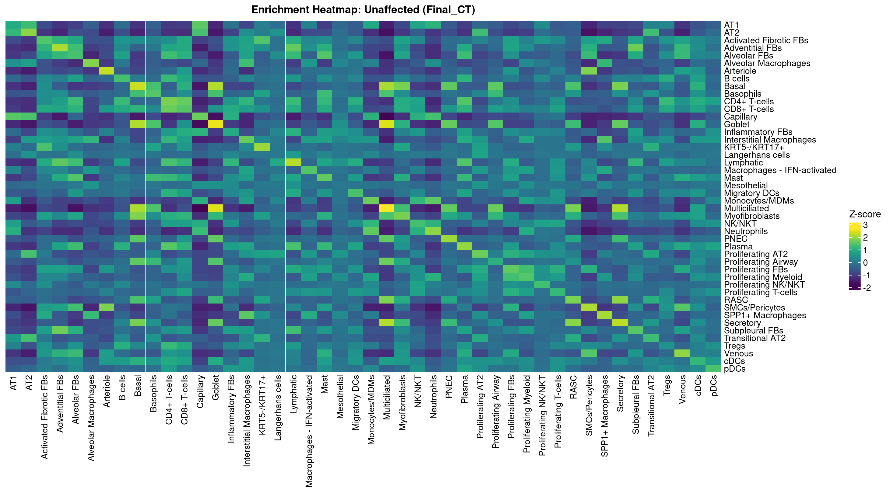
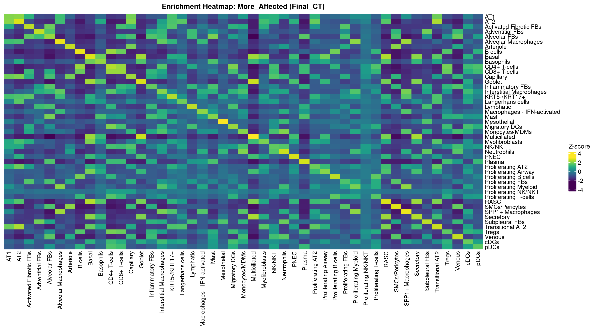

Clustering (IPF)
```
create_enrichment_heatmap(
    obj = CellChat_Squidpy,
    group = "More_Affected",
    annotation = "Final_CT",
    plot_style = "viridis",
    clustering = TRUE,
    base_size = 9)
```
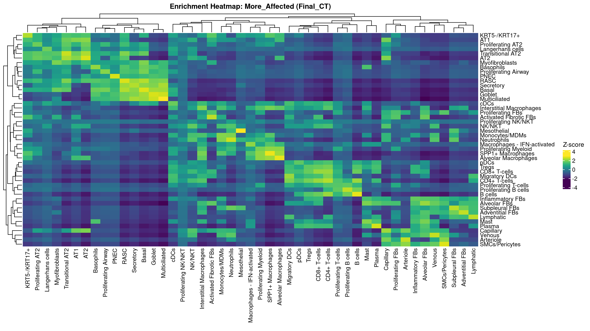


---
#### 4. ToppCell
- Performs cell type enrichment analysis by comparing input gene sets to transcriptional profiles of curated single-cell clusters across multiple tissues and platforms, integrating annotations from large-scale consortia, developed by Chen et al.

#### `get_toppcell_enrichment()`
#### Example usages
```
# 1. Define the list of genes you want to analyze
gene_list <- c("SFTPC","SFTPB","SFTPA1","NAPSA","LAMP3",
               "ABCA3","SLC34A2","ETV5","SFTA2","PGC")

# 2. Call the enrichment function
get_toppcell_enrichment(gene_list)
```
Output
```
  Category                                       ID                                                                                                             Name       PValue  QValueFDRBH  QValueFDRBY
1 ToppCell cf27b4ac4d0caa6f9b068dc8ea93472470a01a4d             390C-Epithelial_cells-Epithelial-A_(AT2)-|390C / Donor, Lineage, Cell class and subclass (all cells) 2.430753e-25 1.385033e-22 1.215504e-21
2 ToppCell 731def6d82814ebac1a400bc7aea5f6da43ec960              390C-Epithelial_cells-Epithelial-A_(AT2)|390C / Donor, Lineage, Cell class and subclass (all cells) 2.430753e-25 1.385033e-22 1.215504e-21
3 ToppCell b0ed8cb6000ce8bf94444307e4b7b3574fa3fab2  367C-Epithelial_cells-Epithelial-A_(AT2)|Epithelial_cells / Donor, Lineage, Cell class and subclass (all cells) 3.133866e-25 1.385033e-22 1.215504e-21
4 ToppCell 3aea6207a011ad55a1aeb2ed9fb54d31b23694b5 367C-Epithelial_cells-Epithelial-A_(AT2)-|Epithelial_cells / Donor, Lineage, Cell class and subclass (all cells) 3.133866e-25 1.385033e-22 1.215504e-21
5 ToppCell 2a8338e94937686a148b5433515700ca0f674058             367C-Epithelial_cells-Epithelial-A_(AT2)-|367C / Donor, Lineage, Cell class and subclass (all cells) 1.021566e-24 1.385033e-22 1.215504e-21
```

---
#### 5. Ingestion
TO BE UPDATED 
