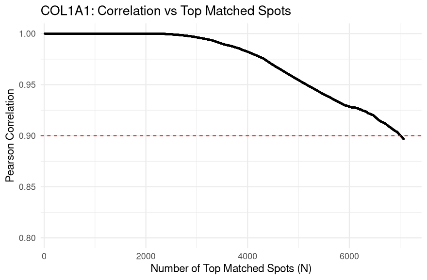

## 5. LungChat (LLM) functions

### Outline
[5.1. Visualization/Analysis](#1-Visualization-&-Analysis)

[5.2. CellChat](#2-CellChat)

[5.3. Neighbors enrichment_analysis](#3-neighbors-enrichment_analysis)

[5.4. Ingestion](#4-Ingestion)

---
#### 1. Visualization & Analysis
Script: [`Spatial_functions.R`](./Spatial_functions_v2.R)

#### `plot_spatial()`
- Visualize spatial annotation (categorical or numeric) from a SummarizedExperiment object.

| **Parameter**       | **Type**                                        | **Default**  | **Options**                                                              | **Description**                                                                 |
| ------------------- | ----------------------------------------------- | ------------ | ------------------------------------------------------------------------ | ------------------------------------------------------------------------------- |
| `obj`               | `SingleCellExperiment` / `SummarizedExperiment` | *(required)* | —                                                                        | H5AD-derived object loaded using `zellkonverter::readH5AD()`                    |
| `platform`          | character                                       | `"Xenium"`   | `"Xenium"`, `"Visium"`                                                   | Used to select the appropriate UMAP coordinate columns                          |
| `annotation`        | character                                       | `"Final_CT"` | Any column in `colData(obj)`, e.g., `"Final_CT"`, `"pruned"`, `"TNiche"` | Column in `colData(obj)` used to color the UMAP plot                            |
| `title`             | character                                       | `NULL`       | —                                                                        | Custom plot title; if `NULL`, uses `"<platform> UMAP: <annotation>"`            |
| `point_size`        | numeric                                         | `0.5`        | Any positive number                                                      | Size of points in the UMAP scatterplot                                          |
| `legend_point_size` | numeric                                         | `4`          | Any positive number                                                      | Size of points in the legend                                                    |
| `highlight`         | character vector                                | `NULL`       | Subset of annotation levels, e.g., `c("AT1", "AT2")`                     | If set and `annotation` is a factor, highlights selected levels, others in grey |

[`The list of available annotations is here.`](./annotation_labels.md)

#### Example usages
Generates a spatial scatterplot of scTriangulate2 cells or spots, colored by the "pruned" annotation to visualize cell type or cluster identity across tissue space.
```
plot_spatial(scTriangulate2, annotation = "pruned")
```


Generate a spatial plot highlighting `TNiche@T6` and `TNiche@T7` clusters
```
plot_spatial(scTriangulate2, 
             annotation = "pruned", 
             highlight = c("TNiche@T6", "TNiche@T7"))
```


Generates a spatial map of the IPF microenvironment where each spot is colored by confidence score
```
plot_spatial(
    obj = scTriangulate2,
    annotation = "confidence",
    title = "Spatial Confidence Map of the IPF Microenvironment",
    point_size = 0.4
)
```


---
#### `plot_umap()`
- Visualize UMAP embedding for Visium HD or Xenium platforms using metadata or highlights.

| **Parameter**       | **Type**                                        | **Default**  | **Options**                                                              | **Description**                                                                 |
| ------------------- | ----------------------------------------------- | ------------ | ------------------------------------------------------------------------ | ------------------------------------------------------------------------------- |
| `obj`               | `SingleCellExperiment` / `SummarizedExperiment` | *(required)* | —                                                                        | H5AD-derived object loaded using `zellkonverter::readH5AD()`                    |
| `platform`          | character                                       | `"Xenium"`   | `"Xenium"`, `"Visium"`                                                   | Used to select the appropriate UMAP coordinate columns                          |
| `annotation`        | character                                       | `"Final_CT"` | Any column in `colData(obj)`, e.g., `"Final_CT"`, `"pruned"`, `"TNiche"` | Column in `colData(obj)` used to color the UMAP plot                            |
| `title`             | character                                       | `NULL`       | —                                                                        | Custom plot title; if `NULL`, uses `"<platform> UMAP: <annotation>"`            |
| `point_size`        | numeric                                         | `0.5`        | Any positive number                                                      | Size of points in the UMAP scatterplot                                          |
| `legend_point_size` | numeric                                         | `4`          | Any positive number                                                      | Size of points in the legend                                                    |
| `highlight`         | character vector                                | `NULL`       | Subset of annotation levels, e.g., `c("AT1", "AT2")`                     | If set and `annotation` is a factor, highlights selected levels, others in grey |

[`The list of available annotations is here.`](./annotation_labels.md)

#### Example usages
Xenium UMAP
```
plot_umap(scTriangulate2, 
          platform = "Xenium", 
          annotation = "Final_CT")
```
Visium HD UMAP
```
plot_umap(scTriangulate2, 
          platform = "Visium", 
          annotation = "Visium_RCTD_LungMap_ref")
```


Xenium (AT1 & AT2)
```
plot_umap(scTriangulate2, 
          platform = "Visium", 
          annotation = "Visium_RCTD_LungMap_ref", 
          title = "Visium - AT1 & AT2",
          highlight = c("AT1", "AT2"))
```
Visium HD (AT1 & AT2)
```
plot_umap(scTriangulate2, 
          platform = "Xenium", 
          annotation = "Final_CT", 
          title = "Xenium - AT1 & AT2",
          highlight = c("AT1", "AT2"))
```


---
#### `plot_gene_spatial()`
- Plot spatial gene expression for Visium or Xenium using platform-specific coordinates.

| **Parameter** | **Type**                                        | **Default**                   | **Options**                                                | **Description**                                                           |
| ------------- | ----------------------------------------------- | ----------------------------- | ---------------------------------------------------------- | ------------------------------------------------------------------------- |
| `obj`         | `SingleCellExperiment` / `SummarizedExperiment` | *(required)*                  | —                                                          | H5AD-derived object loaded using `zellkonverter::readH5AD()`              |
| `gene`        | character                                       | *(required)*                  | Must match a row in `rownames(assay(obj))`, e.g., `"AGER"` | Gene to visualize (suffix added based on platform)                        |
| `platform`    | character                                       | `"Xenium"`                    | `"Xenium"`, `"Visium"`                                     | Platform used to determine spatial columns and gene suffix                |
| `x_col`       | character                                       | `"X_xenium_norm"` (if Xenium) | e.g., `"X_visium_norm"`, `"X_xenium_norm"`                 | Column in `colData(obj)` for X coordinates (auto-set by platform if NULL) |
| `y_col`       | character                                       | `"Y_xenium_norm"` (if Xenium) | e.g., `"Y_visium_norm"`, `"Y_xenium_norm"`                 | Column in `colData(obj)` for Y coordinates (auto-set by platform if NULL) |
| `title`       | character                                       | `NULL`                        | —                                                          | Custom plot title; if NULL, defaults to `"Spatial Expression of <gene>"`  |
| `point_size`  | numeric                                         | `0.5`                         | Any positive number                                        | Size of points on the scatterplot                                         |
| `low_color`   | character                                       | `"grey90"`                    | Any valid R color                                          | Color used for low expression                                             |
| `high_color`  | character                                       | `"red"`                       | Any valid R color                                          | Color used for high expression                                            |

[`The list of available genes is here.`](./available_genes_by_platform.md)

#### Example usages
```
plot_gene_spatial(scTriangulate2, 
                  gene = "COL1A1", 
                  platform = "Visium", 
                  point_size = 0.4,
                  title = "Visium - Expression of COL1A1")
                  
plot_gene_spatial(scTriangulate2, 
                  gene = "COL1A1", 
                  platform = "Xenium", 
                  point_size = 0.4,
                  title = "Xenium - Expression of COL1A1")
```


---
#### `rank_cross_platform_gene_correlation()`
- Rank genes by Pearson correlation across Xenium-Visium matched expression.

| **Parameter** | **Type**                                        | **Default**  | **Options**              | **Description**                                                               |
| ------------- | ----------------------------------------------- | ------------ | ------------------------ | ----------------------------------------------------------------------------- |
| `obj`         | `SingleCellExperiment` / `SummarizedExperiment` | *(required)* | —                        | Object containing gene expression from both Xenium and Visium platforms       |
| `top_genes`   | numeric                                         | `5`          | Any positive integer     | Number of top correlated gene pairs to return and visualize                   |
| `layer`       | character                                       | `"X"`        | Must match an assay name | Assay layer (e.g., `"X"`, `"counts"`, `"logcounts"`) used for expression data |

#### Example usages
Top 5 highly correlated genes (Visium HD - Xenium)
```
rank_cross_platform_gene_correlation(
    obj = scTriangulate2,
    top_genes = 5
)
```
Output
```
     Gene Correlation
1  COL1A1   0.8968483
2  COL3A1   0.6852229
3  COL1A2   0.6121173
4 SCGB3A2   0.5324030
5   MARCO   0.4863397
```


---
#### `plot_cross_platform_gene_correlation()`
- Plot cumulative Pearson correlation across best-matched Visium-Xenium spots for a gene.

| **Parameter** | **Type**                                        | **Default**   | **Options**                                   | **Description**                                                                |
| ------------- | ----------------------------------------------- | ------------- | --------------------------------------------- | ------------------------------------------------------------------------------ |
| `obj`         | `SingleCellExperiment` / `SummarizedExperiment` | *(required)*  | —                                             | Object containing cross-platform expression matrix and metadata                |
| `gene_name`   | character                                       | *(required)*  | Any gene base name present with both suffixes | Gene to compare between platforms (must exist with appropriate suffixes)       |
| `ID1_col`     | character                                       | `"Visium_ID"` | Column name in `colData(obj)`                 | Column storing Visium-matched cell/spot IDs                                    |
| `ID2_col`     | character                                       | `"Xenium_ID"` | Column name in `colData(obj)`                 | Column storing Xenium-matched cell/spot IDs                                    |
| `hline`       | numeric                                         | `0.9`         | `NULL` or any numeric between -1 and 1        | Horizontal line for reference on the correlation plot                          |
| `y_range`     | numeric vector (length 2)                       | `c(0, 1)`     | Any valid range of Pearson correlation values | Y-axis limits for the plot                                                     |
| `title`       | character                                       | `NULL`        | —                                             | Custom plot title; if `NULL`, defaults to `"Gene: Correlation vs Top Matched"` |


[`The list of available genes is here.`](./available_genes_by_platform.md)

#### Example usages
Cumulative Pearson correlation (COL1A1)
```
plot_cross_platform_gene_correlation(
    obj = scTriangulate2,
    gene_name = "COL1A1",
    ID1_col = "Visium_ID",
    ID2_col = "Xenium_ID",
    y_range = c(0.8,1)
)
```


---
#### `generate_stability_report()`
- Summarize per-cluster metrics (confidence, reassign, SCCAF, TF-IDF 10, TF-IDF 5m Shapley)

| **Parameter**     | **Type**                                        | **Default**  | **Options**                                          | **Description**                                                      |
| ----------------- | ----------------------------------------------- | ------------ | ---------------------------------------------------- | -------------------------------------------------------------------- |
| `sce`             | `SingleCellExperiment` / `SummarizedExperiment` | *(required)* | —                                                    | Object containing stability metric columns and cell type annotations |
| `celltype_labels` | `list` (named character vectors)                | *(required)* | Format: `list("Annotation" = c("Label1", "Label2"))` | Specifies which cell type labels (per annotation) to evaluate        |

[`The list of available annotations is here.`](./annotation_labels.md)

#### Example usages
Stability of T cells 
```
# Define Inputs and Generate Outputs
# Define the single list of clusters you want to analyze and plot
clusters_to_process <- list(
    Final_CT = c("CD4+_T-cells", "CD8+_T-cells"),
    Visium_RCTD_LungMap_ref = c("T"),
    Visium_RCTD_GSE250346_based = c("CD4+_T-cells", "CD8+_T-cells")
)

# Call the function once to get both the table and the plot
output <- generate_stability_report(
    sce = scTriangulate2, 
    celltype_labels = clusters_to_process
)


# Print Both the Table and the Plot
if (!is.null(output)) {
    
    # Print the summary table
    print(kable(output$summary_table, digits = 3, caption = "Summary of Cell Type Stability Metrics"))
    
    # Print the final plot
    print(output$stability_plot)
    
}
```
Output
```
Table: Summary of Cell Type Stability Metrics

|Cluster                                  | Reassign| SCCAF| TF-IDF 5| TF-IDF 10| Shapley| Confidence|
|:----------------------------------------|--------:|-----:|--------:|---------:|-------:|----------:|
|Final_CT@CD4+_T-cells                    |    0.562| 0.767|    0.727|     0.540|   1.783|      0.599|
|Final_CT@CD8+_T-cells                    |    0.456| 0.722|    0.837|     0.673|   6.917|      0.850|
|Visium_RCTD_LungMap_ref@T                |    0.706| 0.789|    0.623|     0.521|   8.083|      0.156|
|Visium_RCTD_GSE250346_based@CD4+_T-cells |    0.476| 0.290|    0.520|     0.469|   0.783|      0.850|
|Visium_RCTD_GSE250346_based@CD8+_T-cells |    0.000| 0.304|    0.332|     0.305|   0.067|      0.128|
```


---
#### `rank_marker_specificity()`
- Rank how specific a gene is to a cell type using one-sided t-tests and FDR correction.

| **Parameter**  | **Type**                                        | **Default**             | **Options**                                           | **Description**                                                               |
| -------------- | ----------------------------------------------- | ----------------------- | ----------------------------------------------------- | ----------------------------------------------------------------------------- |
| `sce`          | `SingleCellExperiment` / `SummarizedExperiment` | *(required)*            | —                                                     | Object containing gene expression matrix and cluster annotations              |
| `gene_name`    | character                                       | `"COL1A1"`              | Any gene (with or without `_xenium`/`_visium` suffix) | Base name of the gene to assess for cluster-specific enrichment               |
| `cluster_cols` | character vector                                | `c("pruned")`           | One or more column names in `colData(sce)`            | Metadata columns used to define clusters or cell types                        |
| `assay_name`   | character                                       | `"X"`                   | Must exist in `assayNames(sce)`                       | Expression matrix to use                                                      |
| `platforms`    | character vector                                | `c("Xenium", "Visium")` | Subset of `c("Xenium", "Visium")`                     | Platforms to include when filtering by `meta$Platform`, if such column exists |
| `top_n`        | integer or `NULL`                               | `NULL`                  | `NULL` (all clusters) or a positive integer           | If set, returns only the top N cluster-gene combinations by adjusted p-value  |

[`The list of available genes is here.`](./available_genes_by_platform.md)

#### Example usages
COL1A1 - pruned, both Visium and Xenium
```
rank_marker_specificity(scTriangulate2, 
                        gene_name = "COL1A1",
                        top_n = 3)
```
Output
```
                    Cluster Mean_Expr Pct_Expr      P_Value Annotation_Source        P_Adj
1                 TNiche@T6 15.087205 99.83700 0.000000e+00            pruned 0.000000e+00
2 Final_CT@Inflammatory_FBs  8.892857 99.10714 2.637340e-07            pruned 3.824143e-06
3  Final_CT@Adventitial_FBs  6.216667 93.33333 3.877084e-01            pruned 1.000000e+00
```
Top 5 clusters across selected annotations
```
rank_marker_specificity(scTriangulate2,
                        gene_name = "COL1A1",
                        cluster_cols = c("Final_CT", "TNiche", "Xenium_RCTD_LungMap_ref"),
                        top_n = 5)
```
Output
```
                 Cluster Mean_Expr  Pct_Expr       P_Value       Annotation_Source         P_Adj
1                     T6 15.398747 100.00000  0.000000e+00                  TNiche  0.000000e+00
2                   SCMF 13.409579  99.00383  0.000000e+00 Xenium_RCTD_LungMap_ref  0.000000e+00
3 Activated_Fibrotic_FBs 17.800000  99.76744 6.613296e-302                Final_CT 1.851723e-300
4           Alveolar_FBs  9.208145  96.15385  2.075145e-59                Final_CT  4.357804e-58
5                    AF1 10.039419  93.77593  2.415718e-20 Xenium_RCTD_LungMap_ref  4.058406e-19
```
Visium-only, limited annotations
```
rank_marker_specificity(scTriangulate2,
                        gene_name = "COL1A1",
                        cluster_cols = c("Visium_RCTD_GSE250346_based"),
                        platforms = "Visium",
                        top_n = 3)
```
Output
```
                 Cluster Mean_Expr Pct_Expr       P_Value           Annotation_Source         P_Adj
1 Activated_Fibrotic_FBs 13.004885 97.06927 5.559134e-288 Visium_RCTD_GSE250346_based 2.501610e-286
2        Adventitial_FBs  7.719212 88.17734  1.283858e-07 Visium_RCTD_GSE250346_based  2.888679e-06
3         Subpleural_FBs  6.034483 93.10345  3.533602e-01 Visium_RCTD_GSE250346_based  1.000000e+00
```
---
#### `find_celltype_markers()`
- Identify top marker genes for a specific cell type by calculating their differential expression and statistical significance, returning both a ranked table and a volcano plot to visualize the results.

| **Parameter**     | **Type**                                        | **Default**  | **Options**                                   | **Description**                                                                |
| ----------------- | ----------------------------------------------- | ------------ | --------------------------------------------- | ------------------------------------------------------------------------------ |
| `sce`             | `SingleCellExperiment` / `SummarizedExperiment` | *(required)* | —                                             | Object containing normalized gene expression and metadata                      |
| `celltype`        | character                                       | *(required)* | Any value in `colData(sce)[[annotation_col]]` | Cell type label to compare against all others                                  |
| `annotation_col`  | character                                       | *(required)* | A column name in `colData(sce)`               | Metadata column that defines cell types or clusters                            |
| `platform`        | character                                       | `"Xenium"`   | `"Xenium"`, `"Visium"`                        | Platform used to select gene suffix (e.g., `_xenium`) for expression filtering |
| `assay_name`      | character                                       | `"X"`        | Any value in `assayNames(sce)`                | Expression assay to use                                                        |
| `top_n`           | integer                                         | `10`         | Any positive integer                          | Number of top-ranked marker genes to return                                    |
| `logfc_threshold` | numeric                                         | `0.25`       | ≥ 0                                           | Minimum log2 fold change threshold to consider as significant                  |
| `padj_threshold`  | numeric                                         | `0.05`       | (0, 1)                                        | Adjusted p-value (FDR) threshold for statistical significance                  |


#### Example usages
Identify top marker genes for T6
```
# Define Inputs and Find Markers
marker_report <- find_celltype_markers(
    sce = scTriangulate2,
    celltype = "T6",
    annotation_col = "TNiche",
    platform = "xenium"
)
# Access and Print Both the Table and the Plot
if (!is.null(marker_report)) {
    # Print the ranked table of top marker genes
    print(kable(marker_report$table, digits = 3, caption = "Top Marker Genes"))
    
    # Print the volcano plot
    print(marker_report$plot)
}
```
Output
```
Table: Top Marker Genes

|gene   | logFC| P_Value| P_Adj| log10_P_Adj|significant |
|:------|-----:|-------:|-----:|-----------:|:-----------|
|COL1A1 | 3.647|       0|     0|     335.145|TRUE        |
|MEG3   | 3.508|       0|     0|     335.145|TRUE        |
|COL3A1 | 3.403|       0|     0|     335.145|TRUE        |
|SFRP4  | 3.148|       0|     0|     335.145|TRUE        |
|LUM    | 3.067|       0|     0|     335.145|TRUE        |
|COL1A2 | 3.058|       0|     0|     335.145|TRUE        |
|CTHRC1 | 3.047|       0|     0|     335.145|TRUE        |
|DCN    | 2.268|       0|     0|     335.145|TRUE        |
|POSTN  | 1.964|       0|     0|     335.145|TRUE        |
|FN1    | 1.251|       0|     0|     335.145|TRUE        |
```


---
#### `generate_marker_report()`
- Analyzes the expression specificity of given genes across various cell type annotations, returning both a ranked statistical table and a dot plot summarizing the results.

| **Parameter**     | **Type**                                        | **Default**  | **Options**                                                           | **Description**                                                              |
| ----------------- | ----------------------------------------------- | ------------ | --------------------------------------------------------------------- | ---------------------------------------------------------------------------- |
| `obj`             | `SingleCellExperiment` / `SummarizedExperiment` | *(required)* | —                                                                     | Object containing expression data and cell metadata                          |
| `genes`           | `character vector`                              | *(required)* | Any set of gene names (e.g., `"COL1A1"`, `"AGER"`, `"CD3D"`)          | Gene names to test for enrichment                                            |
| `annotation_cols` | `character vector`                              | *(required)* | Must match columns in `colData(obj)` (e.g., `"Final_CT"`, `"pruned"`) | Annotation columns used to group cells for differential expression testing   |
| `assay_name`      | `character`                                     | `"X"`        | Any valid assay in `assayNames(obj)`                                  | Assay layer to pull expression data from                                     |
| `min_pct`         | `numeric`                                       | `5`          | 0–100                                                                 | Minimum percentage of expressing cells in a cluster to include the gene      |
| `max_genes_plot`  | `integer`                                       | `50`         | Positive integer or `NULL`                                            | Max number of genes to display in dot plot; `NULL` shows all passing filters |

[`The list of available genes is here.`](./available_genes_by_platform.md)

#### Example usages
List cell types that "COL1A1", "AGER", "CD3D", "SFTPC" are differentially expressed.
```
# Define Inputs and Generate Outputs
genes_of_interest <- c("COL1A1", "AGER", "CD3D", "SFTPC")
annotations_to_process <- c("pruned")

# Call the function
marker_report <- generate_marker_report(
    obj = scTriangulate2,
    genes = genes_of_interest,
    annotation_cols = annotations_to_process
)


# Access and Print Both the Table and the Plot
if (!is.null(marker_report)) {
    # Print the full, ranked data table
    print(kable(marker_report$table, digits = 3, caption = "Marker Gene Specificity Ranking"))
    
    # Print the dot plot
    print(marker_report$plot)
}
```
Output (Portion)
```
Table: Marker Gene Specificity Ranking

|Gene   |Platform |Cluster                                             | Mean_Expr| Pct_Expr| P_Value| P_Adj|
|:------|:--------|:---------------------------------------------------|---------:|--------:|-------:|-----:|
|COL1A1 |Visium   |pruned@TNiche@T6                                    |    13.681|   99.307|   0.000| 0.000|
|COL1A1 |Xenium   |pruned@TNiche@T6                                    |    15.087|   99.837|   0.000| 0.000|
|SFTPC  |Xenium   |pruned@TNiche@T11                                   |    18.464|   93.724|   0.000| 0.000|
|CD3D   |Xenium   |pruned@Xenium_RCTD_LungMap_ref@T                    |     1.008|   60.615|   0.000| 0.000|
|CD3D   |Xenium   |pruned@Final_CT@CD8+_T-cells                        |     1.052|   56.897|   0.000| 0.000|
|SFTPC  |Visium   |pruned@TNiche@T11                                   |     0.732|   31.799|   0.000| 0.000|
|AGER   |Xenium   |pruned@Final_CT@AT1                                 |     3.209|   79.104|   0.000| 0.000|
|AGER   |Xenium   |pruned@Xenium_RCTD_LungMap_ref@AT1                  |     2.037|   57.009|   0.000| 0.000|
|SFTPC  |Visium   |pruned@Visium_RCTD_LungMap_ref@AT2                  |     0.990|   46.392|   0.000| 0.000|
|AGER   |Xenium   |pruned@TNiche@T11                                   |     0.427|   27.615|   0.000| 0.000|
|COL1A1 |Xenium   |pruned@Final_CT@Inflammatory_FBs                    |     8.893|   99.107|   0.000| 0.000|
|CD3D   |Visium   |pruned@Xenium_RCTD_LungMap_ref@T                    |     0.120|    7.821|   0.000| 0.000|
|CD3D   |Xenium   |pruned@Visium_RCTD_LungMap_ref@B                    |     0.241|   14.815|   0.004| 0.065|
|COL1A1 |Visium   |pruned@Final_CT@Inflammatory_FBs                    |     7.312|   99.107|   0.010| 0.167|
|AGER   |Visium   |pruned@Xenium_RCTD_LungMap_ref@AT1                  |     0.047|    4.673|   0.017| 0.265|
|SFTPC  |Xenium   |pruned@Xenium_RCTD_LungMap_ref@AT1                  |     1.336|   35.514|   0.019| 0.282|
|CD3D   |Xenium   |pruned@Visium_RCTD_LungMap_ref@AEC                  |     0.323|   14.516|   0.021| 0.283|
|SFTPC  |Visium   |pruned@Xenium_RCTD_LungMap_ref@AT1                  |     0.178|    8.411|   0.051| 0.653|
|AGER   |Visium   |pruned@Visium_RCTD_LungMap_ref@AT2                  |     0.031|    3.093|   0.059| 0.719|
|CD3D   |Xenium   |pruned@Visium_RCTD_LungMap_ref@Pericyte             |     0.273|   10.606|   0.065| 0.759|
```


---
#### `plot_ARI_dotplot()`
- Plot pairwise cluster overlap using dotplot and display Adjusted Rand Index (ARI).

| **Parameter** | **Type**                                         | **Default**  | **Options**                                                                                                                                    | **Description**                                                            |
| ------------- | ------------------------------------------------ | ------------ | ---------------------------------------------------------------------------------------------------------------------------------------------- | -------------------------------------------------------------------------- |
| `obj`         | `SingleCellExperiment` or `SummarizedExperiment` | *(required)* | —                                                                                                                                              | Object containing cell metadata with clustering annotations.               |
| `annotation1` | `character`                                      | *(required)* | `pruned`, `Final_CT`, `Final_lineage`, `CNiche`, `TNiche`, `Visium_RCTD_LungMap_ref`, `Visium_RCTD_GSE250346_based`, `Xenium_RCTD_LungMap_ref` | First clustering annotation to compare.                                    |
| `annotation2` | `character`                                      | *(required)* | `pruned`, `Final_CT`, `Final_lineage`, `CNiche`, `TNiche`, `Visium_RCTD_LungMap_ref`, `Visium_RCTD_GSE250346_based`, `Xenium_RCTD_LungMap_ref` | Second clustering annotation to compare.                                   |
| `title`       | `character` or `NULL`                            | `NULL`       | Custom string or `NULL`                                                                                                                        | Optional plot title; if `NULL`, auto-generates a title with the ARI value. |
| `size_range`  | `numeric vector (length = 2)`                    | `c(1, 10)`   | Any numeric range                                                                                                                              | Range of point sizes in the dot plot based on cross-tabulated frequency.   |

#### Example usages
ARI between Visium HD and Xenium RCTD based on LungMap ref
```
plot_ARI_dotplot(
  obj = scTriangulate2,
  annotation1 = "Xenium_RCTD_LungMap_ref",
  annotation2 = "Visium_RCTD_LungMap_ref",
  title = "RCTD Matching Dot Plot"
)
```


---
#### `plot_cluster_composition_groupedbar()`
- Compare cluster or cell-type compositions between one or two annotations using barplots.

| **Parameter** | **Type**                                        | **Default**  | **Options**                                                                                                                                    | **Description**                                                             |
| ------------- | ----------------------------------------------- | ------------ | ---------------------------------------------------------------------------------------------------------------------------------------------- | --------------------------------------------------------------------------- |
| `obj`         | `SingleCellExperiment` / `SummarizedExperiment` | *(required)* | —                                                                                                                                              | Object containing clustering annotations and metadata in `colData`.         |
| `annotation`  | `character vector` (length 1 or 2)              | *(required)* | `pruned`, `Final_CT`, `Final_lineage`, `CNiche`, `TNiche`, `Visium_RCTD_LungMap_ref`, `Visium_RCTD_GSE250346_based`, `Xenium_RCTD_LungMap_ref` | One or two annotation columns to compare cluster composition.               |
| `palette`     | named `character` vector or `NULL`              | `NULL`       | e.g., `c("Visium" = "blue", "Xenium" = "red")`                                                                                                 | Custom fill colors for annotation sources. If `NULL`, uses default palette. |
| `title`       | `character` or `NULL`                           | `NULL`       | —                                                                                                                                              | Custom plot title. If `NULL`, uses `"Cluster Composition Comparison"`.      |
| `rotate_x`    | `logical`                                       | `TRUE`       | `TRUE`, `FALSE`                                                                                                                                | Whether to rotate x-axis labels by 45° for readability.                     |

#### Example usages
`pruned` cell type composition
```
plot_cluster_composition_groupedbar(
    obj = scTriangulate2,
    annotation = c("pruned")
)
```


Comparison between `Visium_RCTD_LungMap_ref` and `Xenium_RCTD_LungMap_ref`
```
plot_cluster_composition_groupedbar(
    obj = scTriangulate2,
    annotation = c("Visium_RCTD_LungMap_ref", "Xenium_RCTD_LungMap_ref")
)
```


---
#### `compare_annotations_via_heatmap()`
- Visualize overlap between two annotations using a normalized confusion matrix heatmap.

| **Parameter** | **Type**                                        | **Default**  | **Options**                                                                                                                                    | **Description**                                                       |
| ------------- | ----------------------------------------------- | ------------ | ---------------------------------------------------------------------------------------------------------------------------------------------- | --------------------------------------------------------------------- |
| `obj`         | `SingleCellExperiment` / `SummarizedExperiment` | *(required)* | —                                                                                                                                              | Object containing annotation metadata in `colData`.                   |
| `annotation1` | `character`                                     | *(required)* | `pruned`, `Final_CT`, `Final_lineage`, `CNiche`, `TNiche`, `Visium_RCTD_LungMap_ref`, `Visium_RCTD_GSE250346_based`, `Xenium_RCTD_LungMap_ref` | First annotation column to use as heatmap rows.                       |
| `annotation2` | `character`                                     | *(required)* | Same as `annotation1`                                                                                                                          | Second annotation column to use as heatmap columns.                   |
| `normalize`   | `character`                                     | `"none"`     | `"none"`, `"row"`, `"column"`, `"both"`                                                                                                        | Normalize values by row, column, both, or not at all (raw counts).    |
| `palette`     | `character`                                     | `"Blues"`    | Any valid palette from `RColorBrewer::brewer.pal.info` (e.g., `"Reds"`, `"Purples"`)                                                           | Color palette for the heatmap fill.                                   |
| `title`       | `character` or `NULL`                           | `NULL`       | —                                                                                                                                              | Custom plot title. If `NULL`, uses `"Annotation Comparison Heatmap"`. |

#### Example usages
Comparison between `pruned` and `Final_CT`
```
compare_annotations_via_heatmap(
    obj = scTriangulate2,
    annotation1 = "pruned",
    annotation2 = "Final_CT",
    normalize = "row"
)
```


---
#### `visualize_matched_pairs_scatter()`
- Scatterplot showing gene expression correlation across Visium and Xenium matched spots.

| **Parameter**      | **Type**                                    | **Default**  | **Options / Example Values** | **Description**                                                       |
| ------------------ | ------------------------------------------- | ------------ | ---------------------------- | --------------------------------------------------------------------- |
| `obj`              | `SingleCellExperiment` or compatible object | *(required)* | —                            | Object with gene expression matrix and matched Visium/Xenium entries. |
| `gene`             | `character`                                 | *(required)* | e.g., `"COL1A1"`             | Base gene name (assumes suffixes `_visium` and `_xenium` exist).      |
| `layer`            | `character`                                 | `"X"`        | Any valid assay layer        | Layer from which to extract expression data.                          |
| `log1p`            | `logical`                                   | `TRUE`       | `TRUE`, `FALSE`              | Apply log(1 + x) transformation to expression values.                 |
| `point_size`       | `numeric`                                   | `0.4`        | e.g., `0.2`, `0.5`, `1.0`    | Size of scatter plot points.                                          |
| `alpha`            | `numeric`                                   | `0.6`        | Range: 0–1                   | Opacity of scatter plot points.                                       |
| `show_correlation` | `logical`                                   | `FALSE`      | `TRUE`, `FALSE`              | If `TRUE`, displays Pearson correlation in the title.                 |
| `title`            | `character` o                               |              |                              |                                                                       |

[`The list of available genes is here.`](./available_genes_by_platform.md)
#### Example usages
COL1A1 correlation between Visium HD and Xenium
```
visualize_matched_pairs_scatter(
  obj = scTriangulate2,
  gene = "COL1A1",
  show_correlation = TRUE
)
```


---
#### 2. CellChat
Cell-Cell communication analysis pakage developed by Jin et al.

#### Pre-processing
```
# Pre-processing
library(CellChat)
# Initialize output list to store group sizes
groupSizes <- list()
# Loop over annotations and affect groups
for (annot in names(CellChat_Squidpy$CellChat)) {
  groupSizes[[annot]] <- list()
  for (affect in names(CellChat_Squidpy$CellChat[[annot]])) {
    obj <- CellChat_Squidpy$CellChat[[annot]][[affect]]
    # Store group size table
    groupSizes[[annot]][[affect]] <- as.numeric(table(obj@idents))
    # Update with centrality computation
    CellChat_Squidpy$CellChat[[annot]][[affect]] <- netAnalysis_computeCentrality(obj)
  }
}
```

#### `netVisual_circle()`
- Circle plot of cell-cell communication network
```
netVisual_circle(CellChat_Squidpy[["CellChat"]][["Final_CT"]][["Unaffected"]]@net$count, 
                 vertex.weight = groupSizes$CellChat_Squidpy[["CellChat"]][["Final_CT"]][["Unaffected"]], 
                 vertex.label.cex = 0.7, 
                 margin = 0.2, 
                 remove.isolate = TRUE)
```


---
#### List all inferred signaling pathways
Control vs IPF (Annotations based on those annotated by Vannan et al.)
```
> # Unaffected 
> CellChat_Squidpy[["CellChat"]][["Final_CT"]][["Unaffected"]]@netP$pathways
[1] "VEGF"  "SPP1"  "UGRP1" "CCL"   "FASLG" "EGF"  
> # IPF
> CellChat_Squidpy[["CellChat"]][["Final_CT"]][["More_Affected"]]@netP$pathways
[1] "SPP1"  "UGRP1" "VEGF"  "CCL"   "EGF"   "CXCL"  "FASLG"
```

---
#### `netVisual_heatmap()`
- Generates a heatmap of intercellular communication strength
#### Example usages
Xenium, IPF
```
netVisual_heatmap(CellChat_Squidpy[["CellChat"]][["Final_CT"]][["More_Affected"]], 
                  measure = "weight", 
                  color.heatmap = "Reds", 
                  title.name = "Xenium IPF")
```


Xenium, Control
```
netVisual_heatmap(CellChat_Squidpy[["CellChat"]][["Final_CT"]][["Unaffected"]], 
                  measure = "weight", 
                  color.heatmap = "Reds", 
                  title.name = "Xenium Control")
```


---
#### `netVisual_aggregate()`
- Visualize the inferred signaling network of signaling pathways by aggregating all L-R pairs
#### Example usages
Circle plot that visualizes the intercellular communication network for the UGRP1 signaling pathway in the IPFs
```
netVisual_aggregate(CellChat_Squidpy[["CellChat"]][["Final_CT"]][["More_Affected"]], 
                    signaling = "UGRP1", 
                    layout = "circle", 
                    remove.isolate = TRUE)
```


---
#### `subsetCommunication()`
- Subset the inferred cell-cell communications of interest
#### Example usages
Returns a data frame summarizing the UGRP1 pathway-level communication network from the 'Xenium_IPF_Author', author annotation CellChat object.
```
subsetCommunication(CellChat_Squidpy[["CellChat"]][["Final_CT"]][["More_Affected"]],
                    signaling = "UGRP1", 
                    slot.name = "netP")
```
Output
```
                  source                      target pathway_name         prob pval
1                    AT1        Alveolar Macrophages        UGRP1 3.572308e-04    0
2                    AT1 Macrophages - IFN-activated        UGRP1 6.142392e-05    0
3                    AT1              Monocytes/MDMs        UGRP1 1.353383e-05    0
4                    AT1       Proliferating Myeloid        UGRP1 8.546132e-05    0
5                    AT1           SPP1+ Macrophages        UGRP1 2.808011e-04    0
6                    AT2        Alveolar Macrophages        UGRP1 9.379655e-04    0
7                    AT2 Macrophages - IFN-activated        UGRP1 1.613557e-04    0
8                    AT2              Monocytes/MDMs        UGRP1 3.555505e-05    0
9                    AT2       Proliferating Myeloid        UGRP1 2.244913e-04    0
10                   AT2           SPP1+ Macrophages        UGRP1 7.373790e-04    0
11                 Basal        Alveolar Macrophages        UGRP1 1.205943e-03    0
12                 Basal Macrophages - IFN-activated        UGRP1 2.075013e-04    0
13                 Basal              Monocytes/MDMs        UGRP1 4.572496e-05    0
14                 Basal       Proliferating Myeloid        UGRP1 2.886875e-04    0
15                 Basal           SPP1+ Macrophages        UGRP1 9.481030e-04    0
16             Basophils        Alveolar Macrophages        UGRP1 1.350744e-03    0
17             Basophils Macrophages - IFN-activated        UGRP1 2.324444e-04    0
18             Basophils              Monocytes/MDMs        UGRP1 5.122242e-05    0
19             Basophils       Proliferating Myeloid        UGRP1 3.233867e-04    0
20             Basophils           SPP1+ Macrophages        UGRP1 1.061977e-03    0
21                Goblet        Alveolar Macrophages        UGRP1 1.521895e-03    0
22                Goblet Macrophages - IFN-activated        UGRP1 2.619344e-04    0
23                Goblet              Monocytes/MDMs        UGRP1 5.772228e-05    0
24                Goblet       Proliferating Myeloid        UGRP1 3.644102e-04    0
25                Goblet           SPP1+ Macrophages        UGRP1 1.196583e-03    0
26          KRT5-/KRT17+        Alveolar Macrophages        UGRP1 1.161897e-03    0
27          KRT5-/KRT17+ Macrophages - IFN-activated        UGRP1 1.999152e-04    0
28          KRT5-/KRT17+              Monocytes/MDMs        UGRP1 4.405302e-05    0
29          KRT5-/KRT17+       Proliferating Myeloid        UGRP1 2.781341e-04    0
30          KRT5-/KRT17+           SPP1+ Macrophages        UGRP1 9.134657e-04    0
31      Langerhans cells        Alveolar Macrophages        UGRP1 1.696718e-03    0
32      Langerhans cells              Monocytes/MDMs        UGRP1 6.436380e-05    0
33      Langerhans cells       Proliferating Myeloid        UGRP1 4.063248e-04    0
34      Langerhans cells           SPP1+ Macrophages        UGRP1 1.334087e-03    0
35         Multiciliated        Alveolar Macrophages        UGRP1 1.020553e-03    0
36         Multiciliated Macrophages - IFN-activated        UGRP1 1.755750e-04    0
37         Multiciliated              Monocytes/MDMs        UGRP1 3.868873e-05    0
38         Multiciliated       Proliferating Myeloid        UGRP1 2.442730e-04    0
39         Multiciliated           SPP1+ Macrophages        UGRP1 8.023189e-04    0
40        Myofibroblasts        Alveolar Macrophages        UGRP1 8.553471e-04    0
41        Myofibroblasts Macrophages - IFN-activated        UGRP1 1.471330e-04    0
42        Myofibroblasts              Monocytes/MDMs        UGRP1 3.242069e-05    0
43        Myofibroblasts       Proliferating Myeloid        UGRP1 2.047047e-04    0
44        Myofibroblasts           SPP1+ Macrophages        UGRP1 6.724169e-04    0
45                NK/NKT        Alveolar Macrophages        UGRP1 1.971445e-06    0
46                NK/NKT Macrophages - IFN-activated        UGRP1 3.388796e-07    0
47                NK/NKT              Monocytes/MDMs        UGRP1 7.466341e-08    0
48                NK/NKT       Proliferating Myeloid        UGRP1 4.715067e-07    0
49                NK/NKT           SPP1+ Macrophages        UGRP1 1.549535e-06    0
50                  PNEC        Alveolar Macrophages        UGRP1 2.951154e-03    0
51                  PNEC              Monocytes/MDMs        UGRP1 1.120854e-04    0
52                  PNEC       Proliferating Myeloid        UGRP1 7.074093e-04    0
53                  PNEC           SPP1+ Macrophages        UGRP1 2.321042e-03    0
54     Proliferating AT2        Alveolar Macrophages        UGRP1 1.649265e-03    0
55     Proliferating AT2 Macrophages - IFN-activated        UGRP1 2.838860e-04    0
56     Proliferating AT2              Monocytes/MDMs        UGRP1 6.256082e-05    0
57     Proliferating AT2       Proliferating Myeloid        UGRP1 3.949465e-04    0
58     Proliferating AT2           SPP1+ Macrophages        UGRP1 1.296762e-03    0
59  Proliferating Airway        Alveolar Macrophages        UGRP1 2.360339e-03    0
60  Proliferating Airway Macrophages - IFN-activated        UGRP1 4.065221e-04    0
61  Proliferating Airway              Monocytes/MDMs        UGRP1 8.959507e-05    0
62  Proliferating Airway       Proliferating Myeloid        UGRP1 5.655325e-04    0
63  Proliferating Airway           SPP1+ Macrophages        UGRP1 1.856139e-03    0
64 Proliferating Myeloid        Alveolar Macrophages        UGRP1 1.341633e-05    0
65 Proliferating Myeloid Macrophages - IFN-activated        UGRP1 2.306209e-06    0
66 Proliferating Myeloid              Monocytes/MDMs        UGRP1 5.081145e-07    0
67 Proliferating Myeloid       Proliferating Myeloid        UGRP1 3.208785e-06    0
68 Proliferating Myeloid           SPP1+ Macrophages        UGRP1 1.054512e-05    0
69                  RASC        Alveolar Macrophages        UGRP1 4.398891e-03    0
70                  RASC Macrophages - IFN-activated        UGRP1 7.589065e-04    0
71                  RASC              Monocytes/MDMs        UGRP1 1.673045e-04    0
72                  RASC       Proliferating Myeloid        UGRP1 1.055606e-03    0
73                  RASC           SPP1+ Macrophages        UGRP1 3.460740e-03    0
74     SPP1+ Macrophages        Alveolar Macrophages        UGRP1 1.735101e-05    0
75     SPP1+ Macrophages Macrophages - IFN-activated        UGRP1 2.982573e-06    0
76     SPP1+ Macrophages              Monocytes/MDMs        UGRP1 6.571346e-07    0
77     SPP1+ Macrophages       Proliferating Myeloid        UGRP1 4.149856e-06    0
78     SPP1+ Macrophages           SPP1+ Macrophages        UGRP1 1.363776e-05    0
79             Secretory        Alveolar Macrophages        UGRP1 4.721735e-03    0
80             Secretory Macrophages - IFN-activated        UGRP1 8.148229e-04    0
81             Secretory              Monocytes/MDMs        UGRP1 1.796394e-04    0
82             Secretory       Proliferating Myeloid        UGRP1 1.133358e-03    0
83             Secretory           SPP1+ Macrophages        UGRP1 3.714988e-03    0
84      Transitional AT2        Alveolar Macrophages        UGRP1 3.905875e-03    0
85      Transitional AT2 Macrophages - IFN-activated        UGRP1 6.735742e-04    0
86      Transitional AT2              Monocytes/MDMs        UGRP1 1.484827e-04    0
87      Transitional AT2       Proliferating Myeloid        UGRP1 9.369436e-04    0
88      Transitional AT2           SPP1+ Macrophages        UGRP1 3.072545e-03    0
89                  cDCs        Alveolar Macrophages        UGRP1 6.149080e-05    0
90                  cDCs Macrophages - IFN-activated        UGRP1 1.057042e-05    0
91                  cDCs              Monocytes/MDMs        UGRP1 2.328940e-06    0
92                  cDCs       Proliferating Myeloid        UGRP1 1.470731e-05    0
93                  cDCs           SPP1+ Macrophages        UGRP1 4.833176e-05    0
```
---
#### 3. Neighbors enrichment_analysis
Script: [`Neighbors_enrichment_analysis_functions.py`](./Squidpy_functions.py)
- Compute enrichment score based on proximity on the connectivity graph of cell clusters by Palla, Spitzer et al. (2022) in Nature Methods.

#### `create_enrichment_heatmap()`

#### Example usages
Neighbors enrichment Unaffected (Control) vs More_Affected (IPF)
```
create_enrichment_heatmap(
    group="Unaffected",
    cluster_key="final_CT",
    hdf_path=hdf_file,
    plot_style='blue_white_red'
)

create_enrichment_heatmap(
    group="More_Affected",
    cluster_key="final_CT",
    hdf_path=hdf_file,
    plot_style='blue_white_red'
)
```


---
#### `analyze_and_plot_neighbors()`

#### Example usages
Cell Types Adjacent to AT1 in IPF samples
```
analyze_and_plot_neighbors(
    target_cell_type='AT1',
    group='More_Affected',
    cluster_key='final_CT',
    hdf_path=hdf_file
)
```
Output
```
--- Cell Types Adjacent to AT1 in 'More_Affected' ---
(Ranked by Z-score, showing Signed Log10 Values)
AT2                            2.078631
AT1                            2.019169
Capillary                      1.888188
Transitional AT2               1.825739
KRT5-/KRT17+                   1.469495
Alveolar Macrophages           1.349788
Proliferating AT2              1.160443
Activated Fibrotic FBs         1.112117
NK/NKT                         1.108804
RASC                           1.040325
Myofibroblasts                 1.034743
Monocytes/MDMs                 0.590017
Neutrophils                    0.533883
SPP1+ Macrophages              0.394236
Proliferating Myeloid          0.342851
Langerhans cells               0.303135
Proliferating NK/NKT           0.294046
cDCs                           0.076250
Mesothelial                   -0.068462
Proliferating FBs             -0.211667
PNEC                          -0.394750
Proliferating B cells         -0.463301
Basophils                     -0.472423
Arteriole                     -0.587240
Macrophages - IFN-activated   -0.593663
Proliferating Airway          -0.606216
Proliferating T-cells         -0.637261
Interstitial Macrophages      -0.716644
pDCs                          -0.719221
Inflammatory FBs              -0.834237
Migratory DCs                 -0.849226
Secretory                     -0.870928
Tregs                         -1.029499
Subpleural FBs                -1.085672
Adventitial FBs               -1.103593
Lymphatic                     -1.130304
Mast                          -1.172999
Alveolar FBs                  -1.189480
Basal                         -1.256193
Goblet                        -1.290974
SMCs/Pericytes                -1.360777
Venous                        -1.373536
CD8+ T-cells                  -1.379831
Multiciliated                 -1.475444
CD4+ T-cells                  -1.488409
B cells                       -1.508357
Plasma                        -1.572762
Name: AT1, dtype: float64
```


---
#### 4. Ingestion
TO BE UPDATED 
