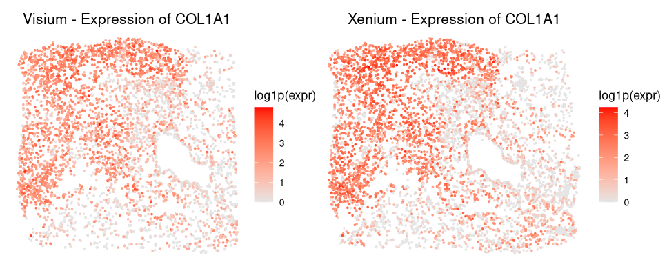
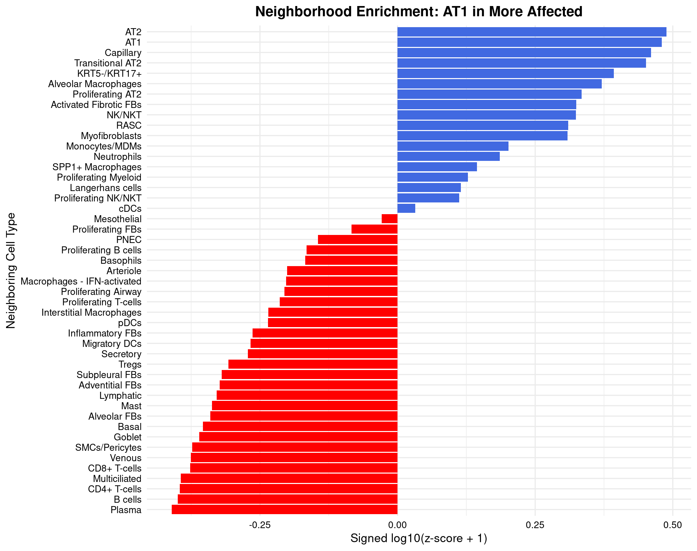

## 5. LungChat (LLM) functions

### Outline
[5.1. Visualization/Analysis](#1-Visualization-&-Analysis)

[5.2. CellChat](#2-CellChat)

[5.3. Neighbors enrichment_analysis](#3-Neighbors_enrichment_analysis)

[5.4. Ingestion](#4-Ingestion)

---
#### 1. Visualization & Analysis
Script: [`Spatial_functions.R`](./Spatial_functions.R)

#### `plot_spatial()`
- Visualize spatial annotation (categorical or numeric) from a SummarizedExperiment object.

| **Parameter** | **Type**                                        | **Default**  | **Options**                                                                                                                                    | **Description**                                                                     |
| ------------- | ----------------------------------------------- | ------------ | ---------------------------------------------------------------------------------------------------------------------------------------------- | ----------------------------------------------------------------------------------- |
| `obj`         | `SingleCellExperiment` / `SummarizedExperiment` | *(required)* | —                                                                                                                                              | H5AD-derived object loaded using `zellkonverter::readH5AD()`                        |
| `annotation`  | character                                       | *(required)* | `pruned`, `Final_CT`, `Final_lineage`, `CNiche`, `TNiche`, `Visium_RCTD_LungMap_ref`, `Visium_RCTD_GSE250346_based`, `Xenium_RCTD_LungMap_ref`, `confidence` | Column name in `colData(obj)` used for coloring the spatial plot                    |
| `title`       | character                                       | `NULL`       | —                                                                                                                                              | Custom plot title; if `NULL`, uses `"Spatial: <annotation>"`                        |
| `point_size`  | numeric                                         | `0.5`        | Any positive number                                                                                                                            | Size of points in the scatterplot                                                   |
| `base_size`   | numeric                                         | `12`         | Any positive number                                                                                                                            | Base font size for theme and legend                                                 |
| `coord_flip`  | logical                                         | `FALSE`      | `TRUE`, `FALSE`                                                                                                                                | Whether to flip the Y-axis (e.g., Visium coordinate convention)                     |
| `highlight`   | character vector                                | `NULL`       | One or more annotation levels (e.g., `c("AT1", "AT2")`)                                                                                        | If `annotation` is categorical, highlights selected levels in color, others in grey |

#### Example usages
Generates a spatial scatterplot of scTriangulate2 cells or spots, colored by the "pruned" annotation to visualize cell type or cluster identity across tissue space.
```
plot_spatial(scTriangulate2, annotation = "pruned")
```


Generate a spatial plot highlighting `TNiche@T6` and `TNiche@T7` clusters
```
plot_spatial(scTriangulate2, 
             annotation = "pruned", 
             highlight = c("TNiche@T6", "TNiche@T7"))
```


Generates a spatial map of the IPF microenvironment where each spot is colored by confidence score
```
plot_spatial(
    obj = scTriangulate2,
    annotation = "confidence",
    title = "Spatial Confidence Map of the IPF Microenvironment",
    point_size = 0.4
)
```


---
#### `plot_umap()`
- Visualize UMAP embedding for Visium HD or Xenium platforms using metadata or highlights.
#### Example usages
Xenium UMAP
```
plot_umap(scTriangulate2, 
          platform = "Xenium", 
          annotation = "Final_CT")
```
Visium HD UMAP
```
plot_umap(scTriangulate2, 
          platform = "Visium", 
          annotation = "Visium_RCTD_LungMap_ref")
```


Xenium (AT1 & AT2)
```
plot_umap(scTriangulate2, 
          platform = "Visium", 
          annotation = "Visium_RCTD_LungMap_ref", 
          title = "Visium - AT1 & AT2",
          highlight = c("AT1", "AT2"))
```
Visium HD (AT1 & AT2)
```
plot_umap(scTriangulate2, 
          platform = "Xenium", 
          annotation = "Final_CT", 
          title = "Xenium - AT1 & AT2",
          highlight = c("AT1", "AT2"))
```


---
#### `plot_gene_spatial()`
- Plot spatial gene expression for Visium or Xenium using platform-specific coordinates.
#### Example usages
```
plot_gene_spatial(scTriangulate2, 
                  gene = "COL1A1", 
                  platform = "Visium", 
                  point_size = 0.4,
                  title = "Visium - Expression of COL1A1")
                  
plot_gene_spatial(scTriangulate2, 
                  gene = "COL1A1", 
                  platform = "Xenium", 
                  point_size = 0.4,
                  title = "Xenium - Expression of COL1A1")
```


---
#### `rank_cross_platform_gene_correlation()`
- Rank genes by Pearson correlation across Xenium-Visium matched expression.
#### Example usages
Top 5 highly correlated genes (Visium HD - Xenium)
```
rank_cross_platform_gene_correlation(
    obj = scTriangulate2,
    top_genes = 5
)
```
Output
```
   COL1A1    COL3A1    COL1A2   SCGB3A2     MARCO 
0.8968483 0.6852229 0.6121173 0.5324030 0.4863397 
```

---
#### `plot_cross_platform_gene_correlation()`
- Plot cumulative Pearson correlation across best-matched Visium-Xenium spots for a gene.
#### Example usages
Cumulative Pearson correlation (COL1A1)
```
plot_cross_platform_gene_correlation(
    obj = scTriangulate2,
    gene_name = "COL1A1",
    ID1_col = "Visium_ID",
    ID2_col = "Xenium_ID",
    y_range = c(0.8,1)
)
```


---
#### `generate_stability_report()`
- Summarize per-cluster metrics (confidence, reassign, SCCAF, TF-IDF 10, TF-IDF 5m Shapley)

#### Example usages
Stability of T cells 
```
# Define Inputs and Generate Outputs
# Define the single list of clusters you want to analyze and plot
clusters_to_process <- list(
    Final_CT = c("CD4+_T-cells", "CD8+_T-cells"),
    Visium_RCTD_LungMap_ref = c("T"),
    Visium_RCTD_GSE250346_based = c("CD4+_T-cells", "CD8+_T-cells")
)

# Call the function once to get both the table and the plot
output <- generate_stability_report(
    sce = scTriangulate2, 
    celltype_labels = clusters_to_process
)


# Print Both the Table and the Plot
if (!is.null(output)) {
    
    # Print the summary table
    print(kable(output$summary_table, digits = 3, caption = "Summary of Cell Type Stability Metrics"))
    
    # Print the final plot
    print(output$stability_plot)
    
}
```
Output
```
Table: Summary of Cell Type Stability Metrics

|Cluster                                  | Reassign| SCCAF| TF-IDF 5| TF-IDF 10| Shapley| Confidence|
|:----------------------------------------|--------:|-----:|--------:|---------:|-------:|----------:|
|Final_CT@CD4+_T-cells                    |    0.562| 0.767|    0.727|     0.540|   1.783|      0.599|
|Final_CT@CD8+_T-cells                    |    0.456| 0.722|    0.837|     0.673|   6.917|      0.850|
|Visium_RCTD_LungMap_ref@T                |    0.706| 0.789|    0.623|     0.521|   8.083|      0.156|
|Visium_RCTD_GSE250346_based@CD4+_T-cells |    0.476| 0.290|    0.520|     0.469|   0.783|      0.850|
|Visium_RCTD_GSE250346_based@CD8+_T-cells |    0.000| 0.304|    0.332|     0.305|   0.067|      0.128|
```


---
#### `scTriangulate_summarize_celltype_stability()`
- Summarize per-cluster metrics (confidence, SCCAF, doublet scores) across platforms.
#### Example usages
Stability of T cells 
```
labels_list <- list(
    Final_CT = c("CD4+_T-cells", "CD8+_T-cells", "Tregs", "Proliferating_T-cells"),
    Visium_RCTD_LungMap_ref = c("T"),
    Visium_RCTD_GSE250346_based = c("CD4+_T-cells", "CD8+_T-cells", "Tregs", "Proliferating_T-cells"),
    Xenium_RCTD_LungMap_ref = c("T")
)

scTriangulate_summarize_celltype_stability(
    sce = scTriangulate2,
    celltype_labels = labels_list
)
```
Output (portion)
```
   Cluster  Platform confidence SCCAF.Final_CT SCCAF.Visium_RCTD_Lu…¹ SCCAF.Visium_RCTD_GS…² SCCAF.Xenium_RCTD_Lu…³
   <chr>    <chr>         <dbl>          <dbl>                  <dbl>                  <dbl>                  <dbl>
 1 Final_C… Xenium        0.545          0.767                  0.738                  0.498                  0.974
 2 Final_C… Xenium        0.837          0.722                  0.742                  0.555                  0.980
 3 Final_C… Xenium        1              0                      0.786                  0.413                  0.986
 4 Final_C… Xenium        0.568          0.292                  0.709                  0.541                  0.982
 5 Visium_… Xenium        0.560          0.648                  0.725                  0.290                  0.920
 6 Visium_… Xenium        0.577          0.699                  0.740                  0.304                  0.940
 7 Visium_… Xenium        0.634          0.651                  0.745                  0.125                  0.934
 8 Visium_… Xenium        0.589          0.663                  0.766                  0.413                  0.946
 9 Visium_… Xenium        0.553          0.654                  0.789                  0.334                  0.947
10 Xenium_… Xenium        0.668          0.683                  0.741                  0.512                  0.986
```
---
#### `rank_marker_specificity()`
- Rank how specific a gene is to a cell type using one-sided t-tests and FDR correction.
#### Example usages
COL1A1 - pruned, both Visium and Xenium
```
rank_marker_specificity(scTriangulate2, 
                        gene_name = "COL1A1",
                        top_n = 3)
```
Output
```
                    Cluster Mean_Expr Pct_Expr      P_Value Annotation_Source        P_Adj
1                 TNiche@T6 15.087205 99.83700 0.000000e+00            pruned 0.000000e+00
2 Final_CT@Inflammatory_FBs  8.892857 99.10714 2.637340e-07            pruned 3.824143e-06
3  Final_CT@Adventitial_FBs  6.216667 93.33333 3.877084e-01            pruned 1.000000e+00
```
Top 5 clusters across selected annotations
```
rank_marker_specificity(scTriangulate2,
                        gene_name = "COL1A1",
                        cluster_cols = c("Final_CT", "TNiche", "Xenium_RCTD_LungMap_ref"),
                        top_n = 5)
```
Output
```
                 Cluster Mean_Expr  Pct_Expr       P_Value       Annotation_Source         P_Adj
1                     T6 15.398747 100.00000  0.000000e+00                  TNiche  0.000000e+00
2                   SCMF 13.409579  99.00383  0.000000e+00 Xenium_RCTD_LungMap_ref  0.000000e+00
3 Activated_Fibrotic_FBs 17.800000  99.76744 6.613296e-302                Final_CT 1.851723e-300
4           Alveolar_FBs  9.208145  96.15385  2.075145e-59                Final_CT  4.357804e-58
5                    AF1 10.039419  93.77593  2.415718e-20 Xenium_RCTD_LungMap_ref  4.058406e-19
```
Visium-only, limited annotations
```
rank_marker_specificity(scTriangulate2,
                        gene_name = "COL1A1",
                        cluster_cols = c("Visium_RCTD_GSE250346_based"),
                        platforms = "Visium",
                        top_n = 3)
```
Output
```
                 Cluster Mean_Expr Pct_Expr       P_Value           Annotation_Source         P_Adj
1 Activated_Fibrotic_FBs 13.004885 97.06927 5.559134e-288 Visium_RCTD_GSE250346_based 2.501610e-286
2        Adventitial_FBs  7.719212 88.17734  1.283858e-07 Visium_RCTD_GSE250346_based  2.888679e-06
3         Subpleural_FBs  6.034483 93.10345  3.533602e-01 Visium_RCTD_GSE250346_based  1.000000e+00
```
---
#### `find_celltype_markers()`
- Identify top marker genes for a specific cell type by calculating their differential expression and statistical significance, returning both a ranked table and a volcano plot to visualize the results.
#### Example usages
Identify top marker genes for T6
```
# Define Inputs and Find Markers
marker_report <- find_celltype_markers(
    sce = scTriangulate2,
    celltype = "T6",
    annotation_col = "TNiche",
    platform = "xenium"
)
# Access and Print Both the Table and the Plot
if (!is.null(marker_report)) {
    # Print the ranked table of top marker genes
    print(kable(marker_report$table, digits = 3, caption = "Top Marker Genes"))
    
    # Print the volcano plot
    print(marker_report$plot)
}
```
Output
```
Table: Top Marker Genes

|gene   | logFC| P_Value| P_Adj| log10_P_Adj|significant |
|:------|-----:|-------:|-----:|-----------:|:-----------|
|COL1A1 | 3.647|       0|     0|     335.145|TRUE        |
|MEG3   | 3.508|       0|     0|     335.145|TRUE        |
|COL3A1 | 3.403|       0|     0|     335.145|TRUE        |
|SFRP4  | 3.148|       0|     0|     335.145|TRUE        |
|LUM    | 3.067|       0|     0|     335.145|TRUE        |
|COL1A2 | 3.058|       0|     0|     335.145|TRUE        |
|CTHRC1 | 3.047|       0|     0|     335.145|TRUE        |
|DCN    | 2.268|       0|     0|     335.145|TRUE        |
|POSTN  | 1.964|       0|     0|     335.145|TRUE        |
|FN1    | 1.251|       0|     0|     335.145|TRUE        |
```


---
#### `find_top_markers_for_celltype()`
- Identify top differentially expressed genes for a specific cell type per platform.
#### Example usages
Top 10 marker genes for B cells
```
find_top_markers_for_celltype(
    obj = scTriangulate2,
    celltype = "B",
    annotation_col = "Visium_RCTD_LungMap_ref",
    platform_suffix = "visium",
    top_n = 10
)
```
Output
```
                gene     logFC      P_Value        P_Adj
CHGB_visium     CHGB 0.6706791 2.218767e-51 6.111790e-49
PSMB9_visium   PSMB9 0.3913351 1.331840e-51 6.111790e-49
ROBO4_visium   ROBO4 0.3908860 2.052060e-51 6.111790e-49
IFNAR2_visium IFNAR2 0.3894054 2.660191e-51 6.111790e-49
WIPF1_visium   WIPF1 0.3885079 4.794008e-51 8.811386e-49
LMBRD1_visium LMBRD1 0.3874692 6.982941e-51 9.167604e-49
STAT3_visium   STAT3 0.3868874 6.514417e-51 9.167604e-49
COL8A1_visium COL8A1 0.3840641 2.360717e-50 2.711874e-48
CCN2_visium     CCN2 1.2009828 5.027688e-44 5.133828e-42
CD79A_visium   CD79A 0.5044293 1.652513e-42 1.518660e-40
```
---
#### `generate_marker_report()`
- Analyzes the expression specificity of given genes across various cell type annotations, returning both a ranked statistical table and a dot plot summarizing the results.
#### Example usages
List cell types that "COL1A1", "AGER", "CD3D", "SFTPC" are differentially expressed.
```
# Define Inputs and Generate Outputs
genes_of_interest <- c("COL1A1", "AGER", "CD3D", "SFTPC")
annotations_to_process <- c("pruned")

# Call the function
marker_report <- generate_marker_report(
    sce = scTriangulate2,
    genes = genes_of_interest,
    annotation_cols = annotations_to_process
)


# Access and Print Both the Table and the Plot
if (!is.null(marker_report)) {
    # Print the full, ranked data table
    print(kable(marker_report$table, digits = 3, caption = "Marker Gene Specificity Ranking"))
    
    # Print the dot plot
    print(marker_report$plot)
}
```
Output (Portion)
```
Table: Marker Gene Specificity Ranking

|Gene   |Platform |Cluster                                             | Mean_Expr| Pct_Expr| P_Value| P_Adj|
|:------|:--------|:---------------------------------------------------|---------:|--------:|-------:|-----:|
|COL1A1 |Visium   |pruned@TNiche@T6                                    |    13.681|   99.307|   0.000| 0.000|
|COL1A1 |Xenium   |pruned@TNiche@T6                                    |    15.087|   99.837|   0.000| 0.000|
|SFTPC  |Xenium   |pruned@TNiche@T11                                   |    18.464|   93.724|   0.000| 0.000|
|CD3D   |Xenium   |pruned@Xenium_RCTD_LungMap_ref@T                    |     1.008|   60.615|   0.000| 0.000|
|CD3D   |Xenium   |pruned@Final_CT@CD8+_T-cells                        |     1.052|   56.897|   0.000| 0.000|
|SFTPC  |Visium   |pruned@TNiche@T11                                   |     0.732|   31.799|   0.000| 0.000|
|AGER   |Xenium   |pruned@Final_CT@AT1                                 |     3.209|   79.104|   0.000| 0.000|
|AGER   |Xenium   |pruned@Xenium_RCTD_LungMap_ref@AT1                  |     2.037|   57.009|   0.000| 0.000|
|SFTPC  |Visium   |pruned@Visium_RCTD_LungMap_ref@AT2                  |     0.990|   46.392|   0.000| 0.000|
|AGER   |Xenium   |pruned@TNiche@T11                                   |     0.427|   27.615|   0.000| 0.000|
|COL1A1 |Xenium   |pruned@Final_CT@Inflammatory_FBs                    |     8.893|   99.107|   0.000| 0.000|
|CD3D   |Visium   |pruned@Xenium_RCTD_LungMap_ref@T                    |     0.120|    7.821|   0.000| 0.000|
|CD3D   |Xenium   |pruned@Visium_RCTD_LungMap_ref@B                    |     0.241|   14.815|   0.004| 0.065|
|COL1A1 |Visium   |pruned@Final_CT@Inflammatory_FBs                    |     7.312|   99.107|   0.010| 0.167|
|AGER   |Visium   |pruned@Xenium_RCTD_LungMap_ref@AT1                  |     0.047|    4.673|   0.017| 0.265|
|SFTPC  |Xenium   |pruned@Xenium_RCTD_LungMap_ref@AT1                  |     1.336|   35.514|   0.019| 0.282|
|CD3D   |Xenium   |pruned@Visium_RCTD_LungMap_ref@AEC                  |     0.323|   14.516|   0.021| 0.283|
|SFTPC  |Visium   |pruned@Xenium_RCTD_LungMap_ref@AT1                  |     0.178|    8.411|   0.051| 0.653|
|AGER   |Visium   |pruned@Visium_RCTD_LungMap_ref@AT2                  |     0.031|    3.093|   0.059| 0.719|
|CD3D   |Xenium   |pruned@Visium_RCTD_LungMap_ref@Pericyte             |     0.273|   10.606|   0.065| 0.759|
```


---
#### `plot_ARI_dotplot()`
- Plot pairwise cluster overlap using dotplot and display Adjusted Rand Index (ARI).
#### Example usages
ARI between Visium HD and Xenium RCTD based on LungMap ref
```
plot_ARI_dotplot(
  obj = scTriangulate2,
  annotation1 = "Xenium_RCTD_LungMap_ref",
  annotation2 = "Visium_RCTD_LungMap_ref",
  title = "RCTD Matching Dot Plot"
)
```


---
#### `plot_marker_expression_dotplot()`
- Show dot plot of average expression and detection rate for selected genes by group.
#### Example usages
Visualizes the expression of selected marker genes across annotated cell types in a dot plot, faceted by platform using annotations from the `pruned` column
```
plot_marker_expression_dotplot(
    obj = scTriangulate2,
    genes = c("COL1A1", "AGER", "CD3D", "SFTPC"),
    platform = c("visium", "xenium"),
    annotation = "pruned"
)
```


---
#### `plot_cluster_composition_groupedbar()`
- Compare cluster or cell-type compositions between one or two annotations using barplots.
#### Example usages
`pruned` cell type composition
```
plot_cluster_composition_groupedbar(
    obj = scTriangulate2,
    annotation = c("pruned")
)
```


Comparison between `Visium_RCTD_LungMap_ref` and `Xenium_RCTD_LungMap_ref`
```
plot_cluster_composition_groupedbar(
    obj = scTriangulate2,
    annotation = c("Visium_RCTD_LungMap_ref", "Xenium_RCTD_LungMap_ref")
)
```


---
#### `compare_annotations_via_heatmap()`
- Visualize overlap between two annotations using a normalized confusion matrix heatmap.
#### Example usages
Comparison between `pruned` and `Final_CT`
```
compare_annotations_via_heatmap(
    obj = scTriangulate2,
    annotation1 = "pruned",
    annotation2 = "Final_CT",
    normalize = "row"
)
```


---
#### `visualize_matched_pairs_scatter()`
- Scatterplot showing gene expression correlation across Visium and Xenium matched spots.
#### Example usages
COL1A1 correlation between Visium HD and Xenium
```
visualize_matched_pairs_scatter(
  obj = scTriangulate2,
  gene = "COL1A1",
  show_correlation = TRUE
)
```


---
#### 2. CellChat
Cell-Cell communication analysis pakage developed by Jin et al.

#### `netVisual_circle()`
- Circle plot of cell-cell communication network
```
netVisual_circle(CellChat_combined$Xenium_IPF_Author@net$count, 
                 vertex.weight = groupSizes$Xenium_IPF_Author, 
                 vertex.label.cex = 0.7, 
                 margin = 0.2, 
                 remove.isolate = TRUE)
```


---
#### List all inferred signaling pathways
Control, Two different annotations
```
> # Xenium, Authors annotation, Control
> CellChat_combined$Xenium_Control_Author@netP$pathways
[1] "SPP1"  "VEGF"  "UGRP1" "CCL"   "EGF"  
> # Xenium, LungMap-based RCTD, Control
> CellChat_combined$Xenium_Control_LungMap@netP$pathways
[1] "VEGF" "CCL" 
```
IPF, Visium HD & Xenium
```
> # Visium, LungMap-based RCTD, IPF
> CellChat_combined$Visium_IPF_LungMap@netP$pathways
[1] "UGRP1" "CXCL" 
> # Xenium, Authors annotation, IPF
> CellChat_combined$Xenium_IPF_Author@netP$pathways
[1] "UGRP1"  "SPP1"   "VEGF"   "CCL"    "FASLG"  "CXCL"   "APELIN"
> # Xenium, LungMap-based RCTD, IPF
> CellChat_combined$Xenium_IPF_LungMap@netP$pathways
[1] "UGRP1"  "VEGF"   "CCL"    "APELIN" "FASLG"  "SPP1"   "CXCL"  
```
---
#### `netVisual_heatmap()`
- Generates a heatmap of intercellular communication strength
#### Example usages
Xenium, IPF
```
netVisual_heatmap(CellChat_combined$Xenium_IPF_Author, 
                  measure = "weight", 
                  color.heatmap = "Reds", 
                  title.name = "Xenium IPF
```


Xenium, Control
```
netVisual_heatmap(CellChat_combined$Xenium_Control_Author, 
                  measure = "weight", 
                  color.heatmap = "Reds", 
                  title.name = "Xenium Control")
```


---
#### `netVisual_aggregate()`
- Visualize the inferred signaling network of signaling pathways by aggregating all L-R pairs
#### Example usages
Circle plot that visualizes the intercellular communication network for the UGRP1 signaling pathway in the Xenium IPF Author annotation
```
netVisual_aggregate(CellChat_combined$Xenium_IPF_Author, 
                    signaling = "UGRP1", 
                    layout = "circle", 
                    remove.isolate = TRUE)
```


---
#### `subsetCommunication()`
- Subset the inferred cell-cell communications of interest
#### Example usages
Returns a data frame summarizing the UGRP1 pathway-level communication network from the 'Xenium_IPF_Author', author annotation CellChat object.
```
subsetCommunication(CellChat_combined$Xenium_IPF_Author,
                    signaling = "UGRP1", 
                    slot.name = "netP")
```
Output
```
                  source                      target pathway_name         prob pval
1                    AT1        Alveolar Macrophages        UGRP1 1.186312e-04    0
2                    AT1 Macrophages - IFN-activated        UGRP1 3.318226e-06    0
3                    AT1              Monocytes/MDMs        UGRP1 1.256188e-06    0
4                    AT1       Proliferating Myeloid        UGRP1 2.093645e-06    0
5                    AT1           SPP1+ Macrophages        UGRP1 3.452628e-05    0
6                    AT2        Alveolar Macrophages        UGRP1 1.694225e-04    0
7                    AT2 Macrophages - IFN-activated        UGRP1 4.739140e-06    0
8                    AT2              Monocytes/MDMs        UGRP1 1.794108e-06    0
9                    AT2       Proliferating Myeloid        UGRP1 2.990177e-06    0
10                   AT2           SPP1+ Macrophages        UGRP1 4.931030e-05    0
11       Adventitial FBs        Alveolar Macrophages        UGRP1 9.377598e-05    0
12       Adventitial FBs Macrophages - IFN-activated        UGRP1 2.622939e-06    0
13       Adventitial FBs              Monocytes/MDMs        UGRP1 9.929713e-07    0
14       Adventitial FBs       Proliferating Myeloid        UGRP1 1.654951e-06    0
15       Adventitial FBs           SPP1+ Macrophages        UGRP1 2.729197e-05    0
16  Alveolar Macrophages        Alveolar Macrophages        UGRP1 7.073142e-05    0
17  Alveolar Macrophages Macrophages - IFN-activated        UGRP1 1.978332e-06    0
18  Alveolar Macrophages              Monocytes/MDMs        UGRP1 7.489409e-07    0
19  Alveolar Macrophages       Proliferating Myeloid        UGRP1 1.248234e-06    0
20  Alveolar Macrophages           SPP1+ Macrophages        UGRP1 2.058489e-05    0
21               B cells        Alveolar Macrophages        UGRP1 3.272054e-05    0
22               B cells Macrophages - IFN-activated        UGRP1 9.151478e-07    0
23               B cells              Monocytes/MDMs        UGRP1 3.464490e-07    0
24               B cells       Proliferating Myeloid        UGRP1 5.774149e-07    0
25               B cells           SPP1+ Macrophages        UGRP1 9.522367e-06    0
26                 Basal        Alveolar Macrophages        UGRP1 3.468497e-03    0
27                 Basal Macrophages - IFN-activated        UGRP1 9.733410e-05    0
28                 Basal              Monocytes/MDMs        UGRP1 3.685014e-05    0
29                 Basal       Proliferating Myeloid        UGRP1 6.141539e-05    0
30                 Basal           SPP1+ Macrophages        UGRP1 1.011871e-03    0
31                Goblet        Alveolar Macrophages        UGRP1 5.747896e-03    0
32                Goblet              Monocytes/MDMs        UGRP1 6.120552e-05    0
33                Goblet       Proliferating Myeloid        UGRP1 1.020050e-04    0
34                Goblet           SPP1+ Macrophages        UGRP1 1.679565e-03    0
35          KRT5-/KRT17+        Alveolar Macrophages        UGRP1 2.332229e-04    0
36          KRT5-/KRT17+ Macrophages - IFN-activated        UGRP1 6.524191e-06    0
37          KRT5-/KRT17+              Monocytes/MDMs        UGRP1 2.469882e-06    0
38          KRT5-/KRT17+       Proliferating Myeloid        UGRP1 4.116463e-06    0
39          KRT5-/KRT17+           SPP1+ Macrophages        UGRP1 6.788243e-05    0
40         Multiciliated        Alveolar Macrophages        UGRP1 5.889110e-03    0
41         Multiciliated Macrophages - IFN-activated        UGRP1 1.656532e-04    0
42         Multiciliated              Monocytes/MDMs        UGRP1 6.271803e-05    0
43         Multiciliated       Proliferating Myeloid        UGRP1 1.045257e-04    0
44         Multiciliated           SPP1+ Macrophages        UGRP1 1.721001e-03    0
45        Myofibroblasts        Alveolar Macrophages        UGRP1 8.322206e-04    0
46        Myofibroblasts Macrophages - IFN-activated        UGRP1 2.329415e-05    0
47        Myofibroblasts              Monocytes/MDMs        UGRP1 8.818627e-06    0
48        Myofibroblasts       Proliferating Myeloid        UGRP1 1.469763e-05    0
49        Myofibroblasts           SPP1+ Macrophages        UGRP1 2.423311e-04    0
50     Proliferating AT2        Alveolar Macrophages        UGRP1 1.665550e-04    0
51     Proliferating AT2              Monocytes/MDMs        UGRP1 1.763738e-06    0
52     Proliferating AT2       Proliferating Myeloid        UGRP1 2.939560e-06    0
53     Proliferating AT2           SPP1+ Macrophages        UGRP1 4.847562e-05    0
54 Proliferating Myeloid        Alveolar Macrophages        UGRP1 5.725954e-05    0
55 Proliferating Myeloid Macrophages - IFN-activated        UGRP1 1.601508e-06    0
56 Proliferating Myeloid              Monocytes/MDMs        UGRP1 6.062856e-07    0
57 Proliferating Myeloid       Proliferating Myeloid        UGRP1 1.010476e-06    0
58 Proliferating Myeloid           SPP1+ Macrophages        UGRP1 1.666402e-05    0
59                  RASC        Alveolar Macrophages        UGRP1 4.913070e-03    0
60                  RASC Macrophages - IFN-activated        UGRP1 1.380667e-04    0
61                  RASC              Monocytes/MDMs        UGRP1 5.227259e-05    0
62                  RASC       Proliferating Myeloid        UGRP1 8.711795e-05    0
63                  RASC           SPP1+ Macrophages        UGRP1 1.434772e-03    0
64     SPP1+ Macrophages        Alveolar Macrophages        UGRP1 1.552866e-05    0
65     SPP1+ Macrophages Macrophages - IFN-activated        UGRP1 4.343076e-07    0
66     SPP1+ Macrophages              Monocytes/MDMs        UGRP1 1.644165e-07    0
67     SPP1+ Macrophages       Proliferating Myeloid        UGRP1 2.740275e-07    0
68     SPP1+ Macrophages           SPP1+ Macrophages        UGRP1 4.519112e-06    0
69             Secretory        Alveolar Macrophages        UGRP1 7.297660e-03    0
70             Secretory              Monocytes/MDMs        UGRP1 7.782795e-05    0
71             Secretory       Proliferating Myeloid        UGRP1 1.297065e-04    0
72             Secretory           SPP1+ Macrophages        UGRP1 2.134769e-03    0
73      Transitional AT2        Alveolar Macrophages        UGRP1 2.097474e-03    0
74      Transitional AT2 Macrophages - IFN-activated        UGRP1 5.878139e-05    0
75      Transitional AT2              Monocytes/MDMs        UGRP1 2.225377e-05    0
76      Transitional AT2       Proliferating Myeloid        UGRP1 3.708906e-05    0
77      Transitional AT2           SPP1+ Macrophages        UGRP1 6.113039e-04    0
78                  cDCs        Alveolar Macrophages        UGRP1 1.655765e-05    0
79                  cDCs Macrophages - IFN-activated        UGRP1 4.630870e-07    0
80                  cDCs              Monocytes/MDMs        UGRP1 1.753116e-07    0
81                  cDCs       Proliferating Myeloid        UGRP1 2.921859e-07    0
82                  cDCs           SPP1+ Macrophages        UGRP1 4.818570e-06    0
```
---
#### 3. Neighbors enrichment_analysis
- Compute enrichment score based on proximity on the connectivity graph of cell clusters by Palla, Spitzer et al. (2022) in Nature Methods.

#### `create_enrichment_heatmap()`

#### Example usages
Neighbors enrichment Unaffected (Control) vs More_Affected (IPF)
```
create_enrichment_heatmap(
    group="Unaffected",
    cluster_key="final_CT",
    hdf_path=hdf_file,
    plot_style='blue_white_red'
)

create_enrichment_heatmap(
    group="More_Affected",
    cluster_key="final_CT",
    hdf_path=hdf_file,
    plot_style='blue_white_red'
)
```


---
#### `analyze_and_plot_neighbors()`

#### Example usages
Cell Types Adjacent to AT1 in IPF samples
```
analyze_and_plot_neighbors(
    target_cell_type='AT1',
    group='More_Affected',
    cluster_key='final_CT',
    hdf_path=hdf_file
)
```
Output
```
--- Cell Types Adjacent to AT1 in 'More_Affected' ---
(Ranked by Z-score, showing Signed Log10 Values)
AT2                            2.078631
AT1                            2.019169
Capillary                      1.888188
Transitional AT2               1.825739
KRT5-/KRT17+                   1.469495
Alveolar Macrophages           1.349788
Proliferating AT2              1.160443
Activated Fibrotic FBs         1.112117
NK/NKT                         1.108804
RASC                           1.040325
Myofibroblasts                 1.034743
Monocytes/MDMs                 0.590017
Neutrophils                    0.533883
SPP1+ Macrophages              0.394236
Proliferating Myeloid          0.342851
Langerhans cells               0.303135
Proliferating NK/NKT           0.294046
cDCs                           0.076250
Mesothelial                   -0.068462
Proliferating FBs             -0.211667
PNEC                          -0.394750
Proliferating B cells         -0.463301
Basophils                     -0.472423
Arteriole                     -0.587240
Macrophages - IFN-activated   -0.593663
Proliferating Airway          -0.606216
Proliferating T-cells         -0.637261
Interstitial Macrophages      -0.716644
pDCs                          -0.719221
Inflammatory FBs              -0.834237
Migratory DCs                 -0.849226
Secretory                     -0.870928
Tregs                         -1.029499
Subpleural FBs                -1.085672
Adventitial FBs               -1.103593
Lymphatic                     -1.130304
Mast                          -1.172999
Alveolar FBs                  -1.189480
Basal                         -1.256193
Goblet                        -1.290974
SMCs/Pericytes                -1.360777
Venous                        -1.373536
CD8+ T-cells                  -1.379831
Multiciliated                 -1.475444
CD4+ T-cells                  -1.488409
B cells                       -1.508357
Plasma                        -1.572762
Name: AT1, dtype: float64
```


---
#### 4. Ingestion
TO BE UPDATED 
