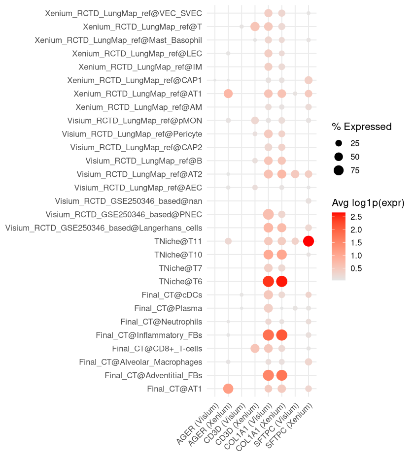

## 5. LungChat (LLM) functions

### Outline
[5.1. Visualization/Analysis](#1-Visualization-&-Analysis)

[5.2. Ingestion](#2-Ingestion)

---
#### 1. Visualization & Analysis

#### `plot_spatial()`
- Visualize spatial annotation (categorical or numeric) from a SummarizedExperiment object.
#### Example usages
Generates a spatial scatterplot of scTriangulate2 cells or spots, colored by the "pruned" annotation to visualize cell type or cluster identity across tissue space.
```
plot_spatial(scTriangulate2, annotation = "pruned")
```


Generate a spatial plot highlighting `TNiche@T6` and `TNiche@T7` clusters
```
plot_spatial(scTriangulate2, 
             annotation = "pruned", 
             highlight = c("TNiche@T6", "TNiche@T7"))
```


Generates a spatial map of the IPF microenvironment where each spot is colored by confidence score
```
plot_spatial(
    obj = scTriangulate2,
    annotation = "confidence",
    title = "Spatial Confidence Map of the IPF Microenvironment",
    point_size = 0.4
)
```


---
#### `plot_umap()`
- Visualize UMAP embedding for Visium HD or Xenium platforms using metadata or highlights.
#### Example usages
Xenium UMAP
```
plot_umap(scTriangulate2, 
          platform = "Xenium", 
          annotation = "Final_CT")
```
Visium HD UMAP
```
plot_umap(scTriangulate2, 
          platform = "Visium", 
          annotation = "Visium_RCTD_LungMap_ref")
```


Xenium (AT1 & AT2)
```
plot_umap(scTriangulate2, 
          platform = "Visium", 
          annotation = "Visium_RCTD_LungMap_ref", 
          title = "Visium - AT1 & AT2",
          highlight = c("AT1", "AT2"))
```
Visium HD (AT1 & AT2)
```
plot_umap(scTriangulate2, 
          platform = "Xenium", 
          annotation = "Final_CT", 
          title = "Xenium - AT1 & AT2",
          highlight = c("AT1", "AT2"))
```


---
#### `plot_gene_spatial()`
- Plot spatial gene expression for Visium or Xenium using platform-specific coordinates.
#### Example usages
```
plot_gene_spatial(scTriangulate2, 
                  gene = "COL1A1", 
                  platform = "Visium", 
                  point_size = 0.4,
                  title = "Visium - Expression of COL1A1")
                  
plot_gene_spatial(scTriangulate2, 
                  gene = "COL1A1", 
                  platform = "Xenium", 
                  point_size = 0.4,
                  title = "Xenium - Expression of COL1A1")
```


---
#### `rank_cross_platform_gene_correlation()`
- Rank genes by Pearson correlation across Xenium-Visium matched expression.
#### Example usages
Top 5 highly correlated genes (Visium HD - Xenium)
```
rank_cross_platform_gene_correlation(
    obj = scTriangulate2,
    top_genes = 5
)
```
Output
```
   COL1A1    COL3A1    COL1A2   SCGB3A2     MARCO 
0.8968483 0.6852229 0.6121173 0.5324030 0.4863397 
```

---
#### `plot_cross_platform_gene_correlation()`
- Plot cumulative Pearson correlation across best-matched Visium-Xenium spots for a gene.
#### Example usages
Cumulative Pearson correlation (COL1A1)
```
plot_cross_platform_gene_correlation(
    obj = scTriangulate2,
    gene_name = "COL1A1",
    ID1_col = "Visium_ID",
    ID2_col = "Xenium_ID",
    y_range = c(0.8,1)
)
```


---
#### `scTriangulate_summarize_celltype_stability()`
- Summarize per-cluster metrics (confidence, SCCAF, doublet scores) across platforms.
#### Example usages
Stability of T cells 
```
labels_list <- list(
    Final_CT = c("CD4+_T-cells", "CD8+_T-cells", "Tregs", "Proliferating_T-cells"),
    Visium_RCTD_LungMap_ref = c("T"),
    Visium_RCTD_GSE250346_based = c("CD4+_T-cells", "CD8+_T-cells", "Tregs", "Proliferating_T-cells"),
    Xenium_RCTD_LungMap_ref = c("T")
)

scTriangulate_summarize_celltype_stability(
    sce = scTriangulate2,
    celltype_labels = labels_list
)
```
Output (portion)
```
   Cluster  Platform confidence SCCAF.Final_CT SCCAF.Visium_RCTD_Lu…¹ SCCAF.Visium_RCTD_GS…² SCCAF.Xenium_RCTD_Lu…³
   <chr>    <chr>         <dbl>          <dbl>                  <dbl>                  <dbl>                  <dbl>
 1 Final_C… Xenium        0.545          0.767                  0.738                  0.498                  0.974
 2 Final_C… Xenium        0.837          0.722                  0.742                  0.555                  0.980
 3 Final_C… Xenium        1              0                      0.786                  0.413                  0.986
 4 Final_C… Xenium        0.568          0.292                  0.709                  0.541                  0.982
 5 Visium_… Xenium        0.560          0.648                  0.725                  0.290                  0.920
 6 Visium_… Xenium        0.577          0.699                  0.740                  0.304                  0.940
 7 Visium_… Xenium        0.634          0.651                  0.745                  0.125                  0.934
 8 Visium_… Xenium        0.589          0.663                  0.766                  0.413                  0.946
 9 Visium_… Xenium        0.553          0.654                  0.789                  0.334                  0.947
10 Xenium_… Xenium        0.668          0.683                  0.741                  0.512                  0.986
```
---
#### `rank_marker_specificity()`
- Rank how specific a gene is to a cell type using one-sided t-tests and FDR correction.
#### Example usages
COL1A1 - pruned, both Visium and Xenium
```
rank_marker_specificity(scTriangulate2, 
                        gene_name = "COL1A1",
                        top_n = 3)
```
Output
```
                    Cluster Mean_Expr Pct_Expr      P_Value Annotation_Source        P_Adj
1                 TNiche@T6 15.087205 99.83700 0.000000e+00            pruned 0.000000e+00
2 Final_CT@Inflammatory_FBs  8.892857 99.10714 2.637340e-07            pruned 3.824143e-06
3  Final_CT@Adventitial_FBs  6.216667 93.33333 3.877084e-01            pruned 1.000000e+00
```
Top 5 clusters across selected annotations
```
rank_marker_specificity(scTriangulate2,
                        gene_name = "COL1A1",
                        cluster_cols = c("Final_CT", "TNiche", "Xenium_RCTD_LungMap_ref"),
                        top_n = 5)
```
Output
```
                 Cluster Mean_Expr  Pct_Expr       P_Value       Annotation_Source         P_Adj
1                     T6 15.398747 100.00000  0.000000e+00                  TNiche  0.000000e+00
2                   SCMF 13.409579  99.00383  0.000000e+00 Xenium_RCTD_LungMap_ref  0.000000e+00
3 Activated_Fibrotic_FBs 17.800000  99.76744 6.613296e-302                Final_CT 1.851723e-300
4           Alveolar_FBs  9.208145  96.15385  2.075145e-59                Final_CT  4.357804e-58
5                    AF1 10.039419  93.77593  2.415718e-20 Xenium_RCTD_LungMap_ref  4.058406e-19
```
Visium-only, limited annotations
```
rank_marker_specificity(scTriangulate2,
                        gene_name = "COL1A1",
                        cluster_cols = c("Visium_RCTD_GSE250346_based"),
                        platforms = "Visium",
                        top_n = 3)
```
Output
```
                 Cluster Mean_Expr Pct_Expr       P_Value           Annotation_Source         P_Adj
1 Activated_Fibrotic_FBs 13.004885 97.06927 5.559134e-288 Visium_RCTD_GSE250346_based 2.501610e-286
2        Adventitial_FBs  7.719212 88.17734  1.283858e-07 Visium_RCTD_GSE250346_based  2.888679e-06
3         Subpleural_FBs  6.034483 93.10345  3.533602e-01 Visium_RCTD_GSE250346_based  1.000000e+00
```
---
#### `find_top_markers_for_celltype()`
- Identify top differentially expressed genes for a specific cell type per platform.
#### Example usages
Top 10 marker genes for B cells
```
find_top_markers_for_celltype(
    obj = scTriangulate2,
    celltype = "B",
    annotation_col = "Visium_RCTD_LungMap_ref",
    platform_suffix = "visium",
    top_n = 10
)
```
Output
```
                gene     logFC      P_Value        P_Adj
CHGB_visium     CHGB 0.6706791 2.218767e-51 6.111790e-49
PSMB9_visium   PSMB9 0.3913351 1.331840e-51 6.111790e-49
ROBO4_visium   ROBO4 0.3908860 2.052060e-51 6.111790e-49
IFNAR2_visium IFNAR2 0.3894054 2.660191e-51 6.111790e-49
WIPF1_visium   WIPF1 0.3885079 4.794008e-51 8.811386e-49
LMBRD1_visium LMBRD1 0.3874692 6.982941e-51 9.167604e-49
STAT3_visium   STAT3 0.3868874 6.514417e-51 9.167604e-49
COL8A1_visium COL8A1 0.3840641 2.360717e-50 2.711874e-48
CCN2_visium     CCN2 1.2009828 5.027688e-44 5.133828e-42
CD79A_visium   CD79A 0.5044293 1.652513e-42 1.518660e-40
```
---
#### `plot_ARI_dotplot()`
- Plot pairwise cluster overlap using dotplot and display Adjusted Rand Index (ARI).
#### Example usages
ARI between Visium HD and Xenium RCTD based on LungMap ref
```
plot_ARI_dotplot(
  obj = scTriangulate2,
  annotation1 = "Xenium_RCTD_LungMap_ref",
  annotation2 = "Visium_RCTD_LungMap_ref",
  title = "RCTD Matching Dot Plot"
)
```


---
#### `plot_marker_expression_dotplot()`
- Show dot plot of average expression and detection rate for selected genes by group.
#### Example usages
Visualizes the expression of selected marker genes across annotated cell types in a dot plot, faceted by platform using annotations from the `pruned` column
```
plot_marker_expression_dotplot(
    obj = scTriangulate2,
    genes = c("COL1A1", "AGER", "CD3D", "SFTPC"),
    platform = c("visium", "xenium"),
    annotation = "pruned"
)
```


---
#### `plot_cluster_composition_groupedbar()`
- Compare cluster or cell-type compositions between one or two annotations using barplots.
#### Example usages
`pruned` cell type composition
```
plot_cluster_composition_groupedbar(
    obj = scTriangulate2,
    annotation = c("pruned")
)
```


Comparison between `Visium_RCTD_LungMap_ref` and `Xenium_RCTD_LungMap_ref`
```
plot_cluster_composition_groupedbar(
    obj = scTriangulate2,
    annotation = c("Visium_RCTD_LungMap_ref", "Xenium_RCTD_LungMap_ref")
)
```


---
#### `compare_annotations_via_heatmap()`
- Visualize overlap between two annotations using a normalized confusion matrix heatmap.
#### Example usages
Comparison between `pruned` and `Final_CT`
```
compare_annotations_via_heatmap(
    obj = scTriangulate2,
    annotation1 = "pruned",
    annotation2 = "Final_CT",
    normalize = "row"
)
```


---
#### `visualize_matched_pairs_scatter()`
- Scatterplot showing gene expression correlation across Visium and Xenium matched spots.
#### Example usages
COL1A1 correlation between Visium HD and Xenium
```
visualize_matched_pairs_scatter(
  obj = scTriangulate2,
  gene = "COL1A1",
  show_correlation = TRUE
)
```


---
#### 2. Ingestion
TO BE UPDATED 
